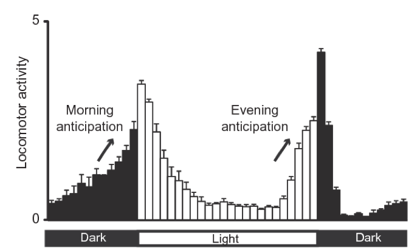
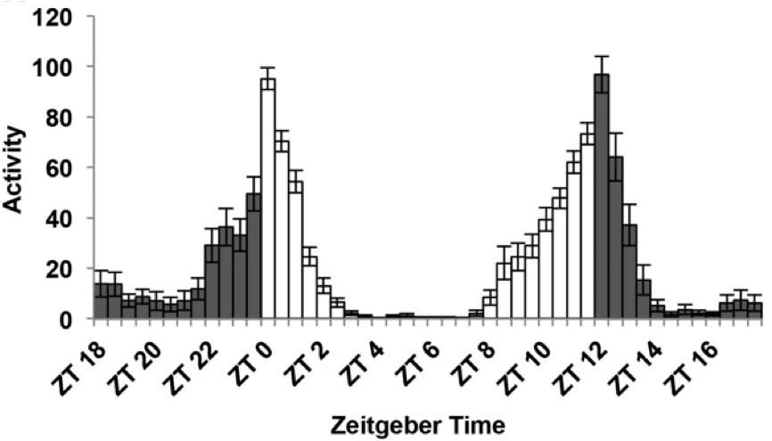
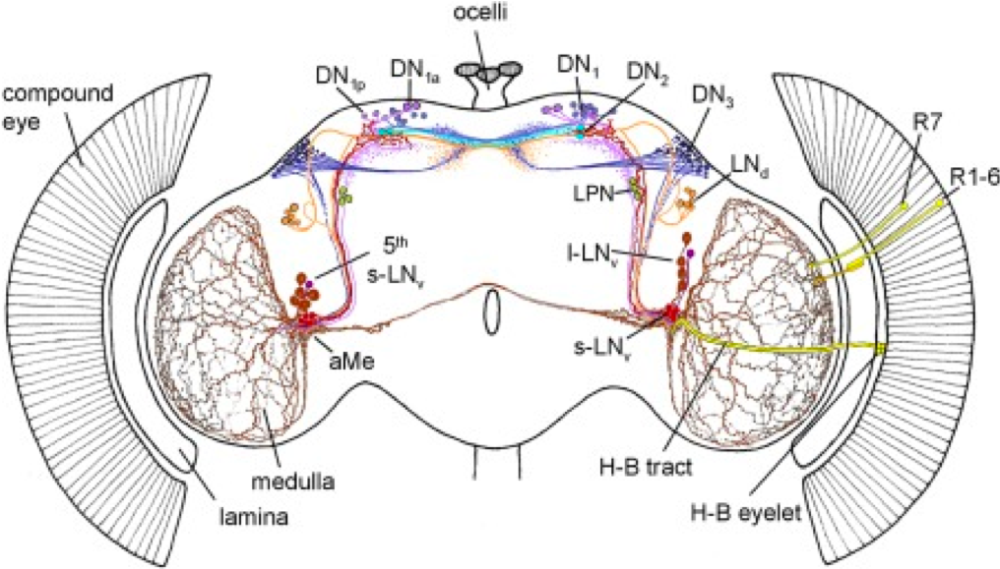

```{r setup, include=FALSE}
knitr::opts_chunk$set(echo = TRUE)
```
```{r, echo=FALSE,message=FALSE,warning=FALSE}
library(DESeq2) #for differential expression analysis
library(ggplot2) #for 2D graph
library(ggrepel) #to get the names in ggplot graph 
library(gridExtra)
library(factoextra)
library(plotly) #for 3D graphics
library(plyr)#table manipulation
library(dplyr)#table manipulation
library(tidyr)#table manipulation
library("RColorBrewer")
library("pheatmap")
library(org.Dm.eg.db)#get annotation
library(MetaCycle) # to identify cycling genes, the successor of JTK according to JTK authors
library(pcaExplorer)
#load("../RNAseq/all_tables.RData")
```

# RNA seq analysis

## Objectives

After this section you should be able to:

1. Understand RNA sequencing counts.
2. Perform differential gene expresion.
3. Do GO term analysis.
4. Analyze circadian data.

## Introduction

We will re-analyze some data from [Abruzzi et al, 2017](https://journals.plos.org/plosgenetics/article?id=10.1371/journal.pgen.1006613). These are data that explore gene expression in different neuronal cell types in a circadian layout.

This time we will just take the process data from the paper, and no directly the Raw data like in the previous ChipAnalisys. The data was downloaded from [GEO](https://www.ncbi.nlm.nih.gov/geo/query/acc.cgi?acc=GSE77451). The only pre-processing to the data was done to change column names.

As you can see in the methods section of the paper they have different cell-types and timepoints. Lets try to understand what type of system and data we have in hands.

__Circadian behavior__

Most living organisms change their behavior and metabolism over the day. Some animals like us have more activity over the day while others like mice have more activity over night. Flies in particular have a peak of activity the first hours of the morning and the last hours of the afternoon with a "siesta" (nap in Spanish) at the middle of the day. 

```{r, out.width = "500px", echo=FALSE, , fig.align="center",fig.cap="Fly activity over the day. Adapted from Nicholas R. J Glossop et al 2011. To meassure fly activity each individual fly is monitored either by counting when they cross a red-light bim (regular activity monitors) of by software tracking (flyboxes)."}

```

These changes in behaviour are govern by changes in gene expression in particular cell-types in the brain called the pace-makers. If we look at gene expression in these cells over the day we will notice that some genes oscillate. Like __Clk__ and __tim__, the proteins we analyzed in the previous Lab. 

In the circadian field time is reported as "hours after the light is ON". This is zeitgeber time (ZT) and it is usefull to have a unified meassurement of time. Most animals in labs are kept in 12 hours of light followed by 12 hours of dark. Therfore, ZT0 is the "sunrise" or lights on and ZT12 is lights off in a light/dark (LD)12:12 cycle time.

```{r, out.width = "500px", echo=FALSE, , fig.align="center",fig.cap="Fly activity over the day with ZT scale. Figure adapted from Dubowy et al 2017"}

```

As stated before, circadian behaviors is generated by a small subset of neurons. 

```{r, out.width = "500px", echo=FALSE , fig.align="center",fig.cap="Schematic representation of the circadian neural network. Four small ventrolateral neurons (s‐LNvs, red), the 5th s‐LNv (dark violet), four large ventrolateral neurons (l‐LNvs, brown), six dorsolateral neurons (LNds, orange), three lateral posterior neurons (LPN, green), and ca. 60 neurons per hemisphere in three dorsal groups (DN1–3, lilac, cyan, blue, respectively). Adapted from Schubert et al 2018"}

```

In the data analzed in this lab, the authors collected RNA samples over 6 times of the day (ZT3, 7, 11, 15, 19, 23) from 4 celltypes: LNv, LNd, DN1 and Dopaminergic neurons (TH cells). This last group of cells are not part of the circadian core clock but in this study they see oscilating genes! 


__Packages:__

We will use the following packages. Do not forget to executing them every time you open a new R session. Before runing them for the first time, you will have to install them (go back to Lab1 if you have any doubt).

```{r message=FALSE,warning=FALSE}
library(DESeq2) #for differential expression analysis
library(ggplot2) #for 2D graph
library(ggrepel) #to get the names in ggplot graph 
library(gridExtra) #to arrange the plots
library(factoextra) #extra plots
library(plotly) #for 3D graphics
library(plyr) #table manipulation
library(dplyr)#table manipulation
library(tidyr)#table manipulation
library("RColorBrewer") #extra color palettes
library("pheatmap") #nice heatmaps
library(org.Dm.eg.db) #get annotation
library(MetaCycle) # to identify cycling genes, the successor of JTK according to JTK authors
library(pcaExplorer) #more PCA analysis
```

## Differential gene expression

Gene expression data is made of integer numbers by genes. Each number represents exactly how many reads aligned to the DNA sequence that is assigned to each gene. 

Table: Gene counts table

| Gene| Condition 1 replicate 1| Condition 1 replicate 2| Condition 2 replicate 1| Condition 2 replicate 2|
|----:|-----------:|------------:|-----------:|------------:|
|    A|          20|          400|          60|           40|
|    B|           2|           50|        2000|         2500|
|    C|           0|            5|           0|            0|
|    D|           5|         2050|         150|          144|

Ultimatelly, what we want to do is to compare gene expression between conditions. To do so we have to make some considerations. One is the fact that we want to make conslusions about the whole transciptome of the organism we are working with. This means around 12000 comparisons (assuming 12000 genes). This implies a huge multiple-comparison correction. Another important consideration is the difference in sequencing depth, to overcame this issue the reads are normalized using an stimate that includes the total amount of reads in that sample. Finally, genes that are too lowlly expressed or have a huge dispersion have to be removed from the analysis as they are too noisy to get a trustable conclusion from them.

To perform differential gene expression we have to build a model that explains the differences in gene expression using the condition we are testing, fit the data to that model and see if it can explain the differences. This is done using generalized linear models (GLM) modeled using a negative binomial distribution (NB). Why is this? Becasue the data are counts, ie. integers (there are not 12.5 reads, you either have 12 or 13), to model discrete counts, we use either poisson or NB distribution. NB is ussed because it allows for expression and variance to be unlinked.

Luckily for us, there are many packages dedicated to solve this problems. We will use [DeSeq2](https://www.bioconductor.org/packages/devel/bioc/vignettes/DESeq2/inst/doc/DESeq2.html)

The steps performed by the DESeq function are documented in the manual page of DESeq2; briefly, they are:

1 estimation of size factors by estimateSizeFactors (this is for normalization)
2 estimation of dispersion by estimateDispersions (calculate the gene expression dispersion)
3 negative binomial GLM fitting and Wald statistics by nbinomWaldTest (this is the actuall differential gene expression step)

The only requirement for Deseq2 is to have the tables of data in a proper format and a meta-data object that indicates what is each sample.

Imagine we have a wildtype and a mutant, DeSeq2 requieres
Table: **1: Data matrix with Gene name as ROWNAMES**

| Row Names|  WildType.1|   WildType.2|    Mutant.1|     Mutant.2|
|---------:|-----------:|------------:|-----------:|------------:|
|         A|          20|          400|          60|           40|
|         B|           2|           50|        2000|         2500|
|         C|           0|            5|           0|            0|
|         D|           5|         2050|         150|          144|

Table: **2: MetaData (colData) in which ROWNAMES are the COLNAMES of the Data matrix and the conditions are column names**

|  Row Names|    Genotype|    replicate|    
|----------:|-----------:|------------:|
| WildType.1|          WT|            1|
| WildType.2|          WT|            2|
|   Mutant.1|     actinKD|            1|
|   Mutant.2|     actinKD|            2|

The we can use the Genotype as a condition to compare gene expresion for example.

At this time we will start by comparing gene expression at two timepoints in one celltype. This is good to have a first impresion of the data but it is not the way to go if your idea is to analyze circadian cycling behaviour. 


### Loading the tables

This time we have 4 gene expression tables: one for each cell type we are analyzing. Therefore, some of the processing will be done using for loops. This might be confusing at the beginning but is a really useful tool.

```{r }
#We can list the files that are present in our working directory, or any path we specify. Remeber the path will change depending where you have your data.
list.files(path = "../RNAseq/")
list.files(path = "../RNAseq/",pattern = "expression") #what do you think patter is doing? remember to go to the help page if you need to.
list.files(path = "../RNAseq/",pattern = "expression",full.names = T) #what happened now?

paper_tables<-list.files(path = "../RNAseq/",pattern = "xpression",full.names = T) #what we are doing here?, check your enviroment, do you see something new?

#If we try with one
TH_gene_expression<-read.table("../RNAseq/TH_gene_expression.txt",header = T)
```

How can we make it work for all the tables? We want to change the name, we basically want to remove the ".txt" ending. That can be done using gsub. We want to remove ".txt", so we replace it for an empty string.

```{r }
gsub(x = "../RNAseq/TH_gene_expression.txt",pattern =".txt",  replacement = "")
```
```{r }
#We also need to remove the path file
gsub(x = "../RNAseq/TH_gene_expression.txt",pattern ="../RNAseq/",  replacement = "")
```

Now we can try to do it for all of them, just trying to see if changing the names is working but NOT applying it to anything until we know it works.

```{r }
for (e in (paper_tables)){
  print("original name:          ")
  print(e) # this is printing e
  n<-gsub(pattern =".txt",  replacement = "",x = e)
  n<-gsub(pattern ="../RNAseq//",  replacement = "",x = n)
  print("final name:        ")
  print(n)
}
```
>What is this for loop doing? Do you think it is working? Why?

Now we will read the tables and put them in the names we created. To do this we will use the function assign, that actually assign anything to a given name. The names is stored in "n". What we want to assign is the "read.delim" of the file name stored in e.

```{r }
for (e in (paper_tables)){
  n<-gsub(pattern =".txt",  replacement = "",x = e)
  n<-gsub(pattern ="../RNAseq//",  replacement = "",x = n)
  print(paste0("I am reading: ",n))
  assign(n,read.delim(e))
}
```

### Create the DeSeq2 count matrix

DeSeq2 expects to have a data.frame with the gene-names as `row.names` and then just the counts. 

I will first show it for one of the tables and then do a for loop to do it for all of them.


```{r }
#We do not want to overwrite the raw tables. So, we will create new objects with the same data and we will modify these new objects and preserve the original data. Is like doing "save as" in word.

ds2_DN1_gene_expression_try<-DN1_gene_expression #what is this doing?

#We do now the loop for all of them to create the `ds2_` objects
ls(pattern = "gene_expression") #this list the objects in the environment that has the selected pattern in its name
```

```{r }
#The new name we want is just adding "ds2_" to the begining of the object name. We can do this with the paste0 funciton.
paste0("ds2_","DN1_gene_expression")

for (e in ls(pattern = "gene_expression")){ 
  x = paste0("ds2", sep="_",e) #this is the new name
  print("new name is:")
  print(x) 
  assign(x, get(e)) #get is a function that extracts the data from an object name
}

```

Now we have to do some manipulation in the tables for them to work with Deseq2.

```{r }
ds2_DN1_gene_expression_try <- ds2_DN1_gene_expression
row.names(ds2_DN1_gene_expression_try) = ds2_DN1_gene_expression$Symbol # we put the symbols as row.names
ds2_DN1_gene_expression_try<-ds2_DN1_gene_expression_try[,-1] # we take the symbols column out
head(ds2_DN1_gene_expression_try) # we can see that now the table is what we need
rm(ds2_DN1_gene_expression_try) #remove it becasue you do not need it anymore and because it can create problems
```
We can add this step to the for loop, or even better we can create a funciton and practice something new in R.
```{r }
#We create a small funciton to remember
sum2<-function(x){
 y=x+2 
 return(y)
}

sum2(4) 
```
>what is this doing? why?

```{r }
#Now we create a function that takes the data frame and does all the transformation we did before
create_ds2= function(df_name){
  df = as.data.frame(get(df_name))
  row.names(df) = as.character(df[,1])
  df=df[,-1]
  return(df) # this actually tells the function to return the transformed data.frame
}

#Let's try the function in one of the ds2 objects
#head(create_ds2(ds2_LNd_gene_expression))[,c(1:3)]
for (e in ls(pattern = "ds2_")){
  print(e)
  assign(e,create_ds2(e)) #this should actually run the function and apply it to the data frame
}
```

### colData preparation {.tabset .tabset-fade .tabset-pills}

We now need to have a data.frame with the mapping between the columns and the ZT, the program call this colData. Is what is usually called "meta data". Is a file that explains what each object/column is.

We will do it by hand just changing the names. No more loops for now. After you execute each step I recommend you to inspect the object to see what is happening.
 
**DN1**
```{r message=FALSE,warning=FALSE}
#takes the names in the data frame and put them in the new objects. We want to get the information for each 
colData.DN1 = as.data.frame(names(ds2_DN1_gene_expression)) 
#now we put them as row.names
rownames(colData.DN1) = colData.DN1[,1]
#now we take the columns out 
colData.DN1 =colData.DN1[,-1]
#this is taking the last part of the rownames and put them in a column named `ZT`
colData.DN1$ZT = sapply(strsplit(rownames(colData.DN1),"_"),"[[",2)
colData.DN1$rep = sapply(strsplit(rownames(colData.DN1),"_"),"[[",3)

head(colData.DN1)
```
**LNv**
```{r message=FALSE,warning=FALSE}
colData.LNv = as.data.frame(names(ds2_LNv_gene_expression)) 
#now we put them as row.names
rownames(colData.LNv) = colData.LNv[,1]
#now we take the columns out 
colData.LNv =colData.LNv[,-1]
#this is taking the last part of the rownames and put them in a column named `ZT`
colData.LNv$ZT = sapply(strsplit(rownames(colData.LNv),"_"),"[[",2)
colData.LNv$rep = sapply(strsplit(rownames(colData.LNv),"_"),"[[",3)
```

**LNd**
```{r message=FALSE,warning=FALSE}
colData.LNd = as.data.frame(names(ds2_LNd_gene_expression)) 
#now we put them as row.names
rownames(colData.LNd) = colData.LNd[,1]
#now we take the columns out 
colData.LNd =colData.LNd[,-1]
#this is taking the last part of the rownames and put them in a column named `ZT`
colData.LNd$ZT = sapply(strsplit(rownames(colData.LNd),"_"),"[[",2)
colData.LNd$rep = sapply(strsplit(rownames(colData.LNd),"_"),"[[",3)
```

**TH**
```{r message=FALSE,warning=FALSE}
colData.TH = as.data.frame(names(ds2_TH_gene_expression)) 
#now we put them as row.names
rownames(colData.TH) = colData.TH[,1]
#now we take the columns out and 
colData.TH =colData.TH[,-1]
colData.TH$ZT = sapply(strsplit(rownames(colData.TH),"_"),"[[",2)
colData.TH$rep = sapply(strsplit(rownames(colData.TH),"_"),"[[",3)
```

### Heat-map PCA analysis {.tabset .tabset-fade .tabset-pills}

Now we will initialize the data and see the differences between them.

We first need to initiate the object. This imply telling the package which is the matrix of read counts, the colData (meta deta) and the design. The design is what the program uses to do the differential expression. Is simple in this case: only the ZT.

Then we will do a HeatMap and a principal component analysis (PCA) to see the differences between samples. This is a regular procedure in differential gene expression analysis as it helps us to identify samples that might be outliers. 

**DN1**
```{r message=FALSE,warning=FALSE}
#This is actually the main function of the package and prepares everything to run the differential expression analysis.
dds.DN1 <- DESeqDataSetFromMatrix(countData = as.matrix(ds2_DN1_gene_expression), colData = colData.DN1,design = ~ ZT)

#class of dds.DN1
class(dds.DN1)
```

We will first create the heat map with the unnormalized counts.

First we need the distance matrix. A distance matrix is a way to quantify differences. In this case each column of the data matrix will be compared with all the others.
You can read more [here](https://www.displayr.com/what-is-a-distance-matrix/) or [here](http://www.sthda.com/english/articles/31-principal-component-methods-in-r-practical-guide/120-correspondence-analysis-theory-and-practice/)

```{r message=FALSE,warning=FALSE, fig.cap="Heatmap representing distance between samples"}
sampleDists <- dist(t(assay(dds.DN1)))

#Then we take this in a matrix and create the heatmap
sampleDistMatrix <- as.matrix(sampleDists)
rownames(sampleDistMatrix) <- paste(dds.DN1$ZT,dds.DN1$rep,sep="_rep_")
colnames(sampleDistMatrix) <- NULL
colors <- colorRampPalette( rev(brewer.pal(9, "Blues")) )(255)#select color 
#Heatmap fucntion
pheatmap(sampleDistMatrix,
         clustering_distance_rows=sampleDists,
         clustering_distance_cols=sampleDists,
                  annotation_row = rownames(sampleDists),
         annotation_col = rownames(sampleDists),
         cutree_rows = 2,
         cutree_cols = 2,
         col=colors)

```

Now we do a logaritmig transformation to see how the data looks like after minimizing differences between samples for rows with small counts, and which normalizes with respect to library size. You can read the help excecuting `?rlog`.

```{r message=FALSE,warning=FALSE}
rdl.DN1 <- rlog(dds.DN1) 
```
now we can plot the PCA analysis
```{r message=FALSE,warning=FALSE, fig.cap="PCA coloring by ZT"}
plotPCA(rdl.DN1, intgroup=c("ZT"))
```
And also we can work with the plot by taking the data out and using ggplot2:
```{r message=FALSE,warning=FALSE, fig.cap="PCA coloring by ZT adding label by name"}
data <- plotPCA(rdl.DN1, intgroup=c("ZT"), returnData=TRUE)#extract the data
percentVar <- round(100 * attr(data, "percentVar")) #calculate the percentage of variation explained by each PC

ggplot(data, aes(PC1, PC2, color=ZT,label=name)) +
  geom_point(size=3) +
  geom_label_repel(aes(label = name),
                   box.padding   = 0.35, 
                   point.padding = 0.5,
                   segment.color = 'grey50') +
  theme_minimal()+
  xlab(paste0("PC1: ",percentVar[1],"% variance")) +
  ylab(paste0("PC2: ",percentVar[2],"% variance")) +
  labs(title="PC1 vs PC2")

```
This analyze how much variation are we seeing in each principal component (PC)
```{r message=FALSE,warning=FALSE, fig.cap="Variance explained by each PC"}
#We can even create 3D plots for all the PC we want
ntop <- 1000
rv <- rowVars(assay(rdl.DN1))
select <- order(rv, decreasing = TRUE)[seq_len(min(ntop, length(rv)))]
mat <- t(assay(rdl.DN1)[select, ])
pc <- prcomp(mat)

fviz_eig(pc, addlabels = TRUE)
```

Now we can plot more than 2 PCs

```{r message=FALSE,warning=FALSE, fig.cap="Ploting many principal components"}
pc_df=as.data.frame(pc$x)
pc_df=merge(pc_df,colData.DN1,by="row.names",all=T)
rownames(pc_df)=pc_df$Row.names


p1=ggplot(pc_df, aes(PC1, PC2, color=ZT)) +
  geom_point(size=3)  +
  theme_minimal()


p2=ggplot(pc_df, aes(PC3, PC2, color=ZT)) +
  geom_point(size=3) +
  theme_minimal()


#and both together
grid.arrange(p1,p2, ncol=2)
p1=ggplot(pc_df, aes(PC1, PC2, color=ZT,label=Row.names)) +
  geom_point(size=3) +
  geom_label_repel(aes(label = Row.names),
                   box.padding   = 0.35, 
                   point.padding = 0.5,
                   segment.color = 'grey50') +
  theme_minimal()


p2=ggplot(pc_df, aes(PC3, PC2, color=ZT,label=Row.names)) +
  geom_point(size=3) +
  geom_label_repel(aes(label = Row.names),
                   box.padding   = 0.35, 
                   point.padding = 0.5,
                   segment.color = 'grey50') +
  theme_minimal()


#and both together
grid.arrange(p1,p2, ncol=2)

```
```
#We can do some fancy 3D plots also
plot_ly(pc_df, x = ~PC1, y = ~PC2, z = ~PC3, color = ~ZT,colorscale = c('#FFE1A1', '#683531'))

plot_ly(pc_df, x = ~PC2, y = ~PC3, z = ~PC4, color = ~ZT,colorscale = c('#FFE1A1', '#683531'))

```

### Differential gene expression analysis between ZT. {.tabset .tabset-fade .tabset-pills}

We already saw that for DN1: ZT19 and ZT23 looks more similar between them and also ZT3, 7, 15 and 11. We will now explore particular differences. `DESeq` is the main function here it acts over the object created previously. It executes the normalization and differential gene expression analysis.

**DN1**

```{r }

dds.DN1 = DESeq(dds.DN1)

#The resultNames is taking the names of the comparisons done by the DESeq function
resultsNames(dds.DN1)
```
The `results` function extract this result, we will compare ZT3 vs ZT15. Use ?results to explore this function further.

```{r message=FALSE,warning=FALSE}
res.ZT3vsZT15.DN1 <- results( dds.DN1, contrast = c("ZT","ZT3", "ZT15"),alpha=0.05)

head(res.ZT3vsZT15.DN1)
```
> What is each column?

```{r message=FALSE,warning=FALSE}
mcols(res.ZT3vsZT15.DN1)$description
```

We can see the distribution.

```{r message=FALSE,warning=FALSE}
summary(res.ZT3vsZT15.DN1)
```

We can now do an histogram to explore how is the distribution of the padj.
```{r message=FALSE,warning=FALSE, fig.cap="Histogram of psjusted value distribution"}
#
hist(res.ZT3vsZT15.DN1$padj, breaks=100, col="skyblue", border="slateblue", main="")
```

Other way to see significance is to use MA plots which shows log2 fold changes (on the y-axis) versus the mean of normalized counts (on the x-axis).

```{r message=FALSE,warning=FALSE,fig.cap="MA plot: log2 fold changes vs normalized counts"}
plotMA(res.ZT3vsZT15.DN1,alpha=0.05) #In red everything with padj < 0.05

```
We can create a data frame of the results and play around.
```{r message=FALSE,warning=FALSE,fig.cap=="MA plot: log2 fold changes vs normalized counts"}
res.ZT3vsZT15.DN1_df<-as.data.frame(res.ZT3vsZT15.DN1)
res.ZT3vsZT15.DN1_df=res.ZT3vsZT15.DN1_df[complete.cases(res.ZT3vsZT15.DN1_df),]#remove NAs
res.ZT3vsZT15.DN1_df$transcript_name=rownames(res.ZT3vsZT15.DN1_df)

head(res.ZT3vsZT15.DN1_df)
```

As you can see, the names of the genes are in a nomenclature that is not intuitive. We can then use some functions that will allow us to change the names for some more informative. 

Lets take one example: FBtr0070207, is a trsncript name (not a gene name, but one of the possible variants of the gene) http://flybase.org/reports/FBtr0070207. We want for this analysis the gene name. For that we will use the package `org.Dm.eg.db` (each model organism has one of this: https://bioconductor.org/packages/release/BiocViews.html#___AnnotationData)

```{r message=FALSE,warning=FALSE}
#And add the names of the genes
keytypes(org.Dm.eg.db)
#We have here the ENSEMBLE transcript names, so we will use that keytype
genenames <- mapIds(org.Dm.eg.db,keys = rownames(dds.DN1),column = "SYMBOL",keytype="ENSEMBLTRANS")
annotation_DN1 <- data.frame(gene_name = genenames, transcript_name=rownames(dds.DN1), row.names = rownames(dds.DN1), stringsAsFactors = FALSE)
head(annotation_DN1) 
```
Now that we have a "mapping" we can use it.
```{r message=FALSE,warning=FALSE}
res.ZT3vsZT15.DN1_df=merge(res.ZT3vsZT15.DN1_df,annotation_DN1,by="transcript_name")
head(res.ZT3vsZT15.DN1_df)
```
Now lets look for the genes that are changing with than Log2foldChange > 1 (which is a fold change of 2)
```{r message=FALSE,warning=FALSE}
sig_down=unique(res.ZT3vsZT15.DN1_df$gene_name[(res.ZT3vsZT15.DN1_df$padj<0.05&res.ZT3vsZT15.DN1_df$log2FoldChange<(-1))])
sig_down

sig_up=unique(res.ZT3vsZT15.DN1_df$gene_name[(res.ZT3vsZT15.DN1_df$padj<0.05&res.ZT3vsZT15.DN1_df$log2FoldChange>1)])
```

Lets plot them
```{r message=FALSE,warning=FALSE, fig.cap="Plot gene expression."}
plotCounts(dds.DN1, gene=which.min(res.ZT3vsZT15.DN1$padj), intgroup="ZT")
plotCounts(dds.DN1, gene="FBtr0077567", intgroup="ZT")
```

We can do this in ggplot2
```{r message=FALSE,warning=FALSE, fig.cap="Plot gene expression using ggplot."}

d <- plotCounts(dds.DN1, gene="FBtr0077567", intgroup="ZT", returnData=TRUE)
ggplot(d, aes(x=ZT, y=count)) + geom_point(position=position_jitter(w=0.1,h=0))

trans_down=unique(res.ZT3vsZT15.DN1_df$transcript_name[(res.ZT3vsZT15.DN1_df$padj<0.05&res.ZT3vsZT15.DN1_df$log2FoldChange<(-1))])

#We can do this for the genes differentially expressed.
e=0
for (i in trans_down[1:5]){
  d <- plotCounts(dds.DN1, gene=i, intgroup="ZT", returnData=T)
  e=e+1 #this makes e greater each time
  n=paste0("p",sep="_",e)
 assign(n,ggplot(d, aes(x=ZT, y=count)) + geom_point(position=position_jitter(w=0.1,h=0)) + labs (title=(res.ZT3vsZT15.DN1_df$gene_name[res.ZT3vsZT15.DN1_df$transcript_name==i]))) 
  }
grid.arrange(p_4,p_2, ncol=2)

#Or for the clock genes like tim, per, clk
#For this we will use the transcript_names for each of them
tim_trans<-na.omit(annotation_DN1$transcript_name[annotation_DN1$gene_name=="tim"])
c(tim_trans)
Clk_trans<-na.omit(annotation_DN1$transcript_name[annotation_DN1$gene_name=="Clk"])
per_trans<-na.omit(annotation_DN1$transcript_name[annotation_DN1$gene_name=="per"])

#Take into account that this loop will overwrite the previous plots you should change the names if you want to preserve the precious ones
e=0
for (i in tim_trans){
  d <- plotCounts(dds.DN1, gene=i, intgroup="ZT", returnData=T)
  e=e+1 #this makes e greater each time
  n=paste0("p",sep="_",e)
  t=paste0(annotation_DN1$gene_name[annotation_DN1$transcript_name==i],sep="_",i) #title for the plot
 assign(n,ggplot(d, aes(x=ZT, y=count)) + geom_point(position=position_jitter(w=0.1,h=0)) + labs (title=t) )
  }

grid.arrange(p_1,p_2,p_4,p_5, ncol=2,top="Tim transcripts")

#Notice that will overwrite everything if you want to preserve the plots you need to actually change the object names
e=0
for (i in Clk_trans){
  d <- plotCounts(dds.DN1, gene=i, intgroup="ZT", returnData=T)
  e=e+1 #this makes e greater each time
  n=paste0("p",sep="_",e)
 t=paste0(annotation_DN1$gene_name[annotation_DN1$transcript_name==i],sep="_",i) #title for the plot
 assign(n,ggplot(d, aes(x=ZT, y=count)) + geom_point(position=position_jitter(w=0.1,h=0)) + labs (title=t) )
   }

grid.arrange(p_1,p_2,p_3, ncol=2)

#Notice that will overwrite everything if you want to preserve the plots you need to actually change the object names
e=0
for (i in per_trans){
  d <- plotCounts(dds.DN1, gene=i, intgroup="ZT", returnData=T)
  e=e+1 #this makes e greater each time
  n=paste0("p",sep="_",e)
 t=paste0(annotation_DN1$gene_name[annotation_DN1$transcript_name==i],sep="_",i) #title for the plot
 assign(n,(ggplot(d, aes(x=ZT, y=count, group=1) ) + geom_point(position=position_jitter(w=0.1,h=0))  + labs (title=t) ))
}

grid.arrange(p_1,p_2, ncol=2)

```

Let's discuss what we see in the graphics. 

We have some of the figures that seems to have the exactly same values for each replicate..this is at least suspicious. This might be just the same quantification so it might not be correct to say that they are different isoforms and maybe it is better to collapse them or change the strategy to analyze different isoforms.

### Plot counts using ggplot

Doing a few manipulations on the table we can have even better plots. 

```{r}
#big plot
#I take the normalized values and do the plots
toplot<-as.data.frame(as.data.frame(counts(dds.DN1, normalized=T)))
toplot$transcript_name<-rownames(toplot)

toplot<-toplot %>% gather(zt_rep, value, -transcript_name) #This is a more complex line of code, lets explore the results.
head(toplot)
```
```{r}
toplot=merge(toplot,annotation_DN1,by="transcript_name")
head(toplot)
```

> What changed here? How this allow for better plotting?

```{r, fig.cap="Count plots with ggplot"}
#Lets create now more meta data 
toplot$zt<-sapply(strsplit(as.character(toplot$zt_rep),"_"),"[[",2)
toplot$ztime<-gsub(toplot$zt,pattern = "ZT",replacement = "")
toplot$rep<-sapply(strsplit(as.character(toplot$zt_rep),"_"),"[[",3)
toplot$ztime_2<-as.numeric(toplot$ztime)
toplot$ztime_2[toplot$rep=="2"]<-toplot$ztime_2[toplot$rep=="2"]+24

#And plot
genes.cyc = c("tim","Clk","per","cwo") #you can put here as many genes as you want


ggplot(toplot[toplot$gene_name %in% genes.cyc ,],aes(x = as.numeric(ztime),y = value,color=gene_name,shape=rep)) + geom_point() + geom_line() 

ggplot(toplot[toplot$gene_name %in% genes.cyc ,],aes(x =ztime_2,y = value,color=gene_name,shape=rep)) + geom_point() + geom_line()

ggplot(toplot[toplot$gene_name %in% genes.cyc ,],aes(x =ztime_2,y = value,color=gene_name,shape=rep)) + geom_point() + geom_line() + facet_wrap(scales = "free",facets = ~gene_name )

```


## Cycling genes analysis

As stated before, if we want to see cycling we have to look at repetitive patterns in the data cross the day. To determine cycling genes, different approaches can be done. But basically the idea is to assess for each gene:

1.Identify cycling elements in the data. (ie which genes are changing between the timepoints)
2.If so, in which time point that particular gene has its peak. 
3.Which is the amplitude and the period of the cycle: ie. how pronounced is the peak and how often it is cycling.

One popular algorithm used is [JTK](https://openwetware.org/wiki/HughesLab:JTK_Cycle)
And its description says: "Its purpose is to identify rhythmic components in large, genome-scale data sets and estimate their period length, phase, and amplitude"

We will use the library: [MetaCycle](https://academic.oup.com/bioinformatics/article/32/21/3351/2415176)
It is the successor of JTK according to JTK authors and it incorporates different approaches:

"Using the same input file, MetaCycle::meta2d implements ARSER (ARS), JTK_CYCLE (JTK) and Lomb-Scargle (LS), from dramatically different disciplines, computer science, statistics and physics, respectively.
Three independent algorithms (ARS, JTK and LS) were then selected from best of breed methods (Deckard et al., 2013; Wu et al., 2014). If set analysisStrategy as "auto"(default), it will automatically select proper method from cycMethod for each input dataset"

There is a nice tutorial only from the [CRAN repository](https://cran.r-project.org/web/packages/MetaCycle/vignettes/implementation.html)

And of course you can always use the internal R help `?meta2d`

```{r}
#We already have the tables prepared
head(DN1_gene_expression)#
```
This is the raw data, but we should use the normalized one
```{r}
head(counts(dds.DN1, normalized=T))
```
If you read the specifications of meta2d, you need the first column to be the gene name. Lets do it. We can do it wiht base R or with specific packages.
```{r}
DN1_gene_expression_norm<-as.data.frame(counts(dds.DN1, normalized=T))

DN1_gene_expression_norm <- cbind(Genes = rownames(DN1_gene_expression_norm), DN1_gene_expression_norm)

#We need now to write them in an outside file and run the command. 
#Note that you might be able to use the original data, this is just to keep on learning how to manage the data
write.csv(DN1_gene_expression_norm, file="cycDN1.csv", row.names=FALSE)

DN1_cyc <- meta2d(infile="cycDN1.csv",filestyle="csv", timepoints=(rep(c(3,7,11,15,19,23),2)),outputFile=FALSE,outRawData=F)
```

As we can read in the help page `?meta2d` the output of this function is:

meta2d will write analysis results in different files under outdir if set outputFile = TRUE. Files named with "ARSresult", "JTKresult" and "LSreult" store analysis results from ARS, JTK and LS respectively. The file named with "meta2d" is the integration file, and it stores integrated values in columns with a common name tag-"meta2d". The integration file also contains p-value, FDR value, period, phase(adjusted phase if adjustedPhase = "predictedPer") and amplitude values calculated by each method. If outputFile = FALSE is selected, meta2d will return a list containing the following components:

ARS	analysis results from ARS method
JTK	analysis results from JTK method
LS	analysis results from LS method
meta	the integrated analysis results as mentioned above

Let's explore the results

```{r}
head(DN1_cyc$JTK)
```
```{r}
head(DN1_cyc$LS)
```
```{r}
head(DN1_cyc$meta)
```
Clearly the "meta" is what we want. We can store it in other object to explore it in R or just write a table
```{r}
DN1_cyc_meta<- as.data.frame(DN1_cyc$meta)

#We will add the gene-names and then export it
DN1_cyc_meta$transcript_name=DN1_cyc_meta$CycID
DN1_cyc_meta=merge(DN1_cyc_meta,annotation_DN1,by="transcript_name")

#the tim, clk and per:
DN1_cyc_meta[which(DN1_cyc_meta$gene_name %in% c("tim","Clk","per")),]
```
Save the data
```{r}
write.table(x = DN1_cyc_meta, file="cycDN1_reults.txt",sep = "\t",row.names = F,col.names = T)
```
Plot the data: this it really usefull to make plots. We will use the object created before.

```{r, fig.cap="Cycling genes."}
#And plot
genes.cyc = DN1_cyc_meta$gene_name[c(DN1_cyc_meta$JTK_pvalue<0.05 & DN1_cyc_meta$JTK_amplitude>128.3)]#you can put here as many genes as you want, I am seleceting genes with amplitud bigger than clocl (Clk)

#I pick the first 8 genes, but you can look at all of them.

ggplot(toplot[toplot$gene_name %in% genes.cyc[1:8] ,],aes(x = as.numeric(ztime),y = value,color=gene_name,shape=rep)) + geom_point() + geom_line() 

ggplot(toplot[toplot$gene_name %in% genes.cyc[1:8] ,],aes(x =ztime_2,y = value,color=gene_name,shape=rep)) + geom_point() + geom_line()

ggplot(toplot[toplot$gene_name %in% genes.cyc[1:8] ,],aes(x =ztime_2,y = value,color=gene_name,shape=rep)) + geom_point() + geom_line() + facet_wrap(scales = "free",facets = ~gene_name )

```

## Activity

> Finish the analyziz for the other celltypes.
> Find a way to compare the results (hint: loog at dendograms) 


## Extra: Heatmap and PCA in the other celltypes.

**LNv**
```{r message=FALSE,warning=FALSE,fig.cap="Heatmap and PCA in LNv cells"}
#This is actually the main function of the package and prepares everything to run the differential expression analysis.
dds.LNv <- DESeqDataSetFromMatrix(countData = as.matrix(ds2_LNv_gene_expression), colData = colData.LNv,design = ~ ZT)

#We will create the heat map with the normalized counts
#First we need the distance matrix 
sampleDists <- dist(t(assay(dds.LNv)))

#Then we take this in a matrix and create the heatmap
sampleDistMatrix <- as.matrix(sampleDists)
rownames(sampleDistMatrix) <- paste(dds.LNv$ZT,dds.LNv$rep,sep="_rep_")
colnames(sampleDistMatrix) <- NULL
colors <- colorRampPalette( rev(brewer.pal(9, "Blues")) )(255)
pheatmap(sampleDistMatrix,
         clustering_distance_rows=sampleDists,
         clustering_distance_cols=sampleDists,
         col=colors)

#Now we do some transformation to see how the data looks like in terms of differences and if we should take any sample out.
#please read the help doing ???rlog??
rdl.LNv <- rlog(dds.LNv) 

#now we can plot the PCA analysis
plotPCA(rdl.LNv, intgroup=c("ZT"))

#and also we can work with the plot by taking the data out and using ggplot2
data <- plotPCA(rdl.LNv, intgroup=c("ZT"), returnData=TRUE)
percentVar <- round(100 * attr(data, "percentVar"))

ggplot(data, aes(PC1, PC2, color=ZT,label=name)) +
  geom_point(size=3) +
  geom_label_repel(aes(label = name),
                   box.padding   = 0.35, 
                   point.padding = 0.5,
                   segment.color = 'grey50') +
  theme_minimal()+
  xlab(paste0("PC1: ",percentVar[1],"% variance")) +
  ylab(paste0("PC2: ",percentVar[2],"% variance")) +
  labs(title="PC1 vs PC2")


#We can even create 3D plots for all the PC we want
ntop <- 1000
rv <- rowVars(assay(rdl.LNv))
select <- order(rv, decreasing = TRUE)[seq_len(min(ntop, length(rv)))]
mat <- t(assay(rdl.LNv)[select, ])
pc <- prcomp(mat)
pc_df=as.data.frame(pc$x)
pc_df=merge(pc_df,colData.LNv,by="row.names",all=T)
rownames(pc_df)=pc_df$Row.names

#This analyze how much variation are we seeing in each PC
fviz_eig(pc, addlabels = TRUE)

p1=ggplot(pc_df, aes(PC1, PC2, color=ZT,label=Row.names)) +
  geom_point(size=3) +
  geom_label_repel(aes(label = Row.names),
                   box.padding   = 0.35, 
                   point.padding = 0.5,
                   segment.color = 'grey50') +
  theme_minimal()
p1

p2=ggplot(pc_df, aes(PC3, PC2, color=ZT,label=Row.names)) +
  geom_point(size=3) +
  geom_label_repel(aes(label = Row.names),
                   box.padding   = 0.35, 
                   point.padding = 0.5,
                   segment.color = 'grey50') +
  theme_minimal()
p2

#and both together
grid.arrange(p1,p2, ncol=2)
```
```
#We can do some fancy 3D plots also
plot_ly(pc_df, x = ~PC1, y = ~PC2, z = ~PC3, color = ~ZT,colorscale = c('#FFE1A1', '#683531'))

plot_ly(pc_df, x = ~PC2, y = ~PC3, z = ~PC4, color = ~ZT,colorscale = c('#FFE1A1', '#683531'))

```
**LNd**
```{r message=FALSE,warning=FALSE,fig.cap="Heatmap and PCA in the LNd cells"}
#This is actually the main function of the package and prepares everything to run the differential expression analysis.
dds.LNd <- DESeqDataSetFromMatrix(countData = as.matrix(ds2_LNd_gene_expression), colData = colData.LNd,design = ~ ZT)

#We will create the heat map with the normalized counts
#First we need the distance matrix 
sampleDists <- dist(t(assay(dds.LNd)))

#Then we take this in a matrix and create the heatmap
sampleDistMatrix <- as.matrix(sampleDists)
rownames(sampleDistMatrix) <- paste(dds.LNd$ZT,dds.LNd$rep,sep="_rep_")
colnames(sampleDistMatrix) <- NULL
colors <- colorRampPalette( rev(brewer.pal(9, "Blues")) )(255)
pheatmap(sampleDistMatrix,
         clustering_distance_rows=sampleDists,
         clustering_distance_cols=sampleDists,
         col=colors)


#Now we do some transformation to see how the data looks like in terms of differences and if we should take any sample out.
#please read the help doing ???rlog??
rdl.LNd <- rlog(dds.LNd) 

#now we can plot the PCA analysis
plotPCA(rdl.LNd, intgroup=c("ZT"))

#and also we can work with the plot by taking the data out and using ggplot2
data <- plotPCA(rdl.LNd, intgroup=c("ZT"), returnData=TRUE)
percentVar <- round(100 * attr(data, "percentVar"))

ggplot(data, aes(PC1, PC2, color=ZT,label=name)) +
  geom_point(size=3) +
  geom_label_repel(aes(label = name),
                   box.padding   = 0.35, 
                   point.padding = 0.5,
                   segment.color = 'grey50') +
  theme_minimal()+
  xlab(paste0("PC1: ",percentVar[1],"% variance")) +
  ylab(paste0("PC2: ",percentVar[2],"% variance")) +
  labs(title="PC1 vs PC2")


#We can even create 3D plots for all the PC we want
ntop <- 1000
rv <- rowVars(assay(rdl.LNd))
select <- order(rv, decreasing = TRUE)[seq_len(min(ntop, length(rv)))]
mat <- t(assay(rdl.LNd)[select, ])
pc <- prcomp(mat)
pc_df=as.data.frame(pc$x)
pc_df=merge(pc_df,colData.LNd,by="row.names",all=T)
rownames(pc_df)=pc_df$Row.names

#This analyze how much variation are we seeing in each PC
fviz_eig(pc, addlabels = TRUE)

p1=ggplot(pc_df, aes(PC1, PC2, color=ZT,label=Row.names)) +
  geom_point(size=3) +
  geom_label_repel(aes(label = Row.names),
                   box.padding   = 0.35, 
                   point.padding = 0.5,
                   segment.color = 'grey50') +
  theme_minimal()
p1

p2=ggplot(pc_df, aes(PC3, PC2, color=ZT,label=Row.names)) +
  geom_point(size=3) +
  geom_label_repel(aes(label = Row.names),
                   box.padding   = 0.35, 
                   point.padding = 0.5,
                   segment.color = 'grey50') +
  theme_minimal()
p2

#and both together
grid.arrange(p1,p2, ncol=2)
```
```
#We can do some fancy 3D plots also
plot_ly(pc_df, x = ~PC1, y = ~PC2, z = ~PC3, color = ~ZT,colorscale = c('#FFE1A1', '#683531'))

plot_ly(pc_df, x = ~PC2, y = ~PC3, z = ~PC4, color = ~ZT,colorscale = c('#FFE1A1', '#683531'))

```

**TH**
```{r message=FALSE,warning=FALSE,fig.cap="Heatmap and PCA in TH cells"}
#This is actually the main function of the package and prepares everything to run the differential expression analysis.
dds.TH <- DESeqDataSetFromMatrix(countData = as.matrix(ds2_TH_gene_expression), colData = colData.TH,design = ~ ZT)

#We will create the heat map with the normalized counts
#First we need the distnace matrix 
sampleDists <- dist(t(assay(dds.TH)))

#Then we take this in a matrix and create the heatmap
sampleDistMatrix <- as.matrix(sampleDists)
rownames(sampleDistMatrix) <- paste(dds.TH$ZT,dds.TH$rep,sep="_rep_")
colnames(sampleDistMatrix) <- NULL
colors <- colorRampPalette( rev(brewer.pal(9, "Blues")) )(255)
pheatmap(sampleDistMatrix,
         clustering_distance_rows=sampleDists,
         clustering_distance_cols=sampleDists,
         col=colors)

#This is another way to see this distances. 
#We are doing a correlation between samples and then a clustering and a phylogram plot
#d <- cor(assay(dds.TH), method="spearman")
#hc <- hclust(dist(1-d))
#plot.phylo(as.phylo(hc), type="p", edge.col=4, edge.width=3, show.node.label=TRUE, no.margin=TRUE)

#Now we do some transformation to see how the data looks like in terms of differences and if we should take any sample out.
#please read the help doing ???rlog??
rdl.TH <- rlog(dds.TH) 

#now we can plot the PCA analysis
plotPCA(rdl.TH, intgroup=c("ZT"))

#and also we can work with the plot by taking the data out and using ggplot2
data <- plotPCA(rdl.TH, intgroup=c("ZT"), returnData=TRUE)
percentVar <- round(100 * attr(data, "percentVar"))

ggplot(data, aes(PC1, PC2, color=ZT,label=name)) +
  geom_point(size=3) +
  geom_label_repel(aes(label = name),
                   box.padding   = 0.35, 
                   point.padding = 0.5,
                   segment.color = 'grey50') +
  theme_minimal()+
  xlab(paste0("PC1: ",percentVar[1],"% variance")) +
  ylab(paste0("PC2: ",percentVar[2],"% variance")) +
  labs(title="PC1 vs PC2")


#We can even create 3D plots for all the PC we want
ntop <- 1000
rv <- rowVars(assay(rdl.TH))
select <- order(rv, decreasing = TRUE)[seq_len(min(ntop, length(rv)))]
mat <- t(assay(rdl.TH)[select, ])
pc <- prcomp(mat)
pc_df=as.data.frame(pc$x)
pc_df=merge(pc_df,colData.TH,by="row.names",all=T)
rownames(pc_df)=pc_df$Row.names

#This analyze how much variation are we seeing in each PC
fviz_eig(pc, addlabels = TRUE)

p1=ggplot(pc_df, aes(PC1, PC2, color=ZT,label=Row.names)) +
  geom_point(size=3) +
  geom_label_repel(aes(label = Row.names),
                   box.padding   = 0.35, 
                   point.padding = 0.5,
                   segment.color = 'grey50') +
  theme_minimal()
p1

p2=ggplot(pc_df, aes(PC3, PC2, color=ZT,label=Row.names)) +
  geom_point(size=3) +
  geom_label_repel(aes(label = Row.names),
                   box.padding   = 0.35, 
                   point.padding = 0.5,
                   segment.color = 'grey50') +
  theme_minimal()
p2

#and both together
grid.arrange(p1,p2, ncol=2)
```
```
#We can do some fancy 3D plots also
plot_ly(pc_df, x = ~PC1, y = ~PC2, z = ~PC3, color = ~ZT,colorscale = c('#FFE1A1', '#683531'))

plot_ly(pc_df, x = ~PC2, y = ~PC3, z = ~PC4, color = ~ZT,colorscale = c('#FFE1A1', '#683531'))

```


## Extra: Advanced cycling genes analysis

This is a more complex set-up I arrived after many trials this is way I found to get more reliable results. 

1. Before doing the analysis I normalize the expression by the maximum level in each replicate. This mean that for all the replicates the levels will be between 0 and 1.
2. I calculate the amplitud manually

I share here some of the loops to do this

```
for (i in ls(pattern = "^only")[-2]){
  
  if (i=="onlyCS.ZT.ane"){
    print(i)
    
    x<-get(i)
    ind=apply(x[-1], 1, function(x)(sum(x)>0))
    x=x[ind,]
    assign(i,x)
    print(names(x))
    
    #I separate them by replicate
    x1<-x[,c(1,grep(pattern = "_1",names(x)))]
    x2<-x[,c(1,grep("_2",names(x)))]
    x3<-x[,c(1,grep("_3",names(x)))]
    #I apply a funciton to see that they are all non-cero
    #ind1=apply(x1[-1], 1, function(x)(sum(x)>0))
    #ind2=apply(x2[,-1], 1, function(x)(sum(x)>0))
    #ind2=apply(x3[,-1], 1, function(x)(sum(x)>0))
    
    #I then do the normalization by max
    x1<-t(apply((x1[,-1]), 1, function(x)(x/max(x))))
    x1<-cbind(as.data.frame(x$Gene),x1)
    names(x1)[1]="Gene"
    x2<-t(apply((x2[,-1]), 1, function(x)(x/max(x))))
    x3<-t(apply((x3[,-1]), 1, function(x)(x/max(x)))) 
    #I bind them
    x<-cbind(x1,x2)
    x<-cbind(x,x3)
    x<-x[complete.cases(x),]
    n<-paste0("normtomax_",i)
    print(n)
    assign(n,x)
  }
  
  else{
    print(i)
    x<-get(i)
    
    #I convert them regular reads, not log2
    x[,-1]<-(2^ x[,-1])
    #then I apply the sum > 0
    ind=apply(x[-1], 1, function(x)(sum(x)>0))
    x=x[ind,]
    assign(i,x)
    print(names(x))
    
    #I separate them by replicate
    x1<-x[,c(1,grep(pattern = "Rep1",names(x)))]
    x2<-x[,c(1,grep("Rep2",names(x)))]
    x3<-x[,c(1,grep("Rep3",names(x)))]
    #I apply a funciton to see that they are all non-cero
    #ind1=apply(x1[-1], 1, function(x)(sum(x)>0))
    #ind2=apply(x2[,-1], 1, function(x)(sum(x)>0))
    #ind2=apply(x3[,-1], 1, function(x)(sum(x)>0))
    
    #I then do the normalization by max
    x1<-t(apply((x1[,-1]), 1, function(x)(x/max(x))))
    x1<-cbind(as.data.frame(x$Gene),x1)
    names(x1)[1]="Gene"
    x2<-t(apply((x2[,-1]), 1, function(x)(x/max(x))))
    x3<-t(apply((x3[,-1]), 1, function(x)(x/max(x)))) 
    #I bind them
    x<-cbind(x1,x2)
    x<-cbind(x,x3)
    x<-x[complete.cases(x),]
    n<-paste0("normtomax_",i)
    print(n)
    assign(n,x)
  }

}

#####circadian analysis####

for (i in ls(pattern = "^normtomax")){
  print(i)
  #create names I need
  n=paste0(i,".csv")
  nn=paste0("circ.ana_",i)
  #write the table to do analysis
  write.table(get(i), file=n, row.names=FALSE,sep = ",")
  #run analysis for anes names and deplanke names
  head(get(i))
  if (i=="normtomax_onlyCS.ZT.ane"){
    assign(nn,meta2d(infile=n,filestyle="csv", timepoints=as.numeric(gsub(pattern = "ZT",replacement = "",(sapply(strsplit((names(get(i)))[-1],"_"),"[[",1)))),outputFile=FALSE,outRawData=F))
  }
  else if (i=="normtomax_onlyw1118.ZT") {
    assign(nn,meta2d(infile=n,filestyle="csv", timepoints=as.numeric(gsub(pattern = "ZT",replacement = "",(sapply(strsplit((names(get(i)))[-1],"_"),"[[",3)))),outputFile=FALSE,outRawData=F))
  }
  else {
    assign(nn,meta2d(infile=n,filestyle="csv", timepoints=as.numeric(gsub(pattern = "CT",replacement = "",(sapply(strsplit((names(get(i)))[-1],"_"),"[[",3)))),outputFile=FALSE,outRawData=F))
  }
}

rm(list = ls(pattern = "meta2d"))
for (i in ls(pattern = "^circ.ana")){
  print(i)
  n=paste0("meta2d",sep="_",i)
  assign(n,get(i)[[4]])
}

mean_nona=function(x){
  mean(x,na.rm =TRUE)
}


merge_counts=function(cyc,cs){
  cs$mean.exp=apply(cs[,-c(1)],1,mean_nona)
  #cyc$name=cyc$CycID
  cs=cs[order(cs$Gene),]
  cyc=cyc[order(cyc$CycID),]
  print(unique(cyc$CycID==cs$Gene))
  cyc<-cbind(cyc, cs)
  
  toMatch <- c("_1_", "_2_", "_3_")
  cyc$zero=(apply((cyc)[,grep(paste(toMatch,collapse="|"),names(cyc))],1,function(x)(length(which(x %in% 0))>1)))
  cyc=cyc[cyc$zero==F,]
  cyc$AMP_1=(apply((cyc)[,grep("_1_",names(cyc))],1,function(x)(1/min(x))))
  cyc$AMP_2=(apply((cyc)[,grep("_2_",names(cyc))],1,function(x)(1/min(x))))
  #cyc$AMP_3=(apply((cyc)[,grep("_3_",names(cyc))],1,function(x)(1/min(x))))
  cyc$AMP_min=(apply((cyc)[,grep("^AMP",names(cyc))],1,function(x)(min(x))))
  cyc$AMP_min[cyc$AMP_min=="Inf"]=10
  
  return(cyc)
}


```


## Extra: negative binomial model

The model would be then: counts Kij for gene i, sample j are modeled using a negative binomial distribution with fitted mean μij and a gene-specific dispersion parameter αi. The fitted mean is composed of a sample-specific size factor sj and a parameter qij proportional to the expected true concentration of fragments for sample j.


$$
K_{ij}∼NB(μ_{ij},α_i)
$$
$$
μij=s_jq_{ij}
$$


## Resources and Bibliography

Dubowy C, Sehgal A. Circadian Rhythms and Sleep in Drosophila melanogaster. Genetics. 2017;205(4):1373-1397. doi:10.1534/genetics.115.185157

MEIRELES-FILHO, Antonio Carlos Alves  and  KYRIACOU, Charalambos Panayiotis. Circadian rhythms in insect disease vectors. Mem. Inst. Oswaldo Cruz [online]. 2013, vol.108, suppl.1 [cited  2020-07-08], pp.48-58.

Abruzzi KC, Zadina A, Luo W, Wiyanto E, Rahman R, Guo F, et al. (2017) RNA-seq analysis of Drosophila clock and non-clock neurons reveals neuron-specific cycling and novel candidate neuropeptides. PLoS Genet 13(2): e1006613. https://doi.org/10.1371/journal.pgen.1006613

Schubert FK, Hagedorn N, Yoshii T, Helfrich-Förster C, Rieger D. Neuroanatomical details of the lateral neurons of Drosophila melanogaster support their functional role in the circadian system. J Comp Neurol. 2018;526(7):1209-1231. doi:10.1002/cne.24406

http://bioconductor.org/packages/release/bioc/vignettes/DESeq2/inst/doc/DESeq2.html

Introduction to implementation steps of MetaCycle
Gang Wu, Ron Anafi, Michael Hughes, Karl Kornacker, and John Hogenesch
2015-12-04
<https://cran.r-project.org/web/packages/MetaCycle/vignettes/implementation.html> 


