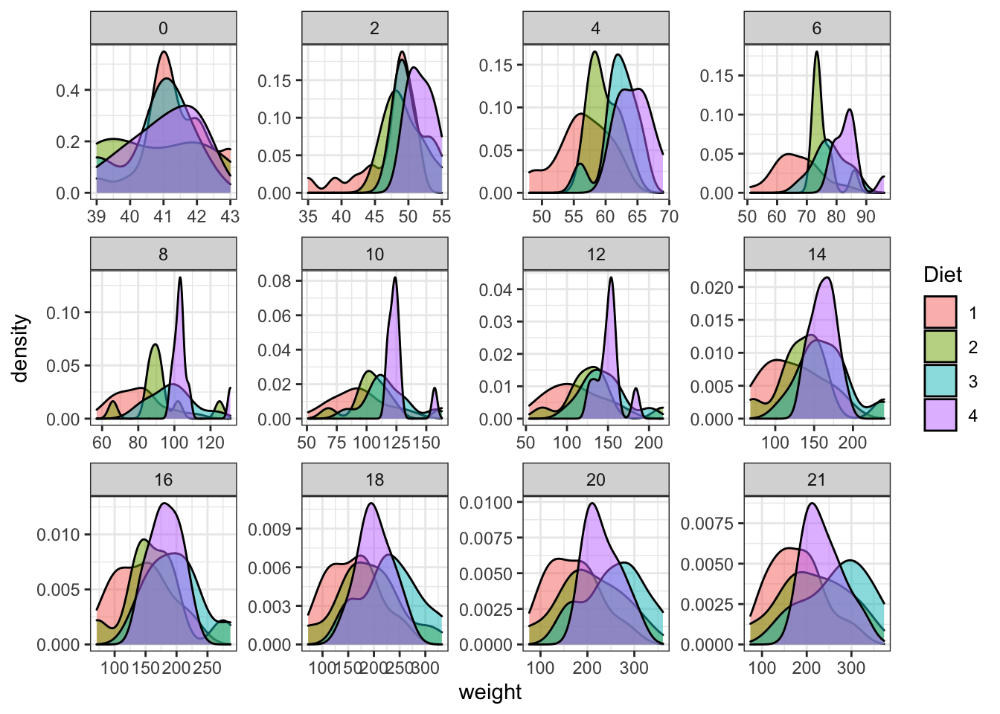

# Data manipulation

## Objectives

After this section you should be able to:

1. Load, explore and manipulate data in R


## Introduction

One of the main uses of R is for data manipulation and plot. This is similar to what many of us do in any regular table editor as excel or google spread sheet. 

We will use the following packages. You can read in detail the manual of each of them.


```r
#Install packages
#install.packages("ggplot2")
#install.packages("dplyr")
#install.packages("plyr")

#Load the package
library("ggplot2")
library("dplyr")
library("plyr")
library(RColorBrewer)
library(car)

#Manuals
#vignette("dplyr")
#?ggplot2
#?plyr
```

## Load data

There are many ways to load data. In the following chapters we will use a diverse set of functions to read the data from files. Some of them are:

```
read.table() #general to any type of table
read.csv() #specific for comma sepparated tables
read.delim() #specific for tab delimited tables
```

Some of the important options of these function are:
```
read.table(file = "location/of/your/file.txt",sep = ".",header = T or F)
```
Where the separator can be a comma, dot, etc. You can see more details using: `?read.table`

In this case we will use data that is already available in R. The package [datasets](https://stat.ethz.ch/R-manual/R-devel/library/datasets/html/00Index.html) provides a handful set of data to analyze. 

We will use the [ChickWeight](https://stat.ethz.ch/R-manual/R-devel/library/datasets/html/ChickWeight.html) dataset. This is data set of weight in chickens with age an different diet. 

This will allow us to visualize the data and to do some statistic tests.


```r
# Install the package
#install.packages("datasets")
# For a full list of these datasets, type library(help = "datasets")
# Load the library and dataset
library(datasets)
data(ChickWeight) #What happens in the Environment section of RStudio?
```

## Data exploration 

It is important to understand the data before heading into the analysis. We will go over some techniques for this.


```r
# To see the table, you can click on the environment part or run this...
#View(ChickWeight)

# As you can see this is a table, just in case we want to convert it to a data.frame
ChickWeight<-as.data.frame(ChickWeight)
```
To see only the beginning, we can use the head function:
  

```r
head(ChickWeight)
```

```
##   weight Time Chick Diet
## 1     42    0     1    1
## 2     51    2     1    1
## 3     59    4     1    1
## 4     64    6     1    1
## 5     76    8     1    1
## 6     93   10     1    1
```

>What is n doing?


```r
head(ChickWeight,n = 20) 
```

```
##    weight Time Chick Diet
## 1      42    0     1    1
## 2      51    2     1    1
## 3      59    4     1    1
## 4      64    6     1    1
## 5      76    8     1    1
## 6      93   10     1    1
## 7     106   12     1    1
## 8     125   14     1    1
## 9     149   16     1    1
## 10    171   18     1    1
## 11    199   20     1    1
## 12    205   21     1    1
## 13     40    0     2    1
## 14     49    2     2    1
## 15     58    4     2    1
## 16     72    6     2    1
## 17     84    8     2    1
## 18    103   10     2    1
## 19    122   12     2    1
## 20    138   14     2    1
```

> What is the structure of the data.frame?


```r
str(ChickWeight) 
```

```
## 'data.frame':	578 obs. of  4 variables:
##  $ weight: num  42 51 59 64 76 93 106 125 149 171 ...
##  $ Time  : num  0 2 4 6 8 10 12 14 16 18 ...
##  $ Chick : Ord.factor w/ 50 levels "18"<"16"<"15"<..: 15 15 15 15 15 15 15 15 15 15 ...
##  $ Diet  : Factor w/ 4 levels "1","2","3","4": 1 1 1 1 1 1 1 1 1 1 ...
```

With the **$ operator** we can explore the columns

```r
class(ChickWeight$weight)
```

```
## [1] "numeric"
```

We can see the **dimensions of the table** for example:  how many **rows** it has?

```r
nrow(ChickWeight)
```

```
## [1] 578
```
How many **columns**?

```r
ncol(ChickWeight)
```

```
## [1] 4
```

The **names** of columns

```r
names(ChickWeight)
```

```
## [1] "weight" "Time"   "Chick"  "Diet"
```

With the **[]** we can access the individual elements

```r
names(ChickWeight)[3]
```

```
## [1] "Chick"
```
We can see the levels of a factor

```r
levels(ChickWeight$Diet)[1:3]
```

```
## [1] "1" "2" "3"
```
What is the difference if we just print the column?

```r
ChickWeight$Diet[1:3]
```

```
## [1] 1 1 1
## Levels: 1 2 3 4
```

Can we see the levels of a numeric vector? This is a reminder that the data type is important.
```
levels(ChickWeight$weight) # nop
```

We can now get different basic statistics now:

```r
mean(ChickWeight$weight)
```

```
## [1] 121.8183
```


```r
summary(ChickWeight$weight)
```

```
##    Min. 1st Qu.  Median    Mean 3rd Qu.    Max. 
##    35.0    63.0   103.0   121.8   163.8   373.0
```

```r
summary(ChickWeight)
```

```
##      weight           Time           Chick     Diet   
##  Min.   : 35.0   Min.   : 0.00   13     : 12   1:220  
##  1st Qu.: 63.0   1st Qu.: 4.00   9      : 12   2:120  
##  Median :103.0   Median :10.00   20     : 12   3:120  
##  Mean   :121.8   Mean   :10.72   10     : 12   4:118  
##  3rd Qu.:163.8   3rd Qu.:16.00   17     : 12          
##  Max.   :373.0   Max.   :21.00   19     : 12          
##                                  (Other):506
```

To see what is this exactly doing, just go to the help page:
`?summary`
 
To save this summary table we can create an object with just the result of the summary

```r
chick_sumary<-summary(ChickWeight)
chick_sumary
```

```
##      weight           Time           Chick     Diet   
##  Min.   : 35.0   Min.   : 0.00   13     : 12   1:220  
##  1st Qu.: 63.0   1st Qu.: 4.00   9      : 12   2:120  
##  Median :103.0   Median :10.00   20     : 12   3:120  
##  Mean   :121.8   Mean   :10.72   10     : 12   4:118  
##  3rd Qu.:163.8   3rd Qu.:16.00   17     : 12          
##  Max.   :373.0   Max.   :21.00   19     : 12          
##                                  (Other):506
```

```r
class(chick_sumary)
```

```
## [1] "table"
```
We can change the data kind, and assign it to a different object

```r
chick_sumary_df<-as.data.frame(chick_sumary)
```
This is not that useful as you can see if you inspect the data in using View(chick_sumary_df) this is because it is a complicated format, we better just save the table. 
We will see other ways to save data in R in the future chapters.
You can see more details using: `?write.table`


```r
write.table(chick_sumary, "mydata.txt", sep="\t",row.names = F,col.names = T)
#this is clearly no perfect but for the important part, the numeric and integer columns, we have the stat
```

## Subsetting

Subsetting means extracting part of the data. There are many different ways to do this. One important notion for tables and data frames is that dimensions go as follows:
`data[row,column]`


```r
#we can see specific columns and rows
ChickWeight[1,1:3] #row 1, column 1:3
```

```
##   weight Time Chick
## 1     42    0     1
```

```r
ChickWeight[1:3,1] #col 1, row 1:3
```

```
## [1] 42 51 59
```

```r
ChickWeight[1,1] #row1, col1
```

```
## [1] 42
```
If we want to know for example only the data from the chickens taking the diet 4

```r
head(ChickWeight[ChickWeight$Diet==4,])
```

```
##     weight Time Chick Diet
## 461     42    0    41    4
## 462     51    2    41    4
## 463     66    4    41    4
## 464     85    6    41    4
## 465    103    8    41    4
## 466    124   10    41    4
```
> Why == and no =?

Remember in R, = is an assignment, as the <-, while the == is for comparison.


```r
head(ChickWeight$Diet==4)
```

```
## [1] FALSE FALSE FALSE FALSE FALSE FALSE
```
Lets explore the class: 

```r
class(ChickWeight$Diet==4)
```

```
## [1] "logical"
```
So, when we do ChickWeight[ChickWeight$Diet==4,], R is just showing the ChickWeight for which ChickWeight$Diet==4 is TRUE

```r
head(which(ChickWeight$Diet==4))
```

```
## [1] 461 462 463 464 465 466
```

```r
head(ChickWeight[ChickWeight$Diet==4,])
```

```
##     weight Time Chick Diet
## 461     42    0    41    4
## 462     51    2    41    4
## 463     66    4    41    4
## 464     85    6    41    4
## 465    103    8    41    4
## 466    124   10    41    4
```
And for more conditions, we can use AND (&) to integrate them.

```r
head(ChickWeight[ChickWeight$Diet==4 & ChickWeight$Time>6,])
```

```
##     weight Time Chick Diet
## 465    103    8    41    4
## 466    124   10    41    4
## 467    155   12    41    4
## 468    153   14    41    4
## 469    175   16    41    4
## 470    184   18    41    4
```
Other option is OR (|). 

Remember, computers will read as things come
$$
condition-A AND condition-B OR condition-C
condition-A & condition-B | condition-C
$$
 Is not the same as 

$$
condition A & (condition B | condition C)
$$


```r
head(ChickWeight[ChickWeight$Diet==4 & ChickWeight$Time>6 & ChickWeight$Time<20,])
```

```
##     weight Time Chick Diet
## 465    103    8    41    4
## 466    124   10    41    4
## 467    155   12    41    4
## 468    153   14    41    4
## 469    175   16    41    4
## 470    184   18    41    4
```
And if we just want the weights of these...

```
ChickWeight$weight[ChickWeight$Diet==4 & ChickWeight$Time>6 & ChickWeight$Time<20,] 
```
>why this gives an error? 

Because we only have one dimension now, not 2. 
ChickWeight$weight is one dimention object, so we have to use [ ], not [ , ].


```r
head(ChickWeight$weight[ChickWeight$Diet==4 & ChickWeight$Time>6 & ChickWeight$Time<20])
```

```
## [1] 103 124 155 153 175 184
```

## Activity: 

This activity integrates knowledge from the previous chapter.

**1. Remove the first and last row of the ChickWeight data frame**
**2. Create a vector with the second column from the data frame**


# Visualization and Statistical test

## Objectives

After this section you should be able to:

1. Plot and explore the data in many ways.
2. Do statistical tests on the data.

## Introduction

We will use the same data we already explored in last chapter. Remember: chickens weight, age (Time) for different diets.

There are many things we can explore in this data. Each question we might want to answer will be better addressed using different plots.
For example: 
1. If the chickens are older we expect them to be bigger. This can be visualized using a dotplot.
2. We might want to see the distribution of weight separated by diet. This can be addressed by a histogram.

## Plots

We will use the package `ggplot2`. It is a very useful and documented package. We will focus on the `ggplot` function. This function generates plots as *layers*. This allows us to manipulate the colors, the plot type, etc. I know it can be difficult to understand it at the beginning but after a while it becomes really intuitive. 

Important things to consider:
1. We will be able to plot anything that is a *column* in the data frame.
2. Everything is or can be a layer in the plot.
3. When you decide to color or shape by a factor that separates your data this will impact the plot.

Again,we can plot any column. So lets axplore the columns. It is important to know the class of each column. It is not the same trying to plot a number, than a letter. 


```r
names(ChickWeight) #names of the columns in the data frame
```

```
## [1] "weight" "Time"   "Chick"  "Diet"
```


```r
head(ChickWeight) #head of the data frame
```

```
##   weight Time Chick Diet
## 1     42    0     1    1
## 2     51    2     1    1
## 3     59    4     1    1
## 4     64    6     1    1
## 5     76    8     1    1
## 6     93   10     1    1
```


```r
str(ChickWeight) #structure of the data frame
```

```
## 'data.frame':	578 obs. of  4 variables:
##  $ weight: num  42 51 59 64 76 93 106 125 149 171 ...
##  $ Time  : num  0 2 4 6 8 10 12 14 16 18 ...
##  $ Chick : Ord.factor w/ 50 levels "18"<"16"<"15"<..: 15 15 15 15 15 15 15 15 15 15 ...
##  $ Diet  : Factor w/ 4 levels "1","2","3","4": 1 1 1 1 1 1 1 1 1 1 ...
```

### Line and points

To see things as correlations, we usually use points and lines. We will see how to do it using different plot options.

Dot plot with basic qplot (from ggplot but les complex)

```r
qplot(data=ChickWeight,x = weight, y=Time, geom = c("line","point"))
```

<div class="figure" style="text-align: center">

<p class="caption">(\#fig:unnamed-chunk-351)Point and line plots</p>
</div>

```r
qplot(data=ChickWeight,x = weight, y=Time, geom = c("line","point"), colour=Diet) #adding the color helps to separate the data
```

<div class="figure" style="text-align: center">

<p class="caption">(\#fig:unnamed-chunk-352)Point and line plots</p>
</div>
The same using ggplot:

```r
ggplot(data = ChickWeight, aes(y = weight, x=Time,colour=Diet))+ #data and basic things about the plot
  geom_point() + #add the type of plot
  scale_colour_brewer(palette = "Set1") #add a colot pallet
```

<div class="figure" style="text-align: center">

<p class="caption">(\#fig:unnamed-chunk-361)Point and line plots</p>
</div>

```r
ggplot(data = ChickWeight, aes(y = weight, x=Time,colour=Diet))+ #data and basic things about the plot
  geom_point() + #add the type of plot
  geom_smooth() + #add a trend line of mean plus se
  scale_colour_brewer(palette = "Set1")
```

<div class="figure" style="text-align: center">

<p class="caption">(\#fig:unnamed-chunk-362)Point and line plots</p>
</div>
### Historgam and density plots

Histograms are used to represent the distribution of a variable over the population. If you want to read more you can go to this [link](https://en.wikipedia.org/wiki/Histogram). Other way to represent the same thing is to use cumulative plots we are not going to explore them now but if you are interested in doing them with ggplot you can go to this [link](https://stackoverflow.com/questions/15844919/cumulative-plot-using-ggplot2)

[Density plots](https://en.wikipedia.org/wiki/Density_estimation) are similar to histograms but implies a more complex treatment of the data. They look like smooth histogram. They are the probability density function of the variable.


```r
qplot(data = ChickWeight,x=weight, binwith=10)
```

<div class="figure" style="text-align: center">

<p class="caption">(\#fig:unnamed-chunk-371)Histogram and Density plots</p>
</div>

```r
qplot(data = ChickWeight,x=weight, binwith=10, colour=Diet) #the color separates the data
```

<div class="figure" style="text-align: center">

<p class="caption">(\#fig:unnamed-chunk-372)Histogram and Density plots</p>
</div>

```r
qplot(data = ChickWeight,x=weight, geom = "density", colour=Diet)
```

<div class="figure" style="text-align: center">

<p class="caption">(\#fig:unnamed-chunk-373)Histogram and Density plots</p>
</div>
With ggplot

```r
ggplot(data = ChickWeight, aes(x=weight,color=Diet))+
  geom_histogram(fill="white", position="identity")+
  scale_colour_brewer(palette = "Set1")#this is selecting the color scheme, try taking it out, or mofyfying it
```

<div class="figure" style="text-align: center">

<p class="caption">(\#fig:unnamed-chunk-381)Point and line plots</p>
</div>

```r
ggplot(data = ChickWeight, aes(x=weight,fill=Diet))+
  geom_density( alpha=0.5)+ #the density plot with the option to modify the transparency of the polot solor, it goes between 0 and 1. Try modifying it.
  scale_colour_brewer(palette = "Set1")
```

<div class="figure" style="text-align: center">

<p class="caption">(\#fig:unnamed-chunk-382)Point and line plots</p>
</div>
### Boxplot

Boxplots are a nice way to visualize the data distribution and to get and intuition of how this is different between conditions. As you can see in this figure, it summarizes a LOT of information:

<div class="figure" style="text-align: center">

<p class="caption">(\#fig:unnamed-chunk-39)Boxplot description. Figrue affapted from https://www.simplypsychology.org/boxplots.html</p>
</div>


```r
ggplot(data = ChickWeight, aes(y=weight,x=as.factor(Time),fill=Diet))+ #Note how the x, y and color changes
  geom_boxplot()+ #this is adding the boxplot
  scale_colour_brewer(palette = "Set1") 
```

<div class="figure" style="text-align: center">

<p class="caption">(\#fig:unnamed-chunk-40)Boxplot</p>
</div>

What happens if we do not use the `as.factor`? Again, a reminder that the data type is important!


```r
ggplot(data = ChickWeight, aes(y=weight,x=Time,fill=Diet))+ 
  geom_boxplot()+ #this is adding the boxplot
  scale_colour_brewer(palette = "Set1")
```

<div class="figure" style="text-align: center">

<p class="caption">(\#fig:unnamed-chunk-41)Boxplot</p>
</div>

It seems interesting to separate this by age (Time). This is achieved by another layer named [facet](https://plotly.com/ggplot2/facet_wrap/).

```r
ggplot(data = ChickWeight, aes(x=weight,fill=Diet))+
  geom_density( alpha=0.5)+ 
  scale_colour_brewer(palette = "Set1")+
  facet_wrap(~Time,scales = "free") #This will separate the data into panels given the time, try looking for the meaning of the scale option
```

<div class="figure" style="text-align: center">

<p class="caption">(\#fig:unnamed-chunk-421)Plot separating by age of the chicken</p>
</div>

```r
ggplot(data = ChickWeight, aes(y=weight,x=as.factor(Time),fill=Diet))+
  geom_boxplot()+scale_colour_brewer(palette = "Set1")+
  facet_wrap(~Time,scales = "free")
```

<div class="figure" style="text-align: center">

<p class="caption">(\#fig:unnamed-chunk-422)Plot separating by age of the chicken</p>
</div>

```r
ggplot(data = ChickWeight, aes(y=weight,x=as.factor(Time),fill=Diet))+
  geom_violin()+
  scale_colour_brewer(palette = "Set1")+
  facet_wrap(~Time,scales = "free")
```

<div class="figure" style="text-align: center">

<p class="caption">(\#fig:unnamed-chunk-423)Plot separating by age of the chicken</p>
</div>


### Saving plots

Imagine you want now to save some of these plots. You can use the button **export** in RStudio. But you can also use the `pdf` function. 

This function allows us to determine the width and height of the plots. Check what happens if you modify the option in the plots below.

These pdf files will be saved on your working directory with the name, width and height determined in the function. 

Important things: 

1. Do not forget to put the ".pdf" at the end of the file name. What do you think it will happen if you forget it?
2. When you finish running the plots that you want to be in the pdf file, you have to run `dev.off()`. This will close the plot. If you forget this, you will not be able to open the plot.


```r
pdf("densityplot.pdf",width = 20, height = 20) #save the plot as a pdf, control width and height of the pdf
ggplot(data = ChickWeight, aes(x=weight,fill=Diet))+
  geom_density( alpha=0.5)+
  scale_colour_brewer(palette = "Set1")+
  facet_wrap(~Time,scales = "free")

dev.off() #end the plot


pdf("density_and_violin.plot.pdf",width = 20, height = 20) #save the plot as a pdf, control width and height of the pdf
ggplot(data = ChickWeight, aes(x=weight,fill=Diet))+
  geom_density( alpha=0.5)+
  scale_colour_brewer(palette = "Set1")+
  facet_wrap(~Time,scales = "free")

ggplot(data = ChickWeight, aes(y=weight,x=as.factor(Time),fill=Diet))+
  geom_violin()+
  scale_colour_brewer(palette = "Set1")+
  facet_wrap(~Time,scales = "free")

dev.off() #end the plot
```

```
## quartz_off_screen 
##                 2 
## quartz_off_screen 
##                 2
```


## Statistical test

### Descriptive statistics

We already saw a way to get the descriptive stats from a table by using `summary`.

We will try to compare the weight of chickens under different diets without considering the age. 

First, we will now do a mean and SD table for each diet. There is one function that can do this for us.
`ddply` is a function that first divides the data by a variable written as .(Var) and then perform an specific function. With the indication of "transform" this will create a new column in out data


```r
stat_ChickWeight<-ddply(ChickWeight,  .(Diet),  transform,  Mean=mean(weight,na.rm = T), SD=sd(weight,na.rm = T))

head(stat_ChickWeight)
```

```
##   weight Time Chick Diet     Mean       SD
## 1     42    0     1    1 102.6455 56.65655
## 2     51    2     1    1 102.6455 56.65655
## 3     59    4     1    1 102.6455 56.65655
## 4     64    6     1    1 102.6455 56.65655
## 5     76    8     1    1 102.6455 56.65655
## 6     93   10     1    1 102.6455 56.65655
```

> Is this what we wanted?
What happens if instead of "transform" we use "summarize"? Check `?ddply` for more detail.


```r
statWeight_ChickWeight<-ddply(ChickWeight,  .(Diet),  summarise,  Mean=mean(weight,na.rm = T), SD=sd(weight,na.rm = T))

head(statWeight_ChickWeight)
```

```
##   Diet     Mean       SD
## 1    1 102.6455 56.65655
## 2    2 122.6167 71.60749
## 3    3 142.9500 86.54176
## 4    4 135.2627 68.82871
```
This is usefull for ploting, here a good plot:

```r
ggplot(statWeight_ChickWeight, aes(x=Diet, y=Mean, fill=Diet)) + 
   geom_bar(stat="identity", position=position_dodge()) +
  geom_errorbar(aes(ymin=Mean-SD, ymax=Mean+SD), width=.2,
                 position=position_dodge(.9))
```

<div class="figure" style="text-align: center">

<p class="caption">(\#fig:unnamed-chunk-46)Boxplot</p>
</div>

### T-test/Wilcoxon

To compare means we can do a T test but to do this we need to test the assumptions of this test: **Normality** of the data and Homoscedasticity (ie, the variance is similar between the two groups we want to compare)

*Question* : Is there any significant difference in the weights between diet 1 and 3?
Preliminary test to check independent t-test assumptions

*Assumption 1*: Are the two samples independents?
Yes, they are two different samples

*Assumption 2*: Are the data from each of the 2 groups follow a normal distribution?

Shapiro-Wilk normality test for the different diets


```r
shapiro.test(ChickWeight$weight[ChickWeight$Diet==1])
```

```
## 
## 	Shapiro-Wilk normality test
## 
## data:  ChickWeight$weight[ChickWeight$Diet == 1]
## W = 0.89336, p-value = 2.211e-11
```

The function with allows us to do a simpler writing

```r
with(ChickWeight, shapiro.test(weight[Diet == 1]))
```

```
## 
## 	Shapiro-Wilk normality test
## 
## data:  weight[Diet == 1]
## W = 0.89336, p-value = 2.211e-11
```

```r
with(ChickWeight, shapiro.test(weight[Diet == 2]))
```

```
## 
## 	Shapiro-Wilk normality test
## 
## data:  weight[Diet == 2]
## W = 0.90399, p-value = 3.159e-07
```

pvalue < 0.05, these are not normally distributed. We can NOT use t-test here. If we remember the histograms, this makes sense.


```r
qplot(data=ChickWeight, x = weight, facets = "Diet",geom = "density")
```

<div class="figure" style="text-align: center">

<p class="caption">(\#fig:unnamed-chunk-50)**CAPTION THIS FIGURE!!**</p>
</div>

*Assumption 3*: Do the two populations have the same variances?

We’ll use F-test to test for homogeneity in variances. This is implemented by a function named `var.test`. This will require you to have which variable you want to test and separated by which variable. 
This is clearly also not homoscedastic.


```r
var.test(weight~ Diet, data = ChickWeight[ChickWeight$Diet %in% c(1,2),])
```

```
## 
## 	F test to compare two variances
## 
## data:  weight by Diet
## F = 0.62601, num df = 219, denom df = 119, p-value = 0.002928
## alternative hypothesis: true ratio of variances is not equal to 1
## 95 percent confidence interval:
##  0.4525703 0.8530014
## sample estimates:
## ratio of variances 
##           0.626013
```
> What happens if you try to run this `var.test(weight~ Diet, data = ChickWeight)`?

We will use then Wilcoxon.


```r
wilcox.test(weight~ Diet, data = ChickWeight[ChickWeight$Diet %in% c(1,2),],exact = FALSE)
```

```
## 
## 	Wilcoxon rank sum test with continuity correction
## 
## data:  weight by Diet
## W = 11213, p-value = 0.02181
## alternative hypothesis: true location shift is not equal to 0
```

> Are them different?

### Anova/Kruskal–Wallis 

Another way to test differences is to do an [ANOVA](https://en.wikipedia.org/wiki/Analysis_of_variance) or its non-parametric alternative [Kruskal–Wallis](https://en.wikipedia.org/wiki/Kruskal–Wallis_one-way_analysis_of_variance). We already know that this data cannot be analyzed using parametric test as anova. But let’s explore just for fun.

Let’s check all the diets together

```r
# Compute the analysis of variance
res.aov <- aov(weight~ Diet, data = ChickWeight)
# Summary of the analysis
summary(res.aov)
```

```
##              Df  Sum Sq Mean Sq F value   Pr(>F)    
## Diet          3  155863   51954   10.81 6.43e-07 ***
## Residuals   574 2758693    4806                     
## ---
## Signif. codes:  0 '***' 0.001 '**' 0.01 '*' 0.05 '.' 0.1 ' ' 1
```

We see that the diet is a significant component of the variance of the data. Now we should know from where it is coming. We need to do a multiple pairwise-comparison. We will use Tukey Honest Significant Difference for this.


```r
TukeyHSD(res.aov)
```

```
##   Tukey multiple comparisons of means
##     95% family-wise confidence level
## 
## Fit: aov(formula = weight ~ Diet, data = ChickWeight)
## 
## $Diet
##          diff         lwr      upr     p adj
## 2-1 19.971212  -0.2998092 40.24223 0.0552271
## 3-1 40.304545  20.0335241 60.57557 0.0000025
## 4-1 32.617257  12.2353820 52.99913 0.0002501
## 3-2 20.333333  -2.7268370 43.39350 0.1058474
## 4-2 12.646045 -10.5116315 35.80372 0.4954239
## 4-3 -7.687288 -30.8449649 15.47039 0.8277810
```

However, you should be screaming at me now: I did not check the assumptions!

1. *Homogeneity of variances*:


```r
plot(res.aov, 1)
```

<div class="figure" style="text-align: center">

<p class="caption">(\#fig:unnamed-chunk-55)**CAPTION THIS FIGURE!!**</p>
</div>


```r
leveneTest(weight~ Diet, data = ChickWeight)
```

```
## Levene's Test for Homogeneity of Variance (center = median)
##        Df F value    Pr(>F)    
## group   3  9.6001 3.418e-06 ***
##       574                      
## ---
## Signif. codes:  0 '***' 0.001 '**' 0.01 '*' 0.05 '.' 0.1 ' ' 1
```
We have just found what we already know. The variance is not homogeneous. The variance across groups is statistically significantly different.


2. *Normality of the residuals*:


```r
plot(res.aov, 2)
```

<div class="figure" style="text-align: center">

<p class="caption">(\#fig:unnamed-chunk-57)**CAPTION THIS FIGURE!!**</p>
</div>


```r
# Extract the residuals
aov_residuals <- residuals(object = res.aov )
# Run Shapiro-Wilk test
shapiro.test(x = aov_residuals )
```

```
## 
## 	Shapiro-Wilk normality test
## 
## data:  aov_residuals
## W = 0.94065, p-value = 2.014e-14
```

Non parametric then:

```r
kruskal.test(weight~ Diet, data = ChickWeight)
```

```
## 
## 	Kruskal-Wallis rank sum test
## 
## data:  weight by Diet
## Kruskal-Wallis chi-squared = 24.45, df = 3, p-value = 2.012e-05
```

> What would you conclude about this data?

## Activity: 

**Find another thing you want to test with this data. Solve this in a graphical and statistical way. Save the plots**


## Resources

* Statistics with R: https://cran.r-project.org/doc/contrib/Seefeld_StatsRBio.pdf
* Stat and plots with R: http://www.sthda.com/english/
