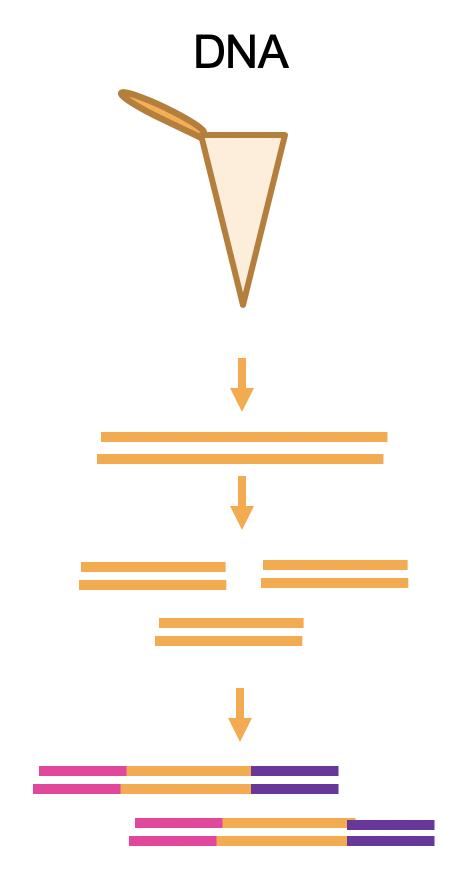

# Sequencing techniques and preprocessing

## Objectives

After this section you should be able to:

1. Have an overview of different sequencing techniques and different genomic data
2. Understand the pre-processing of the data before loading it into R

## Introduction

Large scale sequencing techniques become more and more common as high throughput sequencing technologies became cheaper and widely available. The main objective of these techniques is to quantify the levels of different molecules: DNA, RNA and proteins. 
The "central dogma of molecular biology" states the main flow from the information stated on genes in the DNA to the expression of proteins. DNA is transcribed to RNA that then is translated to proteins. **DNA --> RNA --> Protein**
However, this straight line misses a lot of other molecules as miRNAs, lincRNAs, transposons, etc. Moreover, not only the levels but also the quality and property of each molecule is important. One example is different RNA splicing isoforms or protein modifications.

## Different type of data (DNA, RNA, splicing, single-end paired-end)

It is important to know which type of sequencing techniques are available, its pros and cons and which type of molecules we are able to capture without sequencing.
Even more important we need to understand the characteristics of the data we are analyzing. For example, DNA and RNA libraries differ in the fact that one undergoes splicing. That will affect the way the data is processed.

Nowadays, there are two main types of libraries for nucleotides: short reads libraries and long reads libraries. Long-read techniques are more recently developed with two main technologies available: Pacific Biosciences’ (PacBio) single-molecule real-time (SMRT) sequencing and Oxford Nanopore Technologies’ (ONT) nanopore sequencing. In this book we will focus on short-read libraries, as the ones processed by Illumina machines. This technology is based on PCR amplification of the material and the base pairing with different fluorescently tagged nucleotides. 

<div class="figure" style="text-align: center">

<p class="caption">(\#fig:unnamed-chunk-1)Illumina sequencer strategy, adapted from Illumina user manual www.illumina.com/technology/next-generation-sequencing.html</p>
</div>

There are many library preparation protocols for Illumina sequencers. All of these techniques must include a step of fragmentation and adapter ligation. These adapters are essential to the inclusion of the fragments in the sequencer machine. Moreover, different samples might be pulled together by the use of different adapters with specific sample barcode. The idea of a barcode is the presence of specific sequences that can identify the origin of each sequence fragment. The process of separating each sample is called *demultiplexing*.

<div class="figure" style="text-align: center">

<p class="caption">(\#fig:unnamed-chunk-2)Demultiplexing strategy</p>
</div>
Depending on the molecule of interest the library preparation to detect them will be different. For DNA the addition of the Illumina adaptors can be done by ligation or by tagmentation (which does the fragmentation and tagging at the same time). In this case, as DNA has NOT an orientation (is double stranded and palindromic) we do not care which adapter get in which side of the fragment. 

<div class="figure" style="text-align: center">

<p class="caption">(\#fig:unnamed-chunk-3)DNA library prep</p>
</div>

Contrary to DNA, RNA is single stranded and have a particular direction (5´-3´). It can be produced from the sense or antisense strand of the DNA which is a key property as some parts of the DNA encode different genes in each strand. Therefore, it is important to maintain the direction information from the RNA molecules. This is usually achieved thru the different 3´and 5´ Illumina adaptors.

There are many types of RNA molecules with different biochemical properties. To capture each of them, there are different biochemical approaches. 
For small RNAs (20-30nts), usually the library starts with specific small RNA extraction methods.
To capture polyadenylated mRNAs, we can add a poly A selection step using polyT oligo beads for example. If this step is done after the RNA is fragmented then this library will be 3´UTR selected. This type of libraries do not provide information about the splicing isoforms for example but it is useful to asses gene expression levels and is cheaper than multiple qPCRs. Most commonly used single cell sequencing technology use this type of libraries.
To study also non-polyadenylated transcripts, as lncRNA and circRNAs, we have to deplete the libraries from ribosomal RNA which is the majority of the RNA. This can be achieved by using DNA complementary probes to rRNA followed by RNAseH digestion (cut RNA-DNA hybrids).

<div class="figure" style="text-align: center">

<p class="caption">(\#fig:unnamed-chunk-4)Different RNA librarie strategies</p>
</div>

Regarding sequencing itself we can choose the length of the read and if we want to read only from side of the fragment (**single-ended**) of from both sides (**paired-ended**). Both options have different advantages. To capture different splicing patterns for example, paired-end is recommended.

## From the sequencer machine to the sequence

Illumina sequencing machines can be thought as fluorescence microscopes. The information they generate are basically photographs in which each color represent one nucleotide. The first step to produce the sequences is to process these images an convert them in sequences. This is done using the Illumina program *bcl2fastq*. This process is named *basecalling* and process the raw data form Illumina: basecalls files (BCL) and produces Fastq files. 

<div class="figure" style="text-align: center">

<p class="caption">(\#fig:unnamed-chunk-5)From BCL to Fastq</p>
</div>

Each fragment sequenced by the machine is named **READ** and all the reads together form a **LIBRARY**. Fastq format basically encodes the "name" of each read, the nucleotides and quality in [ASQII format](https://www.cs.cmu.edu/~pattis/15-1XX/common/handouts/ascii.html). 

<div class="figure" style="text-align: center">

<p class="caption">(\#fig:unnamed-chunk-6)Fastq Format</p>
</div>

The overall quality of the *library* can be assed using programs as [FastQC](https://www.bioinformatics.babraham.ac.uk/projects/fastqc/). These programs read the quality and generate a overall measurement of them. Each time the machine sequences a read it evaluates the confidence it has to assign it to a particular nucleotide. This is a general idea of what the quality of each base means.

Low quality reads can be filtered and low-quality bases can be trimmed from reads using tools as [trimgalore](https://www.bioinformatics.babraham.ac.uk/projects/trim_galore/) or [cutadapt](https://cutadapt.readthedocs.io/en/stable/).

## General processing

Once we have the sequencing data in fastq format we have to find where each read comes from. This is called **alignment**. The next step is to **quantify** how many reads comes from each place in the genome.

<div class="figure" style="text-align: center">

<p class="caption">(\#fig:unnamed-chunk-7)General processing</p>
</div>

###Alignment (bam files, annotation files, BOWTIE2 and STAR)

Once we have the fastq file we have to "find" which part of the genome it is coming from. This process is called **alignment**. Unless we are working with uncommon organisms, most genomes are already sequenced, which means we already know the sequence of each part of the genome. Therefore, this step is almost trivial. We have to **align** the **reads** to the **genome**. 

The reads are in **fastq** format, and the genome are in **fasta** format. The fasta format start with `> The name of the chromosome` and then it stores the sequence of the chromosome.

```
>chr1
AAATTCGGGCCAA...
```

Maybe you have already heard about BLAST alignment. Unfortunately, this is not fast enough to aligns the millons of reads we generate from each sequencing experiment. Therefore, new techniques were developed. There are many different really good tools available. It is not the same to align DNA that RNA. The main difference is the splicing awareness and the use of the gene annotation.

<div class="figure" style="text-align: center">

<p class="caption">(\#fig:unnamed-chunk-8)DNA vs RNA alignement single and paired end</p>
</div>

The gene annotation files contain the information about which gene is encoded in each part of the genome. It include exons, introns and different transcript variants. There are different format of annotation files. The mostly used ones are [gtf](https://useast.ensembl.org/info/website/upload/gff.html) and [bed12](https://genome.ucsc.edu/FAQ/FAQformat.html#format1). Both contain the information about gene name, chromosome, start, end, number of exons and where each exon start. 

Of course, both the genome and the annotation files are updated frequently so you should consider update them as you can. Databases commonly used are [ENSEMBL](https://useast.ensembl.org/info/data/ftp/index.html) and [UCSC](https://genome.ucsc.edu/cgi-bin/hgTables).

Just to show one example, gtf of fly annotation version dm6:

```
#gff-version 2
#source-version rtracklayer 1.38.3
#date 2018-04-23
#genome-build .	BDGP6
chr3R	FlyBase	gene	567076	2532932	.	+	.	gene_id "FBgn0267431"; gene_name "Myo81F"; gene_source "FlyBase"; gene_biotype "protein_coding";
chr3R	FlyBase	transcript	567076	2532932	.	+	.	gene_id "FBgn0267431"; gene_name "Myo81F"; gene_source "FlyBase"; gene_biotype "protein_coding"; transcript_id "FBtr0392909"; transcript_name "Myo81F-RB"; transcript_source "FlyBase"; transcript_biotype "protein_coding";
```

One we have aligned the data, we will have **.sam** files or its binary "lighter/smaller" version **.bam**. [These files](http://samtools.github.io/hts-specs/SAMv1.pdf) are composed of one line per read. Each line has the read names, its sequence and the location to where it was aligned it also have encoded a lot of different quality metrics including the already discussed fastq quality. Each alignment will have different alignment quality. A perfect read with a perfect match to the reference genome would give a perfect score. The presence of gaps on the alignment would reduce the alignment quality. Reads with low quality (less than 20 for example) are usually filtered and not used in downstream analysis. 

Here the example for two reads of the data sets used in next chapter. 
```
SRR548157.14400783	16	chr2L	24	1	36M	*	0	AGAACAGATATTTAGATTGCCTCTCATTTTCTCTCC	HHDHHHHHHHHFHHHHHHHHFHEHHHHHHHHHHHFG	AS:i:0	XS:i:0	XN:i:0	XM:i:0	XO:i:0	XG:i:0	NM:i:0	MD:Z:36	YT:Z:UU
SRR548157.4410720	0	chr2L	247	1	36M	*	0	AGTGCCAACATATTGTGCTAATGAGTGCCTCTCGTT	E@=?@BDDBDHGHGHDHGIGGIBGGDEGFGB@BEBD	AS:i:0	XS:i:0	XN:i:0	XM:i:0	XO:i:0	XG:i:0	NM:i:0	MD:Z:36	YT:Z:UU
```
Reads can be also aligning to one or multiple sites in the genome. This last option is usually called: **multiple mapping**. For repetitive sequences in the genome, as rRNA loci and transposons, it is expected that they will map to multiples places. For other loci, the multiple mapping can be an indication of low-quality reads. For RNA sequencing analysis multiple mapping reads are problematic when quantifying gene expression so sometimes they are removed from downstream analysis.

Alignment files can be sorted or unsorted. This means basically if the reads are sorted in the order they were in the fastq file or in the order they appear aligned to the genome. A **sorted** file basically will have the reads aligned to chr1 before the ones from chr2, and so on. This is important as some tools (as the visualization) require reads to be sorted.

### Visualization of alignment (IGV)

Alignment files can be visualized using different tools as [UCSC genome browser] (https://genome.ucsc.edu/goldenPath/help/hgTrackHubHelp.html) or [IGV](https://software.broadinstitute.org/software/igv/home. IGV have the option to load your own genomes and annotation data.

To load it we will need the sorted bam files. This will allow us to visualize each read with its alignment quality, gaps, etc. 

<div class="figure" style="text-align: center">

<p class="caption">(\#fig:unnamed-chunk-9)Alignement files (.bam) loaded into the IGV genome browser</p>
</div>

As bam files are really big there are options to store only the total count visualization. These files format can be bigwig or TDF for example. It is importan to note the different scales (jusr right to the file name).

<div class="figure" style="text-align: center">

<p class="caption">(\#fig:unnamed-chunk-10)Bigwig files (.bw) loaded into the IGV genome browser. </p>
</div>

### Gene counts / read (esat feature counts) /peak calling

Many times, it is important to account for the number of reads aligning to each part of the genome. This is what we call quantification and for each type of data we will use different quantification tools.

One example of DNA sequencing data is ChipSeq data, in which we want to know to which parts of the DNA certain protein is binding to. In that case, the number of reads represent the level of binding of that protein. One tool to see this is [MACS2]( https://github.com/macs3-project/MACS/wiki/Advanced%3A-Call-peaks-using-MACS2-subcommands)

For RNA, the number of reads coming from one gene basically represents the level of expression of that gene. For 5´end libraries the tool we can use is [ESAT](https://www.ncbi.nlm.nih.gov/pmc/articles/PMC5052061/). For full transcript libraries we can use tools as [featurecounts]( https://www.rdocumentation.org/packages/Rsubread/versions/1.22.2/topics/featureCounts). To see splicing patterns, [leafcutter](https://github.com/davidaknowles/leafcutter) is one option.

## Using the terminal

The terminal is just a way to execute commands in your computer. It is alternatively referred to as a computer console, root console or system console. It is a non-graphical output of the computer connected with the keyboard. With it you can do anything that you would do with the mouse like for example copy a file or moving it from one location to another. 

Different operating systems for personal computers as Unix (linux and Mac OS) or Windows have different functioning. Most of the genomic programs are written and executed in Unix, if you have a Windows machine you can use a terminal emulator as the ones listed [here](https://www.puttygen.com/windows-terminal-emulators).

A list of useful commands can be found in many places, [here](http://mally.stanford.edu/~sr/computing/basic-unix.html) one example.

The first thing I would recommend you to try is to find which is your working directory (sometimes called *folder*). Remember, is the place in which you are located right now and where things will be executed. You can do so by typing.

```
pwd
```

If you want to know what is inside your current directory, you can *list* the files and folders (directories) by 

```
ls
```
There are other options to visualize this. What happens if you type this?
```
ls -l
```
Usually commands have options and this option is usually indicated by the `-` sign.

Lets try now something more:
```
ls -la
```
You can see that now it appears to be extra directories inside. This is because the option `-a` basically is exposing the hidden files and directories.

The directory `..` and `.` are ways to point to the directory containing the working directory and the working directory itself. I know it is complicated, so let’s see an example. What happens if you do `ls -l ./` ? and `ls -la`? Basically you will see the same elements because `./` is the current directory. 

`../` is the "upper" directory, meaning the directory that contains the working directory. Try it out.

To change directory, `cd` is your command. You just have to say were you want to go. Try:
`cd ../` and explore it with `ls`. Then you can go back into the one you were before with `cd ./thenameyousawbeforewithpwd`

Once you know where you are and how to move, you can start creating new directories or folders with `mkdir`. Each command has certain things you must provide. Try to run just `mkdir`. You will get an error message like this `usage: mkdir [-pv] [-m mode] directory ...`. This is literally letting you know what is the expected ways of things. Basically, it needs the name of the directory you want to create. Try now 

`mkdir try` 

What happens if you do `ls`. Do you see it now? 

To copy a file, we use `cp`. It works as follows `cp whatyouwant towhereyouwantwiththenameyouwant`. For example, 

`cp try trycopy`

To move the location of a file you use `mv what where`. For example: 

`mv try ../` 

Use 

`ls ../` 

to see if is there. 

To remove it you have to use `rm ../try`. You will get an error message as follows:
`rm: try/: is a directory`. To avoid it you have to use the option `-r`. Basically r comes from recursive and is because you want to delete the folder with all the files inside so it "recursively" removes.
Try now `rm -r ../try`. Use `ls ../` to check that it is out. You can also do `cd ../` and then `ls ./` to see that you removed it.

To edit and create text files like scripts I use [vi](https://www.cs.colostate.edu/helpdocs/vi.html) There are many tutorials you can find online. [This](https://www.guru99.com/the-vi-editor.html) is good. Just by saying `vi newtext.txt`, you will be in your brand-new text to edit it.

Understanding the directories is important. There are a set of "special" directories I would like to mention so you just have them in mind.

**/ – The Root Directory**
Is where all the things are. All you programs, folders, etc. 
Lets see some examples of the sub-directories you will find there.
**/bin – Essential User Binaries**
The /bin director contains the essential user binaries (programs) that must be present when the system is on. This means that for example, your operative system bash shell will be there but your google chrome no. Your installed programs will be in **/usr/bin**
**/boot – Static Boot Files**
The /boot directory contains the files needed to boot the system.
**/etc – Configuration Files**
/etc/ directory contains system-wide configuration files – user-specific configuration files are located in each user’s home directory
**/home**
The /home directory contains a home folder for each user.
**/lib – Essential Shared Libraries**
The /lib directory contains libraries needed by the essential binaries in the /bin and /sbin folder. Libraries needed by the binaries in the /usr/bin folder are located in /usr/lib.
**/tmp – Temporary Files**
Applications store temporary files in the /tmp directory. 
**/usr – User Binaries & Read-Only Data**
The /usr directory contains applications and files used by users, as opposed to applications and files used by the system.

## A bit of shell commands

*Shell* is a another language as *R*. As scripts in R, they also have a particular way of working. I am not going to go into detail with them but will try to give some ideas of for loops that can be useful to write scripts.

Shell commands ends with .sh and to rum them you just type: sh yourshellscript.sh

In a shell script you can do everything that you would do directly in the terminal.

You can create them by `vi myshellscript.sh` and then adding things like:

```
mkdir AAA
```
Remember, to edit the text you will have to use the insert mode (presing the key A for example). To save your changes you have to be out of the insert mode (pressing scape key) and then `:w`. This will "write" the changes. Then you can exit the editor with `:q`. If you want to quit without saving you can press `:q!`.

Try it out and see what happened using `ls` for example. Then you can execute the script by typing

`sh myshellscript.sh`

What do you expect to happened now? Do you see any changes with `ls`?

The asterisk * is used to complete “any chararcters”

`ls tr*`

Will list any file that start with *tr*. You could then list files ending with “.bam” to list the alignment files:

`ls *.bam`

For loops in shell works as follows:

```
for list_files
do
	something you want to do
done
```

Variables in shell are created just with the = sign

VARIABLE=somevalue

And can be called using $VARIABLE.

Try this in your terminal
```
X=2
$X
```

We can now integrate all this and see one example. 
This is an example of a loop to create the tdf file from each bam file:

```
for FILE in *.bam #This will go over all the files that ends with .bam and will store them in a variable named FILE
do
	NAME=`echo $FILE | cut -d 'bam' -f1` #it creates a name using the function cut, just remove the bam
echo "##############Running sample: $NAME##############"	#echo is to print things in the terminal	
igvtools count -w 5 --minMapQuality 20 --strands read "$FILE" ./"$FILE".tdf  genome.fa"  
done
```


## Resources

## Bibliography

Griffith M, Walker JR, Spies NC, Ainscough BJ, Griffith OL (2015) Informatics for RNA Sequencing: A Web Resource for Analysis on the Cloud. PLoS Comput Biol 11(8): e1004393. https://doi.org/10.1371/journal.pcbi.1004393

An introduction to Next-Generation Sequencing Technology, Illumina, available at www.illumina.com/technology/next-generation-sequencing.html

Alberts B, Johnson A, Lewis J, et al. Molecular Biology of the Cell. 4th edition. New York: Garland Science; 2002. From DNA to RNA. Available from: https://www.ncbi.nlm.nih.gov/books/NBK26887/

Amarasinghe, S.L., Su, S., Dong, X. et al. Opportunities and challenges in long-read sequencing data analysis. Genome Biol 21, 30 (2020). https://doi.org/10.1186/s13059-020-1935-5

https://www.howtogeek.com/117435/htg-explains-the-linux-directory-structure-explained/
