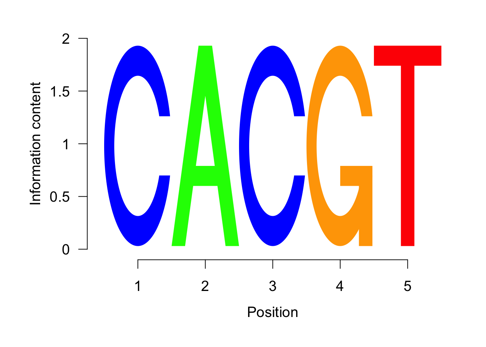

# Chip Sequencing Analysis
## Introduction

We will re-analyze some data from [paper](https://www.ncbi.nlm.nih.gov/geo/query/acc.cgi?acc=GSE77451).

In this work the authors study genomewide the binding of two transcription factors (x and y) in the fruit fly (Drosophila melanogaster). To do so they do Chip sequencing.

__Chip-seq procedure:__

“ChIP-seq” is short for “chromatin immunoprecipitation (ChIP) followed by sequencing”. 

ChipSeq data is basically DNA sequencing data in which the DNA is sequenced AFTER immunoprecipitating a protein of interest. Therefore, we expect to sequence the peaces of DNA that is interacting with the immunoprecipitated protein.

If the protein of interest is a transcription factor (TF) for example, we expect to get the regions of DNA that are being regulated by this particular TF.

It is important to have a control to see the probability to have a signal in a particular region just by chance. Usually as a control we use the DNA sequencing BEFORE immunoprecipitation (IP). This data is usually called input (INP).

The biochemical procedure usually goes as follows:

<div class="figure" style="text-align: center">

<p class="caption">(\#fig:unnamed-chunk-1)ChipSeq procedure. Figure adapted</p>
</div>

## Initial analysis (peak-calling): 

Our goal is then to quantify signal enrichment in certain part of the genome in IP vs INP sequencing. This is achieved by comparing the ALIGNEMENT of the reads of IP vs INP. 

This process is called “peak calling” because it is trying to determine the “pileup” of reads along the genome forming "peaks". As any peak the algorithm used will report high of the peak, summit location, width and finally a pvalue corresponding to the comparison of the signal in that region in IP vs INP.

For this analysis we use [MACS](https://github.com/taoliu/MACS) algorithm to assess the peaks from the sequencing data.

If you want to read the paper [here](https://genomebiology.biomedcentral.com/articles/10.1186/gb-2008-9-9-r137) and [here](https://www.nature.com/articles/nprot.2012.101). The last resource is a nature method publication in which the authors show a fast protocol for analysis. 

The output after running MACS on the shell:

|File name | Description | 
|----------|-------------------------------------------|
|PeakAna_clk_Ip_vs_INP_model.r | An R script for producing a PDF illustrating the peak model |
|PeakAna_clk_Ip_vs_INP_model.pdf |The PDF image of the read distribution in model peaks and fragment size estimation |
|PeakAna_clk_Ip_vs_INP_peaks.xls | Key parameters used by MACS and detailed information of every peak identified by MACS|
|PeakAna_clk_Ip_vs_INP_peaks.bed | Peak locations in BED format |
|PeakAna_clk_Ip_vs_INP_peaks.subpeaks.bed | Subpeak locations in BED-like format. This file is generated by PeakSplitter, which is called by MACS |
|PeakAna_clk_Ip_vs_INP_summits.bed | Summit locations of the peaks in BED format |
|PeakAna_clk_Ip_vs_INP_MACS_bedGraph | Directory where the BedGraph files are generated. For each control or ChIP-seq sample, a BedGraph file describes the read distribution along the whole genome |

> NAME_peaks.xls is a tabular file which contains information about called peaks. You can open it in excel and sort/filter using excel functions. Information include:

```
  chromosome name
  start position of peak
  end position of peak
  length of peak region
  absolute peak summit position
  pileup height at peak summit, -log10(pvalue) for the peak summit (e.g. pvalue =1e-10, then this value should be 10)
  fold enrichment for this peak summit against random Poisson distribution with local lambda, -log10(qvalue) at peak summit
  Coordinates in XLS is 1-based which is different with BED format.
```

> NAME_peaks.narrowPeak is BED6+4 format file which contains the peak locations together with peak summit, pvalue and qvalue. You can load it to UCSC genome browser. Definition of some specific columns are:

```
  5th: integer score for display calculated as int(-10*log10qvalue). Please note that currently this value might be out of the [0-1000] range defined in UCSC Encode narrowPeak [format](https://genome.ucsc.edu/FAQ/FAQformat.html##format12)
  7th: fold-change
  8th: -log10pvalue
  9th: -log10qvalue
  10th: relative summit position to peak start
  The file can be loaded directly to UCSC genome browser. Remove the beginning track line if you want to analyze it by other tools.
```

> NAME_summits.bed is in BED format, which contains the peak summits locations for every peaks. The 5th column in this file is -log10pvalue the same as NAME_peaks.bed. If you want to find the motifs at the binding sites, this file is recommended. The file can be loaded directly to UCSC genome browser. Remove the beginning track line if you want to analyze it by other tools.

> NAME_peaks.broadPeak is in BED6+3 format which is similar to narrowPeak file, except for missing the 10th column for annotating peak summits.

> NAME_peaks.gappedPeak is in BED12+3 format which contains both the broad region and narrow peaks. The 5th column is 10-log10qvalue, to be more compatible to show grey levels on UCSC browser. Tht 7th is the start of the first narrow peak in the region, and the 8th column is the end. The 9th column should be RGB color key, however, we keep 0 here to use the default color, so change it if you want. The 10th column tells how many blocks including the starting 1bp and ending 1bp of broad regions. The 11th column shows the length of each blocks, and 12th for the starts of each blocks. 13th: fold-change, 14th: -log10pvalue, 15th: -log10qvalue. The file can be loaded directly to UCSC genome browser.

> NAME_model.r is an R script which you can use to produce a PDF image about the model based on your data. Load it to R by:

`$ Rscript NAME_model.r`

Then a pdf file NAME_model.pdf will be generated in your current directory. Note, R is required to draw this figure.

> The .bdg files are in bedGraph format which can be imported to UCSC genome browser or be converted into even smaller bigWig files. There are two kinds of bdg files: treat_pileup, and control_lambda.

## Exploring the results:

We will see the first part of the output we get in the "NAME_peaks.xls":

We can see here that we have all the columns we expect and we cqn try to see places we know are interesting for us.


```r
##knitr::include_graphics('images/hex-rmarkdown.png')
macs.res<-read.table("./macs2_analysis_p0.05/PeakAna_clk_Ip_vs_INP_peaks_bed.txt",header = T)
head(macs.res)
```

```
##     chr start   end length abs_summit pileup X.log10.pvalue. fold_enrichment
## 1 chr2L 34224 34348    125      34306  20.88         2.75497         1.97319
## 2 chr2L 34965 35180    216      35108  23.26         3.33362         2.02190
## 3 chr2L 40369 40577    209      40492  30.42         7.01721         2.83398
## 4 chr2L 57282 57429    148      57365  22.07         3.47781         2.08079
## 5 chr2L 58368 58696    329      58541  39.37        12.02019         3.64098
## 6 chr2L 62014 62139    126      62048  19.68         2.42109         1.86559
##   X.log10.qvalue.                         name
## 1         1.12350 PeakAna_clk_Ip_vs_INP_peak_1
## 2         1.65302 PeakAna_clk_Ip_vs_INP_peak_2
## 3         5.05903 PeakAna_clk_Ip_vs_INP_peak_3
## 4         1.77350 PeakAna_clk_Ip_vs_INP_peak_4
## 5         9.82848 PeakAna_clk_Ip_vs_INP_peak_5
## 6         0.83175 PeakAna_clk_Ip_vs_INP_peak_6
```

## Annotating the peaks.

With this information we want to be able to conclude something about this transcription factor regulation. 

The first thing to see is genes that might be regulated. This is basically looking which is the closest gene to each peak. 

To do this we will just looking at the annotation file that have the information of which gene is in each region of the genome (we can think of this as the "map" of the genome).

>What problems you can think that this approach might have? Think about enhancers for example.

For this we will use the following libraries: 


```r
library(GenomicFeatures) ##This is an R package to deal with genomic data. You can read more at https://bioconductor.org/packages/release/bioc/vignettes/GenomicFeatures/inst/doc/GenomicFeatures.pdf
library(ChIPpeakAnno) ##This is a package to annotate Chip-Peaks data https://bioconductor.org/packages/release/bioc/vignettes/ChIPpeakAnno/inst/doc/ChIPpeakAnno.html
```

#### Read the annotation file 

In class we saw what were annotation files. Those were files that contained the "map" of the genome. This map shows us where each gene start and end and where each exon, intron and UTR is in that gene.

We will work with a GTF file. Remember that annotation files can be in many formats. They can be downloaded from different places as UCSC genome browser, Ensemble, etc. 

To read the GTF file we will use the `makeTxDbFromGFF` function. We are doing this because it will allow us to change it to another format, sqlite. 


```r
txdb <- makeTxDbFromGFF(file="macs2_analysis_p0.05/annot2.chr.gtf", format = "gtf", dataSource="dm6", organism="Drosophila melanogaster") ##this funciton is actually reading the GTF file and creating a data base. Try reading the help documentation of this funciton.

##Now we need to save this as an sqlite:
saveDb(txdb, file="./macs2_analysis_p0.05/dm6.sqlite") ##Look at your working directory, what happened?
txdb <- loadDb("./macs2_analysis_p0.05/dm6.sqlite") ##this is loading the sqlite directly without creating the database
```

```
## TxDb object:
## # Db type: TxDb
## # Supporting package: GenomicFeatures
## # Data source: dm6
## # Organism: Drosophila melanogaster
## # Taxonomy ID: 7227
## # miRBase build ID: NA
## # Genome: NA
## # transcript_nrow: 34767
## # exon_nrow: 87482
## # cds_nrow: 62757
## # Db created by: GenomicFeatures package from Bioconductor
## # Creation time: 2020-03-30 18:00:32 -0400 (Mon, 30 Mar 2020)
## # GenomicFeatures version at creation time: 1.38.2
## # RSQLite version at creation time: 2.2.0
## # DBSCHEMAVERSION: 1.2
```

#### Get the genes from this annotation data base
The function `genes` actually extract the genomic ranges (chr start, end, strand, etc) from the genes in the annotation data base we are working with `txdb`.


```r
ge <- genes(txdb, columns=c("tx_name", "gene_id", "tx_type")) ##get the genes genomic ranges, what do you think are the options we are passing to this function? (read the help manual to check).

##lets look at the genes:
as.data.frame(head(ge))
```

```
##             seqnames    start      end width strand      tx_name     gene_id
## FBgn0000003    chr3R  6822498  6822796   299      +  FBtr0081624 FBgn0000003
## FBgn0000008    chr2R 22136968 22172834 35867      + FBtr0071.... FBgn0000008
## FBgn0000014    chr3R 16807214 16830049 22836      - FBtr0306.... FBgn0000014
## FBgn0000015    chr3R 16927212 16972236 45025      - FBtr0415.... FBgn0000015
## FBgn0000017    chr3L 16615866 16647882 32017      - FBtr0112.... FBgn0000017
## FBgn0000018    chr2L 10973443 10975293  1851      -  FBtr0080168 FBgn0000018
##                tx_type
## FBgn0000003 transcript
## FBgn0000008 transcript
## FBgn0000014 transcript
## FBgn0000015 transcript
## FBgn0000017 transcript
## FBgn0000018 transcript
```

#### Get the genomic ranges of the peaks from MACS and find which gene is closer to them (ie. Annotate them)
Now we will use the function `GRanges` to actually get the genomic ranges of the peaks from MACS. And we will annotate them with the function `annotatedPeak` and the `genes` function to map them to the closer gene.

Basically we are using the information about the genes (start, end, etc) to see which is the closest one to each peak.


```r
peaksGR<-GRanges(macs.res) ##create the GRanges object of the macs-table.
annotatedPeak <- annotatePeakInBatch(peaksGR, AnnotationData=genes(txdb))
##look at the begining of the table
as.data.frame(head(annotatedPeak))
```

```
##                    seqnames start   end width strand length abs_summit pileup
## X00001.FBgn0031209    chr2L 34224 34348   125      *    125      34306  20.88
## X00002.FBgn0031209    chr2L 34965 35180   216      *    216      35108  23.26
## X00003.FBgn0267987    chr2L 40369 40577   209      *    209      40492  30.42
## X00004.FBgn0267987    chr2L 57282 57429   148      *    148      57365  22.07
## X00005.FBgn0267987    chr2L 58368 58696   329      *    329      58541  39.37
## X00006.FBgn0051973    chr2L 62014 62139   126      *    126      62048  19.68
##                    X.log10.pvalue. fold_enrichment X.log10.qvalue.
## X00001.FBgn0031209         2.75497         1.97319         1.12350
## X00002.FBgn0031209         3.33362         2.02190         1.65302
## X00003.FBgn0267987         7.01721         2.83398         5.05903
## X00004.FBgn0267987         3.47781         2.08079         1.77350
## X00005.FBgn0267987        12.02019         3.64098         9.82848
## X00006.FBgn0051973         2.42109         1.86559         0.83175
##                                            name  peak     feature
## X00001.FBgn0031209 PeakAna_clk_Ip_vs_INP_peak_1 00001 FBgn0031209
## X00002.FBgn0031209 PeakAna_clk_Ip_vs_INP_peak_2 00002 FBgn0031209
## X00003.FBgn0267987 PeakAna_clk_Ip_vs_INP_peak_3 00003 FBgn0267987
## X00004.FBgn0267987 PeakAna_clk_Ip_vs_INP_peak_4 00004 FBgn0267987
## X00005.FBgn0267987 PeakAna_clk_Ip_vs_INP_peak_5 00005 FBgn0267987
## X00006.FBgn0051973 PeakAna_clk_Ip_vs_INP_peak_6 00006 FBgn0051973
##                    start_position end_position feature_strand insideFeature
## X00001.FBgn0031209          21823        25155              -      upstream
## X00002.FBgn0031209          21823        25155              -      upstream
## X00003.FBgn0267987          54817        55767              +      upstream
## X00004.FBgn0267987          54817        55767              +    downstream
## X00005.FBgn0267987          54817        55767              +    downstream
## X00006.FBgn0051973          25402        65404              -        inside
##                    distancetoFeature shortestDistance fromOverlappingOrNearest
## X00001.FBgn0031209             -9069             9069          NearestLocation
## X00002.FBgn0031209             -9810             9810          NearestLocation
## X00003.FBgn0267987            -14448            14240          NearestLocation
## X00004.FBgn0267987              2465             1515          NearestLocation
## X00005.FBgn0267987              3551             2601          NearestLocation
## X00006.FBgn0051973              3390             3265          NearestLocation
```

#### Change the gene format.

What do you notice about the table annotatedPeak? Can you recognize any of the genes? Try to google some of them. 

The gene names are now in a format that is general for fly genes. This format is the one we have from flyblase.org, a database for fly genes. These names are useful for databases purposes but are not indicative of their function. Therefore, we want now to put the gene-names that we all know (no the Fb...), to do so we need to use the following packages:


```r
library(AnnotationDbi) ##annotation data base package: https://bioconductor.org/packages/release/bioc/vignettes/AnnotationDbi/inst/doc/IntroToAnnotationPackages.pdf
library(org.Dm.eg.db) ##Drosophila melanogaster (Dm) data base
library(dplyr) ##this package allows us to manipulate better the data.frames
```

###### Get the names of the genes

What we need now is to build some kind of dictionary that will be able to translate between both name types: FB to Symbol.

So, we first create an object with the `GeneNames` in both types. To do so we will use the `select` function. 

As you will notice if you try the first line of comand `select(org.Dm.eg.db, c(as.character(annotatedPeak$feature)), "SYMBOL", keytype = "ENSEMBL")`, there is a problem with this function. Basically this comes from the fact that both `AnnotationDbi` and `dplyr` have a function named `select`. R will call the function from the last package executed. To tell R which package we want to use we have to write: `Package::function`, in this case: `AnnotationDbi::select`.

Other solutions to this "function name collision" issue are:

1. execute the package from which we want to use the conflicting function in the last place. 
2. Rename the conflicting function after running the first package. In this case:

`library(AnnotationDbi) ##annotation data base package`
`library(org.Dm.eg.db) ##Drosophila melanogaster (Dm) data base`
`dm.select=select`
`library(dplyr)`


```r
GeneNames = AnnotationDbi::select(org.Dm.eg.db, c(as.character(annotatedPeak$feature)), "SYMBOL", keytype = "ENSEMBL")
```

```
## 'select()' returned many:many mapping between keys and columns
```

```r
GeneNames$feature=GeneNames$ENSEMBL
```
>How does this looks like?


```r
head(GeneNames)
```

```
##       ENSEMBL SYMBOL     feature
## 1 FBgn0031209  Ir21a FBgn0031209
## 2 FBgn0031209  Ir21a FBgn0031209
## 3 FBgn0267987   <NA> FBgn0267987
## 4 FBgn0267987   <NA> FBgn0267987
## 5 FBgn0267987   <NA> FBgn0267987
## 6 FBgn0051973   Cda5 FBgn0051973
```

```r
class(GeneNames)
```

```
## [1] "data.frame"
```


```r
GeneNames=GeneNames[,-1] ##what is this doing? 
```

To see what happened we can look at the object again after that

```r
head(GeneNames)
```

```
##   SYMBOL     feature
## 1  Ir21a FBgn0031209
## 2  Ir21a FBgn0031209
## 3   <NA> FBgn0267987
## 4   <NA> FBgn0267987
## 5   <NA> FBgn0267987
## 6   Cda5 FBgn0051973
```

###### Create a data frame with the peak annotation and the NEW names
We will then put the names into the first table. To this end we will use `dplyr` package function by doing a `left_join`. This is actually a type of merging in which we keep everything that is in the first object. Why do you think we do this? 

We can explore the join options, here are some graphic explanation, and if you want to know more you can go [to the manual](https://www.rdocumentation.org/packages/dplyr/versions/0.7.8/topics/join) and try the examples. Also I would reccomend you to read the [cheatsheet](https://rstudio.com/wp-content/uploads/2015/02/data-wrangling-cheatsheet.pdf).

<div class="figure" style="text-align: center">

<p class="caption">(\#fig:unnamed-chunk-13)**CAPTION THIS FIGURE!!**</p>
</div>


```r
class(annotatedPeak) ## this tells us the class, which type is it?
annotatedPeak_df=as.data.frame(annotatedPeak) ## we will change it to data.frame to have an object we can manipulate better and write to a table
annotatedPeak_df=left_join(annotatedPeak_df,GeneNames, by="feature") ##What is this doing?
```

```
## [1] "GRanges"
## attr(,"package")
## [1] "GenomicRanges"
```

###### Explore and export the table
We can now see how the table looks like and export it as a .txt table so we can explore it outside R.


```r
as.data.frame(head(annotatedPeak_df))##how it looks?
write.table(annotatedPeak_df,file = "./macs2_analysis_p0.05/ChipPeakAnno_results.xls",row.names = T,col.names = T,sep="\t") ##this is writing the table, look in your directory and try opening it with excel.
```

```
##   seqnames start   end width strand length abs_summit pileup X.log10.pvalue.
## 1    chr2L 34224 34348   125      *    125      34306  20.88         2.75497
## 2    chr2L 34224 34348   125      *    125      34306  20.88         2.75497
## 3    chr2L 34965 35180   216      *    216      35108  23.26         3.33362
## 4    chr2L 34965 35180   216      *    216      35108  23.26         3.33362
## 5    chr2L 40369 40577   209      *    209      40492  30.42         7.01721
## 6    chr2L 40369 40577   209      *    209      40492  30.42         7.01721
##   fold_enrichment X.log10.qvalue.                         name  peak
## 1         1.97319         1.12350 PeakAna_clk_Ip_vs_INP_peak_1 00001
## 2         1.97319         1.12350 PeakAna_clk_Ip_vs_INP_peak_1 00001
## 3         2.02190         1.65302 PeakAna_clk_Ip_vs_INP_peak_2 00002
## 4         2.02190         1.65302 PeakAna_clk_Ip_vs_INP_peak_2 00002
## 5         2.83398         5.05903 PeakAna_clk_Ip_vs_INP_peak_3 00003
## 6         2.83398         5.05903 PeakAna_clk_Ip_vs_INP_peak_3 00003
##       feature start_position end_position feature_strand insideFeature
## 1 FBgn0031209          21823        25155              -      upstream
## 2 FBgn0031209          21823        25155              -      upstream
## 3 FBgn0031209          21823        25155              -      upstream
## 4 FBgn0031209          21823        25155              -      upstream
## 5 FBgn0267987          54817        55767              +      upstream
## 6 FBgn0267987          54817        55767              +      upstream
##   distancetoFeature shortestDistance fromOverlappingOrNearest SYMBOL
## 1             -9069             9069          NearestLocation  Ir21a
## 2             -9069             9069          NearestLocation  Ir21a
## 3             -9810             9810          NearestLocation  Ir21a
## 4             -9810             9810          NearestLocation  Ir21a
## 5            -14448            14240          NearestLocation   <NA>
## 6            -14448            14240          NearestLocation   <NA>
```

## Annotate with `ChIPseeker`
We are going to use now [ChIPseeker](https://bioconductor.org/packages/release/bioc/vignettes/ChIPseeker/inst/doc/ChIPseeker.html), another chip-seq annotation package. We need to do again many things, like extracting the Gene-names. Luckily we already did part of the work.


```r
library(ChIPseeker)

##we will use the Genomic Ranges object created previously and the txdb also
peakAnno <- annotatePeak(peaksGR, TxDb=txdb, verbose=FALSE)
peakAnno_df <- as.data.frame(peakAnno)

GeneNames = AnnotationDbi::select(org.Dm.eg.db, c(as.character(peakAnno_df$geneId)), "SYMBOL", keytype = "ENSEMBL")
GeneNames$geneId=GeneNames$ENSEMBL
```
explore it

```r
head(GeneNames)
```

```
##       ENSEMBL SYMBOL      geneId
## 1 FBgn0031209  Ir21a FBgn0031209
## 2 FBgn0031209  Ir21a FBgn0031209
## 3 FBgn0267987   <NA> FBgn0267987
## 4 FBgn0051973   Cda5 FBgn0051973
## 5 FBgn0051973   Cda5 FBgn0051973
## 6 FBgn0051973   Cda5 FBgn0051973
```
modify it

```r
GeneNames=GeneNames[,-1]
peakAnno_df=peakAnno_df %>% left_join(GeneNames, by="geneId") ##this is merging the two tables by the column Geneld
```

#### Explore and Export the output
If we look at the head of the file we can see that we have a __different annotation format__ for the peaks and that we actually have a distance to the TSS.

We will save this file as well. 


```r
head(peakAnno_df)
write.table(peakAnno_df,file = "./macs2_analysis_p0.05/ChIPseekerAnno_results.xls",row.names = T,col.names = T,sep="\t") ##try looking at it on excel or any other spreadshit editor, what are the differences you see with the previous one?
```

```
##   seqnames start   end width strand length abs_summit pileup X.log10.pvalue.
## 1    chr2L 34224 34348   125      *    125      34306  20.88         2.75497
## 2    chr2L 34224 34348   125      *    125      34306  20.88         2.75497
## 3    chr2L 34965 35180   216      *    216      35108  23.26         3.33362
## 4    chr2L 34965 35180   216      *    216      35108  23.26         3.33362
## 5    chr2L 40369 40577   209      *    209      40492  30.42         7.01721
## 6    chr2L 57282 57429   148      *    148      57365  22.07         3.47781
##   fold_enrichment X.log10.qvalue.                         name
## 1         1.97319         1.12350 PeakAna_clk_Ip_vs_INP_peak_1
## 2         1.97319         1.12350 PeakAna_clk_Ip_vs_INP_peak_1
## 3         2.02190         1.65302 PeakAna_clk_Ip_vs_INP_peak_2
## 4         2.02190         1.65302 PeakAna_clk_Ip_vs_INP_peak_2
## 5         2.83398         5.05903 PeakAna_clk_Ip_vs_INP_peak_3
## 6         2.08079         1.77350 PeakAna_clk_Ip_vs_INP_peak_4
##                                         annotation geneChr geneStart geneEnd
## 1     Exon (FBtr0078163/FBgn0051973, exon 7 of 13)       1     21823   25155
## 2     Exon (FBtr0078163/FBgn0051973, exon 7 of 13)       1     21823   25155
## 3     Exon (FBtr0078163/FBgn0051973, exon 5 of 13)       1     21823   25155
## 4     Exon (FBtr0078163/FBgn0051973, exon 5 of 13)       1     21823   25155
## 5 Intron (FBtr0078163/FBgn0051973, intron 2 of 12)       1     54817   55767
## 6                                 Promoter (1-2kb)       1     25402   59268
##   geneLength geneStrand      geneId transcriptId distanceToTSS SYMBOL
## 1       3333          2 FBgn0031209  FBtr0113008         -9069  Ir21a
## 2       3333          2 FBgn0031209  FBtr0113008         -9069  Ir21a
## 3       3333          2 FBgn0031209  FBtr0113008         -9810  Ir21a
## 4       3333          2 FBgn0031209  FBtr0113008         -9810  Ir21a
## 5        951          1 FBgn0267987  FBtr0347585        -14240   <NA>
## 6      33867          2 FBgn0051973  FBtr0078163          1839   Cda5
```

#### Positive controls. 
We can now explore the data back at [IGV](https://igv.org/app/) and see if the genes we get a significantly enriched for this TF are actually enriched. 

Lets think about some controls we can do with the data. Which is the protein we are analyzing? Is there any gene we already know that protein might be regulating?

Well, yes. We are analyzing __Clk__, that happens to regulate __tim__.

So, making it more genral: Other option to see if our analysis and the data in general make sense is to go to previous literature and see what genes we know that are reguated by this TF.


```r
peakAnno_df_tim=peakAnno_df[which(peakAnno_df$SYMBOL=="tim"),] ##What we are doing here?
peakAnno_df_tim=peakAnno_df_tim[order(peakAnno_df_tim$X.log10.pvalue.,decreasing = T),] ## we order them by log10(pval), what that really means?

as.data.frame(head(peakAnno_df_tim))
```

```
##      seqnames   start     end width strand length abs_summit pileup
## 3983    chr2L 3504149 3508352  4204      *   4204    3507246 140.77
## 3984    chr2L 3504149 3508352  4204      *   4204    3507246 140.77
## 3985    chr2L 3504149 3508352  4204      *   4204    3507246 140.77
## 3986    chr2L 3504149 3508352  4204      *   4204    3507246 140.77
## 3987    chr2L 3504149 3508352  4204      *   4204    3507246 140.77
## 3988    chr2L 3504149 3508352  4204      *   4204    3507246 140.77
##      X.log10.pvalue. fold_enrichment X.log10.qvalue.
## 3983        34.61634         3.45781        31.83545
## 3984        34.61634         3.45781        31.83545
## 3985        34.61634         3.45781        31.83545
## 3986        34.61634         3.45781        31.83545
## 3987        34.61634         3.45781        31.83545
## 3988        34.61634         3.45781        31.83545
##                                name       annotation geneChr geneStart geneEnd
## 3983 PeakAna_clk_Ip_vs_INP_peak_539 Promoter (<=1kb)       1   3493986 3507218
## 3984 PeakAna_clk_Ip_vs_INP_peak_539 Promoter (<=1kb)       1   3493986 3507218
## 3985 PeakAna_clk_Ip_vs_INP_peak_539 Promoter (<=1kb)       1   3493986 3507218
## 3986 PeakAna_clk_Ip_vs_INP_peak_539 Promoter (<=1kb)       1   3493986 3507218
## 3987 PeakAna_clk_Ip_vs_INP_peak_539 Promoter (<=1kb)       1   3493986 3507218
## 3988 PeakAna_clk_Ip_vs_INP_peak_539 Promoter (<=1kb)       1   3493986 3507218
##      geneLength geneStrand      geneId transcriptId distanceToTSS SYMBOL
## 3983      13233          2 FBgn0014396  FBtr0077567             0    tim
## 3984      13233          2 FBgn0014396  FBtr0077567             0    tim
## 3985      13233          2 FBgn0014396  FBtr0077567             0    tim
## 3986      13233          2 FBgn0014396  FBtr0077567             0    tim
## 3987      13233          2 FBgn0014396  FBtr0077567             0    tim
## 3988      13233          2 FBgn0014396  FBtr0077567             0    tim
```

#### Plots

This package has some useful plot functions so we can explore the results more easily. 

First we can see the peaks over the chromosomes. For that we use the function `covplot`. Its name comes from "coverage plot".

What do you think about the results? Do they make sense?


```r
covplot(peaksGR, weightCol="X.log10.pvalue.",chrs=c("chr2L","chr2R","chr3L","chr3R","chr4","chrX","chrY"))
```

<div class="figure" style="text-align: center">

<p class="caption">(\#fig:unnamed-chunk-21)**CAPTION THIS FIGURE!!**</p>
</div>

And then a general distribution of the peaks in relation witht he transcription start site (TSS). For that we use the function `peakHeatmap` and `plotAvgProf2`.


```r
peakHeatmap(peaksGR, TxDb=txdb, upstream=1000, downstream=1000, color="violet")
```

<div class="figure" style="text-align: center">

<p class="caption">(\#fig:unnamed-chunk-22)**CAPTION THIS FIGURE!!**</p>
</div>

```
## >> preparing promoter regions...	 2020-03-30 18:01:06 
## >> preparing tag matrix...		 2020-03-30 18:01:07 
## >> generating figure...		 2020-03-30 18:01:12 
## >> done...			 2020-03-30 18:01:15
```


```r
plotAvgProf2(peaksGR, TxDb=txdb, upstream=1000, downstream=1000, xlab="Genomic Region (5'->3')", ylab = "Read Count Frequency") ##Try exploring the options of this function. 
```

<div class="figure" style="text-align: center">

<p class="caption">(\#fig:unnamed-chunk-23)**CAPTION THIS FIGURE!!**</p>
</div>

```
## >> preparing promoter regions...	 2020-03-30 18:01:17 
## >> preparing tag matrix...		 2020-03-30 18:01:17 
## >> plotting figure...			 2020-03-30 18:01:20
```

## Sequence Motif analysis

Another goal now is to analyze this peaks and see a pattern enrichment and see if we can find a __Binding Motif__ for Clk in fly head.

This is basically DNA analysis, so we will have to figure out the regular DNA motifs and see if there is any specific enrichment.

For this we will use: 


```r
library(Biostrings); library(seqLogo); library(BCRANK); library(gridExtra)
```

#### Put the peak sequences in fasta format

To parse the corresponding sequences from the reference genome, the `getSeq` function from the Biostrings package can be used. The following example parses the sequences for each peak set and saves the results to separate FASTA files, one for each peak set. In addition, the sequences in the FASTA files are ranked (sorted) by increasing p-values as expected by some motif discovery tools, such as BCRANK.


```r
library("Rsamtools")

peaksGR <- peaksGR[order(peaksGR$X.log10.pvalue., decreasing=TRUE)] ##order the peacks according to pvalue

pseq <- getSeq(FaFile("./macs2_analysis_p0.05/dm6.fa"), peaksGR) ##extract the sequence of the peacks
```

#### Explore the data

We can see how the `pseq` object looks like.


```r
as.data.frame(head(pseq))
as.data.frame(head(peaksGR))

writeXStringSet(pseq, "peaksGR.fasta") ##use the names and save the peacks in fasta format, how this looks like? open it outside R.
```

```
##                                                                                                                                                                                                                                                                                                                                                                                                                                                                                                                                                                                                                                                                                                                                                                                                                                                                                                                                                                                                                                                                                                                                                                                                                                                                                                                                                                                                                                                                                                                                                                                                                                                                                                                                                                                                                                                                                                                                                                                                                                                                                                                                                                                                                                                                                                                                                                                                                                                                                                                                                                                                                                                                                                                                                                                                                                                                                                                                                                                                                                                                                                                                                                                                                                                                                                                                                                                                                                                                                                                                                                                                                                                                                                                                                                                                                                                                                                                                                                                                                                                           x
## 1                                                                                                                                                                                                                                                                                                                                                                                                                                                                                                                                                                                                                                                                                                                                                                                                                                                                                                                                                                                                                                                                                                                                                                                                                                                                                                                                                                                                                                                                                                                                                                                                                                                                                                                                                                                                                                                                                                                                                                                                                                                                                                                                                                                                                                                                                                                                                                            ACCCATTAAATTGTCAATATTACTTAAGCCCTTTATGGTATTGGAAACTCCCGTTTCACATAATTAAACATGGAATGCAGCAAAAAATTTTCCGTGCAATTGCAAATGGCATTTTACGAGAGAAAATTGTTGACAATAATGAAGCTGATGAACATTTGTGGTTGTGTTCATTGTCATTGTTGCTGCGTTAGTTATTCTACCATCGGTTGGGGTGCATTTGGGCCAGTCTGGAACTGTTTGCGTCATTGTTCAGTTTTAGTTCTCTGCGGTTGCCTGAAATTGTCGTAATGCATTTACGGACATCGCACACACATGTGGCCCAAGTGCGGTTTTGTAGCTGGAAATGTTGGCTGTGTACTGTAAACAAGATTTTAGCAAACCCACTTGCATTTCTCCTGGGGGTCATGTGTCAGCACTTATAATTTTGTTTAAAGAACTAAGAGAAAAATGTCCACTATCTAGAAAATCATTACTATCAAAAAACCCAATTTATATCAGTAACGTTCGATTTCTAAACTCATATTGACATTTTTGTATGTATATTATGTATGTATATAAATGTTCATATTTGTTTCCCTTTTGGTTGCGTACCTAACCACCACCTATAAATTAGCCCGTTCTGCCAATATTAGCCCTTTCATATCTCGTTACTCATACGCCACGTGGTCACGTTTTTGCCTAAGCTCTACGTAGCTGCACTCGCTGCACTTTCCGCTTACGTTTTGTTATTATTTTCCCCAGTACTCGTTAGCCTTGTCTAGTGCCAAAATGAAATGACAATGTTTTCCCAGCGCACAGAACTCAAATCGTAAATCATTTTCTTTTTTTTGGGGTGTTGGCAAAGGTAAACAATGTCACATAGGAGCCCGCAGTTGTCTGTCAGTAGAGAAAAAGGCAAAAAGATTAGAGATATATGGACTGCGGAGAGCGGGGCAGAATGCGAGATATATAGCAACTCAAGTTTGTGTTGCCACGAACTTTGACAGTTACATGCGCTGCACCATTGCAGAATGACAAACGAAGGCGAAAAAAGCCATGAGTTGCACAAAATGTATTTATCTGTCATTCCAGTTTTCACTTTCGCAAAAAGTGGTAGATTTTGGGTTTTGTGTGGAATCATATCTAGCTTTATAGCTCTTGGGGAACTATAATATGACTTAAATACCAAATATTTATATACTCAAGTTTAATATAATACATTTCACGTAGTTTTAACGCAAAACGGAATATGCTAGAATTTATCTTTTCCACTTCGTTTCCCCTCTGATTCTCGCACTTTCCCCCAAACTCTCGGCGTTTGTGTGTGTGCCTGTCTGGCTTTTCTTTTTCGTCTCCGTTCGTGACAGCTTGTTTTTTTGGGGGCGTGGCGAGGGGCGGAAGGGGTTGGGCATTTGGGTCAACTATCGACTGCAATTTGAGCCTTTCAAACTGTCGCCGACACAAAACGAAGGGCTCAGCTGAAAAAAAAAACACACAGTCAGGCAGAGTAAAAGTTGCGGAAAGTGTGACAGCAACTCATTGCAGATGGACATTTGCCGAGTCTGCTGGGAATCCCCTCAAGTGCTCTGGAAATTTGATTTCGATTTCCATATGATTTTGATTTGGCCAGCGAAC
## 2                                                                                                                                                                                                                                                                                                                                                                                                                                                                                                                                                                                                                                                                                                                                                                                                                                                                                                                                                                                                                                                                                                                                                                                                                                                                                                                                                                                                                                                                                                                                                                                                                                                                                                                                                                                                                                                                                                                                                                                                                                                                                                                                                                                                                                                                                                                                                                                                                                                                                                                                                                                                                                                                                                                                                                                                                                                                                                                                                                                                                                                                                                                                                                                                                                                                                                                                           CTTCCCCTTTTATTACTGTTCCAAGGACATTCAAATTAAGCATTCATTTGCGGTGATATCACCGGCTTTAATGCTCTGAACTCCACGAAGAGTTGACTAACCTCGAACTGTGCTACATTTTTTTATGCACCTCCATCATACACACATTTTGTCGTGTAATTTGCACGCTGAGTCTATTAAATGCACTGCAACCGAGTTGTGTCAGCACCTCAGGTGTACAGAGCTTTCACTCACACTCATATACGATTCATAAACATTTGTTGTGGCGCCCAACGTGGGGCATGAAATGCGACGTGTTACACAAGTGGGAAGAAGAAGGTGCAAGTCATTAAGTAAGCTTGTTTTTGTTCTGATTTTTCTCGTTGTTTTCAGGGAAGAGGCCATAAAAGCTTCGTGCGCCACGCACACATGCACACATAATTATAATGGGCATTAAAACGGACGCCTGTGGCCTAACTCTTAGTTTGTCTTGTTCGCCAGCAGGCTTCTTAACCCTCACACTGTCCAACTTGGCTACCTCTGAGTGCTTTATGGCGCAACTGGTAGAATGATTCGCCGAGCATAATATTTAACTCGGAATTCCCTGCTAAACGCACATAATGTCTGCCCAAGACAGTCCCGGTTCCCAGCGGCGAAATTCATTTTCTTGTCGCTTACAAATTATTTTAAAGGTATTTAAAGTTAGAT
## 3                                                                                                                                                                                                                                                                                                                                                                                                                                                                                                                                                                                                                                                                                                                                                                                                                                                                                                                                                                                                                                                                                                                                                                                                                                                                                                                                                                                                                                                                                                                                                                                                                                                                                                                                                                                                                                                                                                                                                                                                                                                                                                                         AAAACAGAAGCTCTAGCATTGTTGTGATACATTAAAGAACTTTACTGACCTGGCCAATTTGTGGATAGTGCTGCAGCTCCATCTCGAGCACCCGCATGGACGGCTTGGGGGTTGTCAGCTCCTGGCCCGTGCACATCTCGTAGAGCAGGTGGCCAAAGCAGACGATGTCCACGTTCTCGATCTCGGTGACCGAGCGGGACCACATGACGGCGTTAATGCGCGAACTGAGGCCCAGGAGGCCGTTCTCCAGGCCCGATAACCTGATGGGTGAAAAACGGAATAAATGTTACGGAAAATGCATAATTAAATGGCGGACCCCTTGTGCTTTCCTTCCCTTTTGTTTCGGTCTTAATTATGCAACATATTCGATGGCTACCCTGCCGTATATTGATGGCCAACACGTGGAAACGTCGGCCGCAAAGTGTCTACTTTTATGGATTTATGTGCGAGCGAGAGGGAGCAGGTATCATCTGCTATCTCTTTCCTCACTGGCCATGTGCCTTAATGACAAAGAGCGTATGTCAGACCTGATATGACAATATTATGACACTCTACACAACACAGCGCTGTATATTGCGGATTGGTTGGGGCTTTTGGTTCGAGGGTCCTGCCGGCATTTCCTAGTATTCATTAGGCCAAATGTGGCTGACTAGTTGGAAAGGTATTCCGAATTGGCTGACAATAGAGGTTCTGAAGATGCTAGTTGTCGTGTGCTATAGTTTATTGGCTTTTGTTGCCAGTTGCCTTTGTTTATTTTATGATCATTTTAATTAGTTTTGAAAATCAGATAAGTATAAATATACGAAAAAAAATCATTTGGGCTTAAAAAAGTTCAATACAAATTGTTGAGTCAACAGGTTACTCCAGAAGTATTTGTTGTCAAATTTACTATCAAATATAAGCATGTTTTTCTTTAGCTGTTATAAAACAATAAAAGCGTTGTGCAGACATTAAATGCTTTCTTTTATTGTCATTGCAAATATCCTGAAATTCTTCACTCAATTTCACTTGAGCAAGCATTTTCTTTTCTACTTCGTCAATCAGCTTTTCAGCTTACTAAATTCCATTTTACCCGTTTTCTTCACGTTGGTCTTTCAACTTTCCTGTGGCCCTATCAATAGCTGTACGTATGTATAAGCAATTTATATGAAAATCAGCTTTTCAATGCGCACAGCGATACCCTGGCGACGAAGGCAGCAAAATTGGGTCATGCACTTGGCGCAAACTTGAACGCAGAAAATCCGCACTTTAATCGACTTTCACCTATAGGAATTCTAGCTTGCAGATCCCACCCTCTTTTAGTCCCGTCCCTGGGCTGCAATATAACCATCTTTTTCGCCGACCATTTATTTTTAAAATGGCAAAAAGCTTAAGCTTTATTTTTGTTACACCCATTCGATGTTTGCAAGTGGGTGGTTTAGTGGGTGGCGCTTACGCGTTGTCGCACAGCAGCTACATGGATAGGAGGGGGCCAGTCAGGGGCTCACGAAACAGGGACATGCATTTAAAGTGCCCTGAAATGGGCAACGATTCTGGGGAATTGCTTTTAATTTGCCATTTAGGCTGAAATCGATGTCGGTTCTATTTGGGTGAATTTTGAATGACTGAAATTTTGCAGTGGAGATAGGGGGGCAGGCCACCGATTCGATATAAAATATTGCAGCCATTATTAAATTAGTTAACAGTTGAGTGGGTCCCAATCGACAACGGACTCACCTGGCTGCCCCGTTCTGCAGGATGACATTGCCGCTGTGCAGGTGACCGTGAAGCGGAAAACCGCGCTCCTTCAGGAAGAGCAGTGCCTCCAGAATCTGTCGTCCCAGGCGCTGCACCTGGCTCACCGGTAAGCCATTTGGC
## 4                                                                                                                                                                                                                                                                                                                                                                                                                                                                                                                                                                                                                                                                                                                                                                                                                                                                                                                                                                                                                                                                                                                                                                                                                                                                                                                                                                                                                                                                                                                                                                                                                                                                                                                                                                                                                                                                                                                                                                                                                                                                                                                                                                                                                                                                                                                                                                                                                                                                                                                                                                                                                                                                                                                                                                                                                                                                                                                                                                                                                                                                                                                                                                                                                                           GGCGCCAACAATCGTAATGGATCCTGGCATGAAAACGGGATGAGGAGACCCAATGGTCACCGCCCTCTAAATGCCGAAAGTCAACTGCGTCATTGTTTGGGGAGAACAGGCCAGCTCCAGCTGAATTTCCTCGATTTTCCGAGGGGTGAGATAAAGGGCCCCGGGCCAGGATGGCCAGGCCCATTTCCAGTGACCTTGCATCATTAACTTAATTGCTCAAACAGTAGTCGGTCCGTCCAATTGCCGGGCTGAATTATTCAGTTGTTCTGCTCGGCCAACTGGCAATTTTGCGTCTTTACTAATGTCACCACAAGCTCATAGAGGAAGCGCTGTCTCTCTCTATTCGGCGCTGCACTGGAAAAGCCATCCGACAGAACCGTTTTTCCATGGGGGCCGGTGAAAATCCCCCACGTGCATTCGGTGTGGTCGTTGGCCCGTTCACGTTGTCCCCCCATTTTAAAGGGGCGTCACGTGTAGCGGGGCTTAGTCCCCCCCACCACAATTTGACATTTTTTACGAAAACAAAATGCAGAGATACGAAGAGAAAAACCAGGCCCAAACAATTTTCACCGGACTAATTGGATTCAAGAGTTTTCCTGCTGCGCTTTTGTCAACGCATATTGCAACAGAAATATTCATATTTATTTATATATAAAAATTCACTGTCAGTACAGCCTAGCCTATAGTTGAATACATACCTGCATCGTCTTATCCAGTATGAAATTACAACAATTCCACCCAATATCAAACCACCTAAGGCACACCAAAAGAGGGTCTGAAAAG
## 5                                                                                                                                                                                                                                                                                                                                                                                                                                                                                                                                                                                                                                                                                                                                                                                                                                                                                                                                                                                                                                                                                                                                                                                                                                                                                                                                                                                                                                                                                                                                                                                                                                                                                                                                                                                                                                                                                                                                                                                                                                                                                                                                                                                                                                                                                                                                                                                                                                                                                                                                                                                                                                                                                                                                                                                                                                                                                                                                                                                                                                                                                                                                                                                                                                               AGGAAAACTCCTAACAAGCTTTAAAAACCTAGCAAGCTAACTACCTTTTTCTTAATTCTCTGGTTCGTTTCGCACACCTGATTAATGGGTTAATGTATCTATTTTTATGCACCCAGCTGCCACTCAGTTGGCTTTGACTGGTCTCGGGGATAAGTGGCAAAGAGGCCGGCTAATCAGGCCCAAAGGTAAAGCCAAAGCCAAAGCCATGAACCAACGAACCGCCCAACAGCCCAACCACCGAAACGCCCCACCCATCCGCTGGTGACCCACTTGAGCATGCACCGCTCGTGACATTGGGCAGGGAAACGTGCAGAAGCGACGGGAAATCGACAAGAAGACAAACAAAACAGCAAAACGTGCAGAACGTCACTTTCGGGCCGCCTTTTTGTTGTTAATTTAGAGAGATGCGTCACAGCGAAAAGTGTTAAGAAAGAAATGCGCGGAAAATCAGGAAATGTAAGCGGTGAGAACTGCGCATTAAGCATCGCATTGCATCGCACGGCAAAACGCAGCCAAATAAAGCGAAACAACAGCGGAGACAGGCGCAATGTTGACAATTGTTGAAACTGACAGTTTGACGTTTTAACTCACGCGCCAAACGCCAAACGTCAAACGGCAGCAACAACCAACACAATATCAACATCAGCAACATAGTAATACGTTGTACGGCCAAACGGCAATCTAGGCAAATCCACCGAGTAGACAACTCAATGAGCCATTTTGATGGACACCTCCGACGACAGCTGTACGGCACACGAATGTATATAATGCATATTCAT
## 6 TGGAATACTTGGAATTTATTAAGTACCTCGTTGTTATAACTAGTAGTTGTCTCCAGTTAACATAAAGCTATTATAAATGTCATAATAAACAACCGCTTATCAGTACTTAGCCGACGAGTGCTTAGGGCTCAATTAAATTAACAACAATTACGTAAATGGAAAAGAACAAAACCCACCACGTAATGTTTGGGTTTAAATACGTCATCCTAGGCGGAAAACAACAAACCAAAATACGCATACTAAATCGATTTCTCGAGCTATTTCTGTACATTCACCTGTCCTGCATTGCTAATACGCCGTGTTGCTCGCGCGTTATTTAATGTTTGAGCCATCGATGTCGATGTCGTGCTGCAATGTCAATATCAAAGACACTGCGCACAGCAAGGTTGCCGAAGCCGTAGTAGTTTACCGCCGTGCAATTGCTGAATTTCTGCTGTGCGGCTAATTGAATTTAGAGGGGCGACAGGTGCCACAATGCCAGGTATAAATGCCGGATTGCCAAAGAGCGCTAATTAATAGCCTAGTGGACCACGCAACGCGGCGTATACCATCGAGAACGAGCGCGAAACGTTAAAGGCACATCCAAAGTTTAAACTATTTCCGCAGAGATTTTGATAAACAGCTCCAAAATGGTGGTCAATTTCAAGGTGTTCAAGAAGTGTTCCCCGAACAACATGATCACGCTCTACATGAACAGGCGTGATTTTGTAGATTCCGTGACTCAGGTGGAACCCATTGGTAGGTGTCACAGACCGAAACCCTTGAGCAATGGGATTTACGAATGAGGAAATCCATCAAAAAATAAATTCGTGTAGGAATTGGTACCCATATTCGATTGAAGTATCTTATAGTTTGAAAATAACTTCAGTGTAACTTTTGTTTCAACTTAACACATTGGAATTTTTAATACCTTCCTTGAAAAGTGATATCAAATCAAAATTATATTATAAAAACTCCATTTCGAATCTGCATATGCCGACCAGCAAATATAAACTCAGGGAGTTATTCAAAATTGCATCTGAATTCAATAGCCCAGGGAGTTAAGTTAAATTGGCTGCGCTAGCAGCTAACCAAGTTCATCGATTACGCGAGCAAGCAAACCAAGAGGCTGGGCGCTTGTAAATAATATTCTCCAATTAATAAGCGTCCTCTTGCAGATGGAATCATTGTGCTGGACGATGAGTACGTGCGCCAGAACCGCAAGATCTTCGTGCAGTTGGTCTGCAATTTCCGATATGGGCGCGAGGACGACGAGATGATCGGTCTGCGGTTCCAGAAGGAACTGACCCTGGTCTCGCAGCAGGTGTGCCCACCCCAGAAGCAGGACATCCAGTTGACCAAGATGCAGGAGCGTCTGCTGAAGAAGCTTGGCTCCAATGCCTATCCCTTCGTGATGCAGATGCCACCAAGCTCGCCGGCCTCGGTGGTTCTCCAGCAGAAGGCCAGTGACGAGAGCCAGCCCTGCGGAGTCCAGTACTTCGTAAAGATCTTTACCGGAGACAGCGACTGCGATCGATCGCATCGCAGGAGCACCATTAACCTGGGCATCCGCAAGGTGCAGTACGCACCGACCAAGCAGGGCATCCAGCCCTGCACCGTCGTTCGCAAGGACTTCCTTCTGTCGCCCGGAGAGCTCGAACTGGAGGTCACCCTCGACAAGCAGCTGTACCATCACGGCGAGAAGATCTCGGTGAACATCTGCGTGCGCAACAACTCCAACAAGGTGGTGAAGAAGATCAAGGCCATGGTGCAGCAGGGCGTCGATGTGGTCCTGTTCCAGAACGGTCAGTTCCGCAACACGATCGCCTTCATGGAGACGAGCGAGGGATGTCCCCTGAACCCGGGATCCAGCCTGCAGAAGGTCATGTATCTGGTGCCCACCCTGGTGGCCAATTGCGACCGCGCAGGCATCGCCGTTGAGGGTGATATCAAGCGCAAAGACACAGCTCTGGCCTCGACCACACTGTGAGTAAAATTTATTCACATCATAGCTTAGCAGATGAAACATTAATATTATACTCTATTAAGTATCAACTTAAAATCATACCATAAAATCAATCAAATTTTAAAGTTAGGAACCTTTTTAAAAATCGTATTTTCCCGGTGACTAACAGTTCTTTAGCTAAATGTGTTTACAAAATGGCATAAAACGCATACTAATACTAAGTGAAAAATGCATATTTAAAATTCTATTTCAGTATTGCCAGTCAGGATGCGAGGGATGCCTTTGGCATAATTGTTTCATATGCTGTGAAGGTCAAGCTTTTCTTGGGAGCCCTGGGCGGCGAGCTCTGCGCTGAGCTACCATTTATTCTGATGCACCCGAAGGTAATAAAAGGTGTGCCCAAATATTTGAATAGTTATTGAAAGGCAATCAATTATTTACAGCCAAGTCGCAAGGCCCAACTGGAAGCCGAGGGCTCCATTGAGGCCTAAACTGAAAGGGCTACCTCAACCAACGAAAAAAATGGCGTATTTCTACAAGTCAAACCGATTTTTGTAGATCCTAAAAAATGCTGATGTTGCTGAAATGTTCTGAACTGCAGTCGTCGTACTTTTCCTATATAGCAAATCCAATATCCATATATTGTATGTGTGTATGTGTATTATATTTATAACTCAACTAACAATTAAATATGAACAGAGTTTATGTATGTATTTTGGAGTATTCTATTGAATTTAGCACGGTGTATTTGAAAAGGCTCCAGCATTGAAAGTTTGTATGGAATGCGCACTAAATATTTAATAATGTGCTTACGAAGGCATTTCGTAGTATTTGATATCTTGCAATGTCTGCTGATTATGTACATTGAAGTGCAATGGGGAAATCAACAGAAGCCAGTGCAATCTATTCAATTACTAATAGTGGGTCTTGCATTTGTGGCTTAGTAATTCCAATTATTGCTACTCTGAAAAGCCGAGGAGCAGCCTAATTAATACTTGGCCACTATGCTGGAGGAAGTTTACTGAACTGAATTCGAGTAAGGAAAATGGACAATAATTGATATAATATGGTGAGCTTCTTGCTGGACTTTGAAATCGTAAAATTTAAGCGAACACACTTCAAACGCATCCATTTAATTTGTGAATGTTTGCAGTCCCACTTTTAATAAGCACCCAATATTAACGATAACGCCACTCTAATCAAAATTTTCCAATAGTCAGGGTTGAAATACTGATCAATCACGCTGCCAACATTTCGGCAGACCAGGTGGGTAATGAGTTTAAAATGGTTTTGCGTAATGGGATTAATCGAATTTCATTAAGGAAGATTAGATTGCCGTCTTTGGAAGTGATCTTTTATAGTGGCTGACCATAAAAATTGCATTGCAAATACTAATTTAAGCATACATGCTATATAACCGATAAGATGGGCGAGCGTCAAGGCAAAAATAGTTGACCGTATTAATAGTTTAATCAACTAGCTTCAAGTTAATTTATAATGCGAATTAGGAAGCACTCTGGCATGCTATTAAAAACTTAAGAACTGATAAACGAAACTTAATTCCTAAAATAAAAATGTACCTAATTACTTTTATATACTATTATAAATAAAATTGTACCATGTATCGTTAAATTTGATTTAGTTACCAAGTGGTATTTGGTACGTGGCAGCATGAAATAGCTACTACTGCTAGTCTGGCTGATTAGCCAGCACTCTCAATAAACTAAGTGCAGCGTTTTGCATTTATCAGGATTTTTGGTACTCTAAACACACACTTAGATCCCAATCACCCCACAGAATAAGTTGAGCAAACCAAACCGAGCTGATTACCACAGTAGACATGATGATTAGCCGCTGCTTTATTTACTAGTGGATAATCTACTAAGCGACGCATGAATAAAAACTCGAGCGATATTTTTCCACTTTGCAGTCGCTCGAAAGCCTTTGTTTCG
##   seqnames    start      end width strand length abs_summit pileup
## 1    chr2L  3133811  3135424  1614      *   1614    3134481 140.17
## 2    chr2L  3136702  3137388   687      *    687    3136981 140.77
## 3    chr2L  7649255  7651111  1857      *   1857    7649737 140.77
## 4    chr2L  7661000  7661782   783      *    783    7661451 140.77
## 5    chr2L 14249821 14250599   779      *    779   14250165 140.77
## 6    chr2L 18077759 18081655  3897      *   3897   18078127 140.77
##   X.log10.pvalue. fold_enrichment X.log10.qvalue.
## 1         106.096        12.73315        97.93874
## 2         106.096        12.78695        97.93874
## 3         106.096        12.78695        97.93874
## 4         106.096        12.78695        97.93874
## 5         106.096        12.78695        97.93874
## 6         106.096        12.78695        97.93874
##                              name
## 1  PeakAna_clk_Ip_vs_INP_peak_474
## 2  PeakAna_clk_Ip_vs_INP_peak_477
## 3 PeakAna_clk_Ip_vs_INP_peak_1071
## 4 PeakAna_clk_Ip_vs_INP_peak_1079
## 5 PeakAna_clk_Ip_vs_INP_peak_1893
## 6 PeakAna_clk_Ip_vs_INP_peak_2290
```

#### Find the MOTIFS

The Bioconductor package [BCRANK](https://www.bioconductor.org/packages//2.12/bioc/vignettes/BCRANK/inst/doc/BCRANK.pdf) is one of the many available for de novo discovery of DNA binding motifs in peak regions of ChIP-Seq. 

The main function we are using here is bcrank. when looking at the documentation we see that: 

"BCRANK uses a heuristic search strategy. First a score is computed for an initial short consensus sequence, typically selected at random. The score takes into account both the number of consensus occurrences and the rank of the genomic regions. Then all consensus sequences in a neighborhood of the start guess are evaluated and the one with highest score is kept as the starting point for the next iteration. When a local optimum is found, the algorithm is terminated and the locally optimal consensus is reported as a result. In order to increase the chance of detecting the globally optimal solution, the algorithm may be restarted several times using different random starting points. Alternatively, BCRANK can be used for assigning scores to previously established consensus sequences. The sections below describe in more detail how the neighborhood, scoring function and start guess are implemented."

We will use 25 restarts and a penalty for both repetitive sequences and non canonical letters. 

 P1 - Penalty on non-specific bases. Let l be the length of the consensus sequence and b the
total number of fixed bases (A, C, G, T) in the sequence. If there are no fixed bases, b is set
to 0.5. The penalty is then defined as P1 = b/l.
 P2 - Penalty on repetitive motifs. Let rn, n ∈ 1, 2 be the number of input DNA regions that
contain at least n occurrences of the consensus. Then P2 = 1 − (r2/r1).

```
set.seed(0)
BCRANKout <- bcrank("peaksGR.fasta", restarts=25, use.P1=TRUE, use.P2=TRUE)
```


#### Explore the results

Then we can also see the results, we will se the results that are in the top.

We can first explore the results: the matrix shows the proportion of each letter in each possition for thar specific motif.
 

```r
head(toptable(BCRANKout))
a<-BCRANKout@toplist
a[[1]]
```

```
##   Consensus    Score
## 1     CACGT 663.2068
## 2     CACGT 648.6057
## 3    GCACGT 550.5658
## 4    ACGTGC 536.9913
## 5    CAAAAG 491.8869
## 6    AAAGCG 491.6031
## 
## An object of class "BCRANKsearch"
## 
## Search path, starting from SHVWHRYYDT:
## 
##     Consensus     Score
## 1  SHVWHRYYDT  26.19329
## 2  SHCWHRYYDT  99.05250
## 3  SHCWHRTYDT 147.47039
## 4  SHCWHRTTDT 178.46498
## 5   HCWHRTTDT 203.84605
## 6   HCAHRTTDT 263.87039
## 7    CAHRTTDT 315.05930
## 8    CAHGTTDT 344.41459
## 9     CAHGTTD 396.57309
## 10    CACGTTD 498.50181
## 11     CACGTT 599.45575
## 12      CACGT 663.20680
## 
## Position weight matrix for search result (CACGT):
## 
##   1 2 3 4 5
## A 0 1 0 0 0
## C 1 0 1 0 0
## G 0 0 0 1 0
## T 0 0 0 0 1
## 
## 
## Use methods searchPath(object) and pwm(object) to access object slots.
```

#### Plot the results
We can play around with the matrixes and plot them in the known DNA-Logo standard. To do this we will first store the most top motif from `toptable`. Then we will use the `pwa` function from BCRANK and the `seqLogo` function from seqLogo package.


```r
topMotif <- toptable(BCRANKout, i=1)
weightMatrix <- pwm(topMotif, normalize = FALSE)
weightMatrixNormalized <- pwm(topMotif, normalize = TRUE)
seqLogo(weightMatrixNormalized,ic.scale = T)
```

<div class="figure" style="text-align: center">

<p class="caption">(\#fig:unnamed-chunk-29)**CAPTION THIS FIGURE!!**</p>
</div>

We can now do the same with a different function just to show you that you can do the same things with different approaches. This is using function form the `seqLogo` package. 


```r
p<-makePWM(as.data.frame(weightMatrixNormalized))
p@consensus
seqLogo(p)
```

<div class="figure" style="text-align: center">

<p class="caption">(\#fig:unnamed-chunk-30)**CAPTION THIS FIGURE!!**</p>
</div>

```
## [1] "CACGT"
```
We will create a table to be able to analyze the data

```r
topt<-as.data.frame(toptable(BCRANKout)) ##extract the results table
head(topt)
```

```
##   Consensus    Score
## 1     CACGT 663.2068
## 2     CACGT 648.6057
## 3    GCACGT 550.5658
## 4    ACGTGC 536.9913
## 5    CAAAAG 491.8869
## 6    AAAGCG 491.6031
```

#### Plotting with Ggplot2

Now with ggplot we will use a package called ggseqlogo. 
This will be nice to learn how to install packages from github (you have to use the package devtools and then the function install_github).
http://www.bioconductor.org/packages//2.11/bioc/vignettes/seqLogo/inst/doc/seqLogo.pdf 


```r
library(ggplot2)
##install.packages("devtools")
library("devtools") ##this library is literally called "developers tools" and allow us to do more complex things as downloading packages from github
```

```
## Loading required package: usethis
```

```r
##install_github("omarwagih/ggseqlogo")
library(ggseqlogo)
```

###### Create the matrixes for ggplot2
We will first store all the matrixes in a list so we can then just plot them all together and not only one by one.


```r
## Some example DNA sequences, lets try to go together over what is this loop doing
seqs_list=list() ##first we create an empty list that we will fill up over the loop
for(e in 1:16){ ##we will loop 16 times
  ##print(e) ##we will print every loop
  topMotif <- toptable(BCRANKout, i=e) ##we get the motif number e (ie, the iteration will let us go from top motif 1 to 16)
weightMatrixNormalized <- pwm(topMotif, normalize = TRUE) ##do some process witht he motif
seqs_list[[e]]<-weightMatrixNormalized ##add the processed motif to the list in position e (ie. the loop allow us to fill up the list)
}
```

###### Plot
We can now, either plot one by one for each position in the list. 


```r
## Get first set of sequences
seqs_dna = seqs_list[[1]]

## Plot a sequence logo with the 2 different methods avilable
p1 = ggseqlogo( seqs_dna, method = 'prob' )
p2 = ggseqlogo( seqs_dna, method = 'bits' ) +labs(y="Information Content") ##this changed the name of the `y` axes
grid.arrange(p1, p2)
```

<div class="figure" style="text-align: center">

<p class="caption">(\#fig:unnamed-chunk-34)**CAPTION THIS FIGURE!!**</p>
</div>

Or we can plot all together using the facet function to actually separate them.


```r
##Plot all the first 12 sequences
ggplot() + geom_logo(seqs_list,method = 'prob') + theme_logo() + 
  facet_wrap(~seq_group, ncol=4)
```

<div class="figure" style="text-align: center">

<p class="caption">(\#fig:unnamed-chunk-35)**CAPTION THIS FIGURE!!**</p>
</div>

## Session info: all the packages installed.

Session info


```r
toLatex(sessionInfo())
```

```
## \begin{itemize}\raggedright
##   \item R version 3.6.2 (2019-12-12), \verb|x86_64-apple-darwin15.6.0|
##   \item Locale: \verb|en_US.UTF-8/en_US.UTF-8/en_US.UTF-8/C/en_US.UTF-8/en_US.UTF-8|
##   \item Running under: \verb|macOS Mojave 10.14.5|
##   \item Random number generation:  \item RNG:    \verb|Mersenne-Twister|  \item Normal: \verb|Inversion|  \item Sample: \verb|Rounding|
##   \item Matrix products: default
##   \item BLAS:   \verb|/Library/Frameworks/R.framework/Versions/3.6/Resources/lib/libRblas.0.dylib|
##   \item LAPACK: \verb|/Library/Frameworks/R.framework/Versions/3.6/Resources/lib/libRlapack.dylib|
##   \item Base packages: base, datasets, graphics, grDevices, grid,
##     methods, parallel, stats, stats4, utils
##   \item Other packages: AnnotationDbi~1.48.0, BCRANK~1.48.0,
##     Biobase~2.46.0, BiocGenerics~0.32.0, BiocParallel~1.20.1,
##     Biostrings~2.54.0, ChIPpeakAnno~3.20.1, ChIPQC~1.22.0,
##     ChIPseeker~1.22.1, DelayedArray~0.12.2, devtools~2.2.2,
##     DiffBind~2.14.0, dplyr~0.8.5, forcats~0.5.0, futile.logger~1.4.3,
##     GenomeInfoDb~1.22.1, GenomicAlignments~1.22.1,
##     GenomicFeatures~1.38.2, GenomicRanges~1.38.0, ggplot2~3.3.0,
##     ggseqlogo~0.1, gridExtra~2.3, IRanges~2.20.2, matrixStats~0.56.0,
##     org.Dm.eg.db~3.10.0, purrr~0.3.3, readr~1.3.1, Rsamtools~2.2.3,
##     rtracklayer~1.46.0, S4Vectors~0.24.3, seqLogo~1.52.0,
##     ShortRead~1.44.3, stringr~1.4.0, SummarizedExperiment~1.16.1,
##     systemPipeR~1.20.0, tibble~2.1.3, tidyr~1.0.2, tidyverse~1.3.0,
##     usethis~1.5.1, VennDiagram~1.6.20, webex~0.9.1, XVector~0.26.0
##   \item Loaded via a namespace (and not attached): ade4~1.7-15,
##     amap~0.8-18, annotate~1.64.0, AnnotationFilter~1.10.0,
##     AnnotationForge~1.28.0, askpass~1.1, assertthat~0.2.1,
##     backports~1.1.5, base64url~1.4, batchtools~0.9.13,
##     BiocFileCache~1.10.2, BiocManager~1.30.10, biomaRt~2.42.1,
##     bit~1.1-15.2, bit64~0.9-7, bitops~1.0-6, blob~1.2.1, bookdown~0.18,
##     boot~1.3-24, brew~1.0-6, broom~0.5.5, BSgenome~1.54.0, callr~3.4.3,
##     Category~2.52.1, caTools~1.18.0, cellranger~1.1.0, checkmate~2.0.0,
##     chipseq~1.36.0, cli~2.0.2, colorspace~1.4-1, compiler~3.6.2,
##     cowplot~1.0.0, crayon~1.3.4, curl~4.3, data.table~1.12.8,
##     DBI~1.1.0, dbplyr~1.4.2, desc~1.2.0, digest~0.6.25, DO.db~2.9,
##     DOSE~3.12.0, edgeR~3.28.1, ellipsis~0.3.0, enrichplot~1.6.1,
##     ensembldb~2.10.2, europepmc~0.3, evaluate~0.14, fansi~0.4.1,
##     farver~2.0.3, fastmatch~1.1-0, fgsea~1.12.0, formatR~1.7, fs~1.3.2,
##     futile.options~1.0.1, gdata~2.18.0, genefilter~1.68.0,
##     generics~0.0.2, GenomeInfoDbData~1.2.2, ggforce~0.3.1,
##     ggplotify~0.0.5, ggraph~2.0.2, ggrepel~0.8.2, ggridges~0.5.2,
##     glue~1.3.2, GO.db~3.10.0, GOSemSim~2.12.1, GOstats~2.52.0,
##     gplots~3.0.3, graph~1.64.0, graphlayouts~0.6.0, gridGraphics~0.5-0,
##     GSEABase~1.48.0, gtable~0.3.0, gtools~3.8.1, haven~2.2.0,
##     highr~0.8, hms~0.5.3, htmltools~0.4.0, httr~1.4.1, hwriter~1.3.2,
##     idr~1.2, igraph~1.2.5, jpeg~0.1-8.1, jsonlite~1.6.1,
##     KernSmooth~2.23-16, knitr~1.28, labeling~0.3, lambda.r~1.2.4,
##     lattice~0.20-40, latticeExtra~0.6-29, lazyeval~0.2.2,
##     lifecycle~0.2.0, limma~3.42.2, locfit~1.5-9.4, lubridate~1.7.4,
##     magrittr~1.5, MASS~7.3-51.5, Matrix~1.2-18, memoise~1.1.0,
##     modelr~0.1.6, multtest~2.42.0, munsell~0.5.0, nlme~3.1-145,
##     Nozzle.R1~1.1-1, openssl~1.4.1, pheatmap~1.0.12, pillar~1.4.3,
##     pkgbuild~1.0.6, pkgconfig~2.0.3, pkgload~1.0.2, plotrix~3.7-7,
##     plyr~1.8.6, png~0.1-7, polyclip~1.10-0, prettyunits~1.1.1,
##     processx~3.4.2, progress~1.2.2, ProtGenerics~1.18.0, ps~1.3.2,
##     qvalue~2.18.0, R6~2.4.1, rappdirs~0.3.1, RBGL~1.62.1,
##     RColorBrewer~1.1-2, Rcpp~1.0.4, RCurl~1.98-1.1, readxl~1.3.1,
##     regioneR~1.18.1, remotes~2.1.1, reprex~0.3.0, reshape2~1.4.3,
##     Rgraphviz~2.30.0, rjson~0.2.20, rlang~0.4.5, rmarkdown~2.1,
##     rprojroot~1.3-2, RSQLite~2.2.0, rstudioapi~0.11, rvcheck~0.1.8,
##     rvest~0.3.5, scales~1.1.0, seqinr~3.6-1, sessioninfo~1.1.1,
##     splines~3.6.2, stringi~1.4.6, survival~3.1-11, testthat~2.3.2,
##     tidygraph~1.1.2, tidyselect~1.0.0, tools~3.6.2, triebeard~0.3.0,
##     tweenr~1.0.1, TxDb.Celegans.UCSC.ce6.ensGene~3.2.2,
##     TxDb.Dmelanogaster.UCSC.dm3.ensGene~3.2.2,
##     TxDb.Hsapiens.UCSC.hg18.knownGene~3.2.2,
##     TxDb.Hsapiens.UCSC.hg19.knownGene~3.2.2,
##     TxDb.Mmusculus.UCSC.mm10.knownGene~3.10.0,
##     TxDb.Mmusculus.UCSC.mm9.knownGene~3.2.2,
##     TxDb.Rnorvegicus.UCSC.rn4.ensGene~3.2.2, urltools~1.7.3,
##     VariantAnnotation~1.32.0, vctrs~0.2.4, viridis~0.5.1,
##     viridisLite~0.3.0, withr~2.1.2, xfun~0.12, XML~3.99-0.3,
##     xml2~1.2.5, xtable~1.8-4, yaml~2.2.1, zlibbioc~1.32.0
## \end{itemize}
```


## Extra: only for the ones interested... 

Lets see some regular problem and how to solve it.

I will show you first a regular problem we can have: annotation files does not correlates with previously used for annotation


```r
txdb <- makeTxDbFromGFF(file="./macs2_analysis_p0.05/Drosophila_melanogaster.BDGP6.92.gtf", format = "gtf", dataSource="dm6", organism="Drosophila melanogaster")
saveDb(txdb, file="./macs2_analysis_p0.05/dm6.sqlite")
txdb <- loadDb("./macs2_analysis_p0.05/dm6.sqlite")
class(txdb)
```

```
## TxDb object:
## # Db type: TxDb
## # Supporting package: GenomicFeatures
## # Data source: dm6
## # Organism: Drosophila melanogaster
## # Taxonomy ID: 7227
## # miRBase build ID: NA
## # Genome: NA
## # transcript_nrow: 34767
## # exon_nrow: 87482
## # cds_nrow: 62757
## # Db created by: GenomicFeatures package from Bioconductor
## # Creation time: 2020-03-30 18:01:36 -0400 (Mon, 30 Mar 2020)
## # GenomicFeatures version at creation time: 1.38.2
## # RSQLite version at creation time: 2.2.0
## # DBSCHEMAVERSION: 1.2
## [1] "TxDb"
## attr(,"package")
## [1] "GenomicFeatures"
```
Now we can actually extract the gen location from the annotation that we created

```r
ge <- genes(txdb, columns=c("tx_name", "gene_id", "tx_type")) ##get the genes genomic ranges
as.data.frame(head(ge))
```

```
##             seqnames    start      end width strand      tx_name     gene_id
## FBgn0000003       3R  6822498  6822796   299      +  FBtr0081624 FBgn0000003
## FBgn0000008       2R 22136968 22172834 35867      + FBtr0071.... FBgn0000008
## FBgn0000014       3R 16807214 16830049 22836      - FBtr0306.... FBgn0000014
## FBgn0000015       3R 16927212 16972236 45025      - FBtr0415.... FBgn0000015
## FBgn0000017       3L 16615866 16647882 32017      - FBtr0112.... FBgn0000017
## FBgn0000018       2L 10973443 10975293  1851      -  FBtr0080168 FBgn0000018
##                tx_type
## FBgn0000003 transcript
## FBgn0000008 transcript
## FBgn0000014 transcript
## FBgn0000015 transcript
## FBgn0000017 transcript
## FBgn0000018 transcript
```
Now we will use the function `annotatePeakInBach`

```r
?annotatePeakInBatch() ##to undestand what are the features we need
peaksGR<-GRanges(macs.res) ## create the GRanges object of the macs-table 
annotatedPeak <- annotatePeakInBatch(peaksGR, AnnotationData=genes(txdb))
head(annotatedPeak)
```

```
## GRanges object with 6 ranges and 16 metadata columns:
##             seqnames      ranges strand |    length abs_summit    pileup
##                <Rle>   <IRanges>  <Rle> | <integer>  <integer> <numeric>
##   X00001.NA    chr2L 34224-34348      * |       125      34306     20.88
##   X00002.NA    chr2L 34965-35180      * |       216      35108     23.26
##   X00003.NA    chr2L 40369-40577      * |       209      40492     30.42
##   X00004.NA    chr2L 57282-57429      * |       148      57365     22.07
##   X00005.NA    chr2L 58368-58696      * |       329      58541     39.37
##   X00006.NA    chr2L 62014-62139      * |       126      62048     19.68
##             X.log10.pvalue. fold_enrichment X.log10.qvalue.
##                   <numeric>       <numeric>       <numeric>
##   X00001.NA         2.75497         1.97319          1.1235
##   X00002.NA         3.33362          2.0219         1.65302
##   X00003.NA         7.01721         2.83398         5.05903
##   X00004.NA         3.47781         2.08079          1.7735
##   X00005.NA        12.02019         3.64098         9.82848
##   X00006.NA         2.42109         1.86559         0.83175
##                                     name        peak     feature start_position
##                                 <factor> <character> <character>      <integer>
##   X00001.NA PeakAna_clk_Ip_vs_INP_peak_1       00001        <NA>           <NA>
##   X00002.NA PeakAna_clk_Ip_vs_INP_peak_2       00002        <NA>           <NA>
##   X00003.NA PeakAna_clk_Ip_vs_INP_peak_3       00003        <NA>           <NA>
##   X00004.NA PeakAna_clk_Ip_vs_INP_peak_4       00004        <NA>           <NA>
##   X00005.NA PeakAna_clk_Ip_vs_INP_peak_5       00005        <NA>           <NA>
##   X00006.NA PeakAna_clk_Ip_vs_INP_peak_6       00006        <NA>           <NA>
##             end_position feature_strand insideFeature distancetoFeature
##                <integer>    <character>      <factor>         <numeric>
##   X00001.NA         <NA>           <NA>          <NA>              <NA>
##   X00002.NA         <NA>           <NA>          <NA>              <NA>
##   X00003.NA         <NA>           <NA>          <NA>              <NA>
##   X00004.NA         <NA>           <NA>          <NA>              <NA>
##   X00005.NA         <NA>           <NA>          <NA>              <NA>
##   X00006.NA         <NA>           <NA>          <NA>              <NA>
##             shortestDistance fromOverlappingOrNearest
##                    <integer>              <character>
##   X00001.NA             <NA>                     <NA>
##   X00002.NA             <NA>                     <NA>
##   X00003.NA             <NA>                     <NA>
##   X00004.NA             <NA>                     <NA>
##   X00005.NA             <NA>                     <NA>
##   X00006.NA             <NA>                     <NA>
##   -------
##   seqinfo: 32 sequences from an unspecified genome; no seqlengths
```
Here we see that the peaks have a lot of NAs so we did something wrong. If we compare the `ge` object and the annotated peaks object we can see the problem.

```r
as.data.frame(head(ge))
as.data.frame(head(annotatedPeak))
```

```
##             seqnames    start      end width strand      tx_name     gene_id
## FBgn0000003       3R  6822498  6822796   299      +  FBtr0081624 FBgn0000003
## FBgn0000008       2R 22136968 22172834 35867      + FBtr0071.... FBgn0000008
## FBgn0000014       3R 16807214 16830049 22836      - FBtr0306.... FBgn0000014
## FBgn0000015       3R 16927212 16972236 45025      - FBtr0415.... FBgn0000015
## FBgn0000017       3L 16615866 16647882 32017      - FBtr0112.... FBgn0000017
## FBgn0000018       2L 10973443 10975293  1851      -  FBtr0080168 FBgn0000018
##                tx_type
## FBgn0000003 transcript
## FBgn0000008 transcript
## FBgn0000014 transcript
## FBgn0000015 transcript
## FBgn0000017 transcript
## FBgn0000018 transcript
##           seqnames start   end width strand length abs_summit pileup
## X00001.NA    chr2L 34224 34348   125      *    125      34306  20.88
## X00002.NA    chr2L 34965 35180   216      *    216      35108  23.26
## X00003.NA    chr2L 40369 40577   209      *    209      40492  30.42
## X00004.NA    chr2L 57282 57429   148      *    148      57365  22.07
## X00005.NA    chr2L 58368 58696   329      *    329      58541  39.37
## X00006.NA    chr2L 62014 62139   126      *    126      62048  19.68
##           X.log10.pvalue. fold_enrichment X.log10.qvalue.
## X00001.NA         2.75497         1.97319         1.12350
## X00002.NA         3.33362         2.02190         1.65302
## X00003.NA         7.01721         2.83398         5.05903
## X00004.NA         3.47781         2.08079         1.77350
## X00005.NA        12.02019         3.64098         9.82848
## X00006.NA         2.42109         1.86559         0.83175
##                                   name  peak feature start_position
## X00001.NA PeakAna_clk_Ip_vs_INP_peak_1 00001    <NA>             NA
## X00002.NA PeakAna_clk_Ip_vs_INP_peak_2 00002    <NA>             NA
## X00003.NA PeakAna_clk_Ip_vs_INP_peak_3 00003    <NA>             NA
## X00004.NA PeakAna_clk_Ip_vs_INP_peak_4 00004    <NA>             NA
## X00005.NA PeakAna_clk_Ip_vs_INP_peak_5 00005    <NA>             NA
## X00006.NA PeakAna_clk_Ip_vs_INP_peak_6 00006    <NA>             NA
##           end_position feature_strand insideFeature distancetoFeature
## X00001.NA           NA           <NA>          <NA>                NA
## X00002.NA           NA           <NA>          <NA>                NA
## X00003.NA           NA           <NA>          <NA>                NA
## X00004.NA           NA           <NA>          <NA>                NA
## X00005.NA           NA           <NA>          <NA>                NA
## X00006.NA           NA           <NA>          <NA>                NA
##           shortestDistance fromOverlappingOrNearest
## X00001.NA               NA                     <NA>
## X00002.NA               NA                     <NA>
## X00003.NA               NA                     <NA>
## X00004.NA               NA                     <NA>
## X00005.NA               NA                     <NA>
## X00006.NA               NA                     <NA>
```

