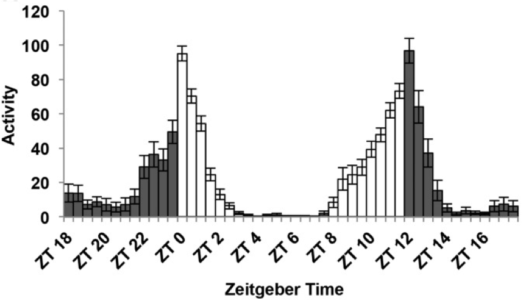
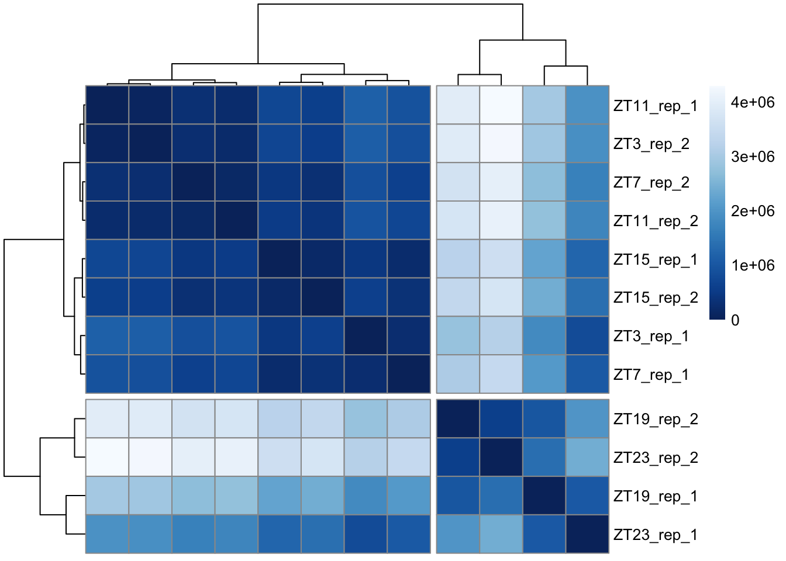
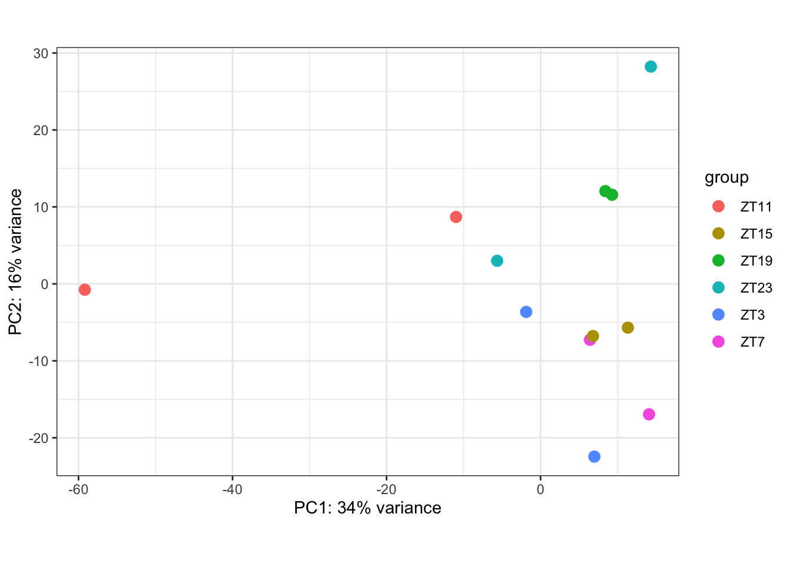
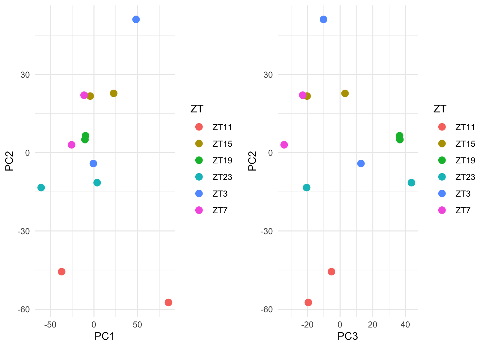
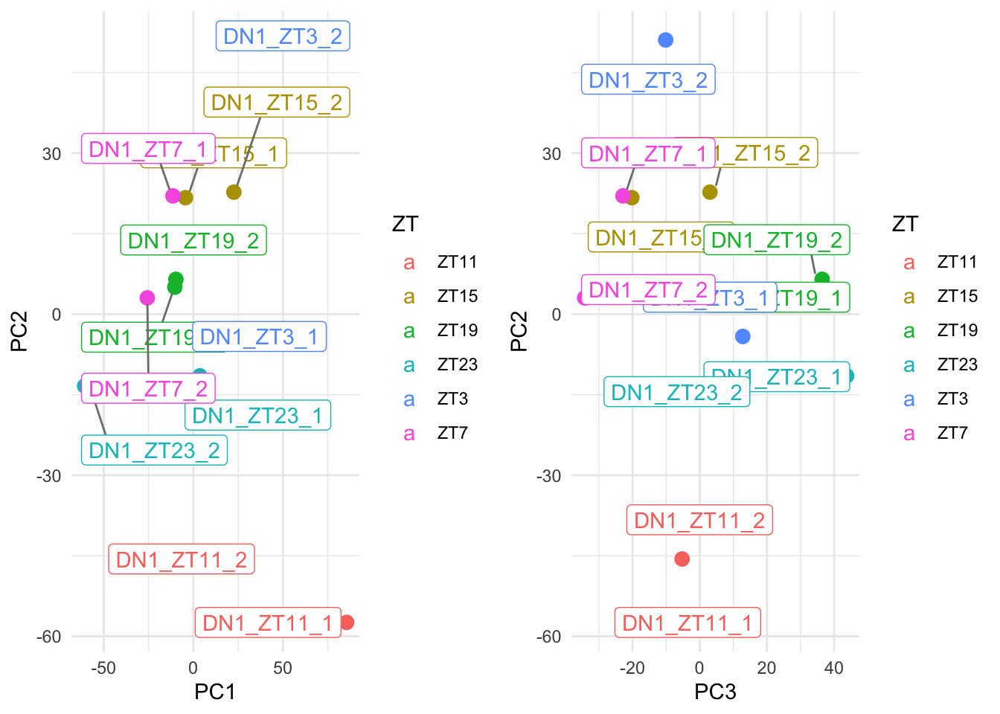
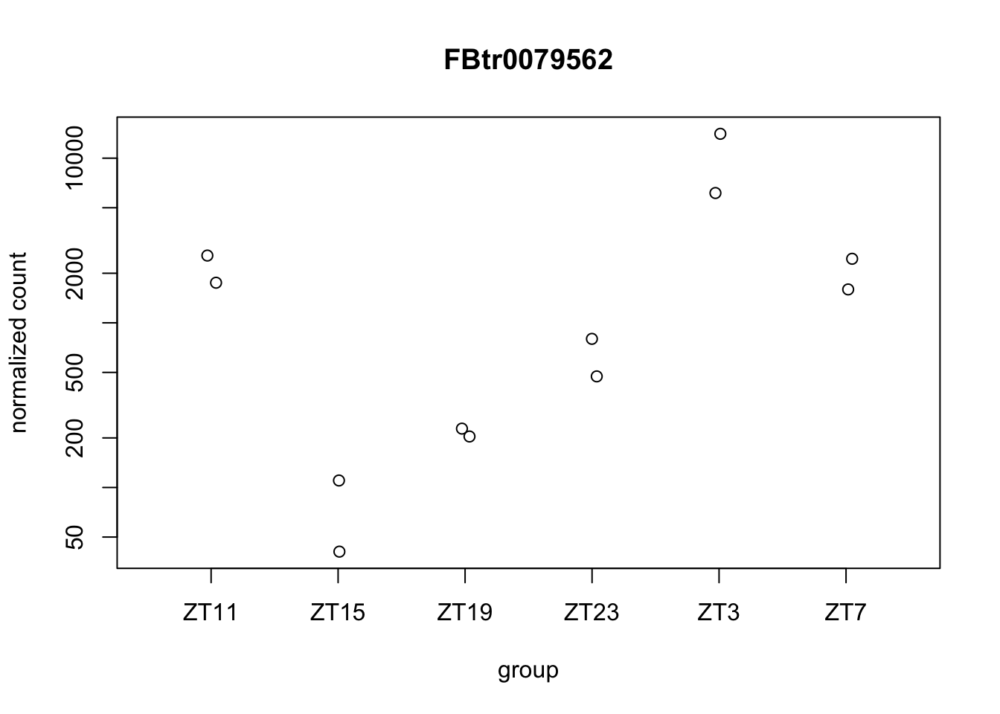
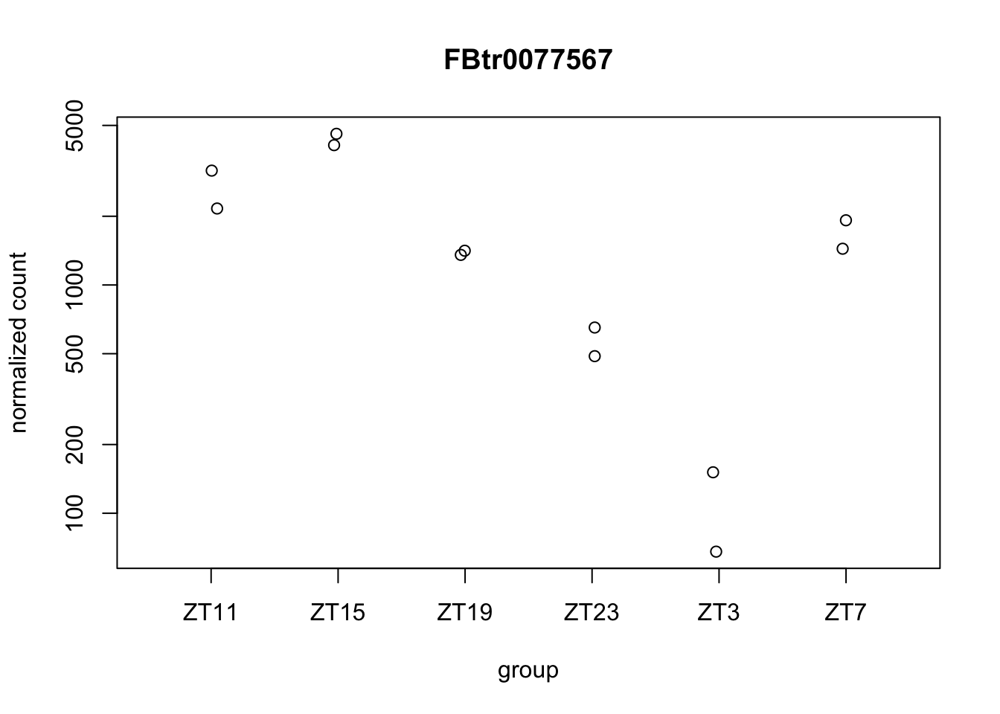
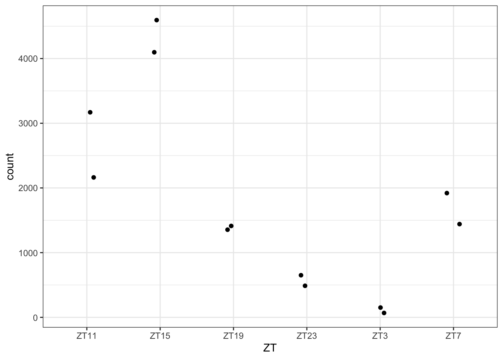
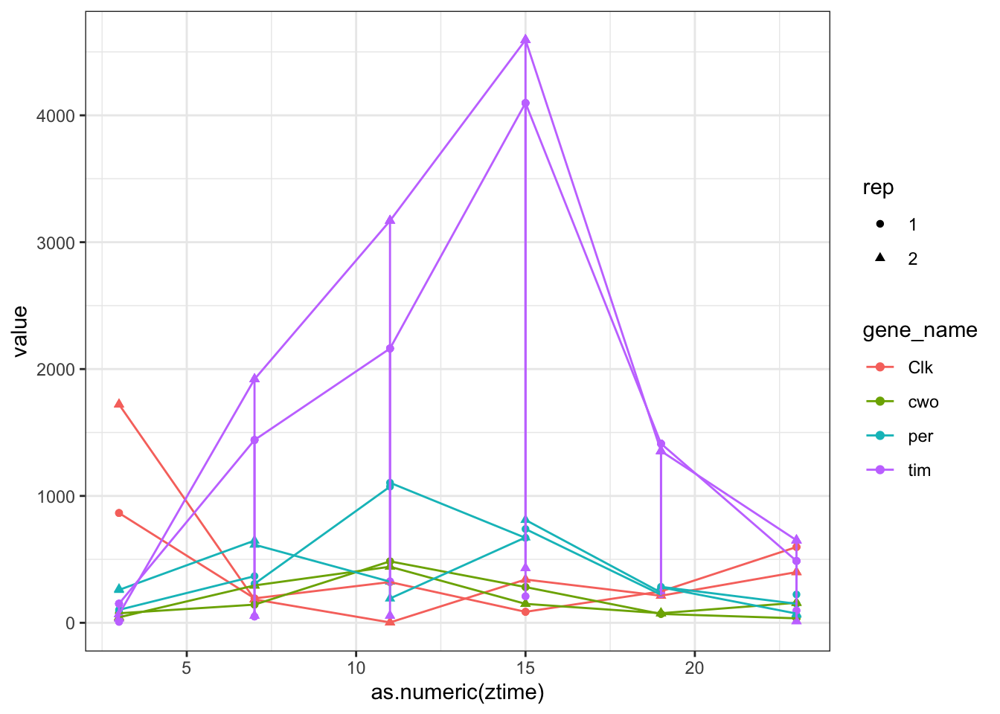
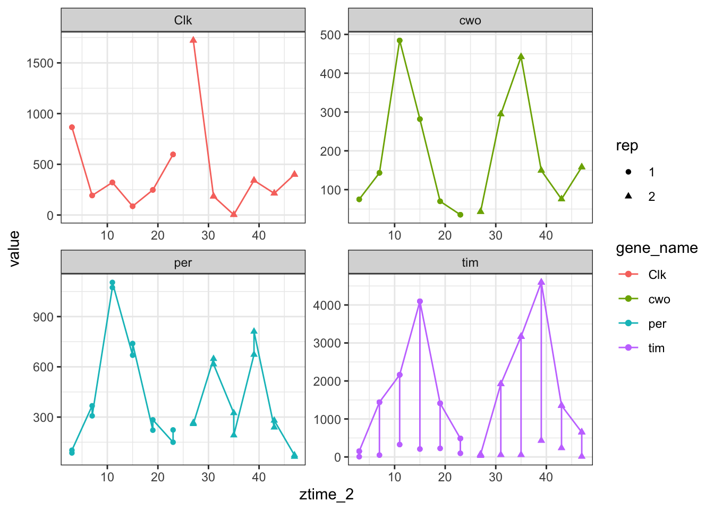

# RNA-seq analysis

## Objectives

After this section you should be able to:

1. Understand RNA sequencing counts.
2. Perform distance matrix and PCA.
3. Do differential gene expression using DeSeq2.

## Introduction

We will re-analyze some data from [Abruzzi et al, 2017](https://journals.plos.org/plosgenetics/article?id=10.1371/journal.pgen.1006613). These are data that explore gene expression in different neuronal cell types in a circadian layout.

This time we will just take the process data from the paper, and no directly the Raw data like in the previous chapter (Chip-seq). The data was downloaded from [GEO](https://www.ncbi.nlm.nih.gov/geo/query/acc.cgi?acc=GSE77451). The only pre-processing to the data was done to change column names.

As you can see in the methods section of the paper they have different cell-types and timepoints. Let’s try to understand what type of system and data we have in hands.

__Circadian behavior__

Most living organisms change their behavior and metabolism over the day. Some animals like us have more activity over the day while others like mice have more activity over night. Flies in particular have a peak of activity the first hours of the morning and the last hours of the afternoon with a "siesta" (nap in Spanish) at the middle of the day. 

<div class="figure" style="text-align: center">

<p class="caption">(\#fig:unnamed-chunk-2)Fly activity over the day. Adapted from Nicholas R. J Glossop et al 2011. To meassure fly activity each individual fly is monitored either by counting when they cross a red-light bim (regular activity monitors) of by software tracking (flyboxes).</p>
</div>

These changes in behavior are govern by changes in gene expression in particular cell-types in the brain called the pace-makers. If we look at gene expression in these cells over the day we will notice that some genes oscillate. Like __Clk__ and __tim__, the proteins we analyzed in the previous Lab. 

In the circadian field time is reported as "hours after the light is ON". This is zeitgeber time (ZT) and it is useful to have a unified measurement of time. Most animals in labs are kept in 12 hours of light followed by 12 hours of dark. Therefore, ZT0 is the "sunrise" or lights on and ZT12 is lights off in a light/dark (LD)12:12 cycle time.

<div class="figure" style="text-align: center">

<p class="caption">(\#fig:unnamed-chunk-3)Fly activity over the day with ZT scale. Figure adapted from Dubowy et al 2017</p>
</div>

As stated before, circadian behaviors is generated by a small subset of neurons. 

<div class="figure" style="text-align: center">

<p class="caption">(\#fig:unnamed-chunk-4)Schematic representation of the circadian neural network. Four small ventrolateral neurons (s‐LNvs, red), the 5th s‐LNv (dark violet), four large ventrolateral neurons (l‐LNvs, brown), six dorsolateral neurons (LNds, orange), three lateral posterior neurons (LPN, green), and ca. 60 neurons per hemisphere in three dorsal groups (DN1–3, lilac, cyan, blue, respectively). Adapted from Schubert et al 2018</p>
</div>

In the data analyzed in this lab, the authors collected RNA samples over 6 times of the day (ZT3, 7, 11, 15, 19, 23) from 4 cell-types: LNv, LNd, DN1 and Dopaminergic neurons (TH cells). This last group of cells are not part of the circadian core clock but in this study they see oscillating genes! 


__Packages:__

We will use the following packages. Do not forget to executing them every time you open a new R session. Before running them for the first time, you will have to install them (go back to Lab1 if you have any doubt).


```r
library(DESeq2) #for differential expression analysis
library(ggplot2) #for 2D graph
library(ggrepel) #to get the names in ggplot graph 
library(gridExtra) #to arrange the plots
library(factoextra) #extra plots
library(plotly) #for 3D graphics
library(plyr) #table manipulation
library(dplyr)#table manipulation
library(tidyr)#table manipulation
library("RColorBrewer") #extra color palettes
library("pheatmap") #nice heatmaps
library(org.Dm.eg.db) #get annotation
library(MetaCycle) # to identify cycling genes, the successor of JTK according to JTK authors
library(pcaExplorer) #more PCA analysis
```

## Differential gene expression

Gene expression data is made of integer numbers by genes. Each number represents exactly how many reads aligned to the DNA sequence that is assigned to each gene. 

Table: Gene counts table

| Gene| Condition 1 replicate 1| Condition 1 replicate 2| Condition 2 replicate 1| Condition 2 replicate 2|
|----:|-----------:|------------:|-----------:|------------:|
|    A|          20|          400|          60|           40|
|    B|           2|           50|        2000|         2500|
|    C|           0|            5|           0|            0|
|    D|           5|         2050|         150|          144|

Ultimately, what we want to do is to compare gene expression between conditions. To do so we have to make some considerations. One is the fact that we want to make conclusions about the whole transcriptome of the organism we are working with. This means around 12000 comparisons (assuming 12000 genes). This implies a huge multiple-comparison correction. Another important consideration is the difference in sequencing depth, to overcame this issue the reads are normalized using an estimate that includes the total amount of reads in that sample. Finally, genes that are too lowly expressed or have a huge dispersion have to be removed from the analysis as they are too noisy to get a trustable conclusion from them.

To perform differential gene expression, we have to build a model that explains the differences in gene expression using the condition we are testing, fit the data to that model and see if it can explain the differences. This is done using generalized linear models (GLM) modeled using a negative binomial distribution (NB). Why is this? Because the data are counts, ie. integers (there are not 12.5 reads, you either have 12 or 13), to model discrete counts, we use either poison or NB distribution. NB is used because it allows for expression and variance to be unlinked.

Luckily for us, there are many packages dedicated to solve this problem. We will use [DeSeq2](https://www.bioconductor.org/packages/devel/bioc/vignettes/DESeq2/inst/doc/DESeq2.html)

The steps performed by the DESeq function are documented in the manual page of DESeq2; briefly, they are:

1 estimation of size factors by estimateSizeFactors (this is for normalization)
2 estimation of dispersion by estimateDispersions (calculate the gene expression dispersion)
3 negative binomial GLM fitting and Wald statistics by nbinomWaldTest (this is the actual differential gene expression step)

The only requirement for Deseq2 is to have the tables of data in a proper format and a meta-data object that indicates what is each sample.

Imagine we have a wildtype and a mutant, DeSeq2 requires
Table: **1: Data matrix with Gene name as ROWNAMES**

| Row Names|  WildType.1|   WildType.2|    Mutant.1|     Mutant.2|
|---------:|-----------:|------------:|-----------:|------------:|
|     geneA|          20|          400|          60|           40|
|     geneB|           2|           50|        2000|         2500|
|     geneC|           0|            5|           0|            0|
|     geneD|           5|         2050|         150|          144|

Table: **2: MetaData (colData) in which ROWNAMES are the COLNAMES of the Data matrix and the conditions are column names**

|  Row Names|    Genotype|    replicate|    
|----------:|-----------:|------------:|
| WildType.1|          WT|            1|
| WildType.2|          WT|            2|
|   Mutant.1|     actinKD|            1|
|   Mutant.2|     actinKD|            2|

The we can use the Genotype as a condition to compare gene expression for example.

At this time, we will start by comparing gene expression at two timepoints in one cell-type. This is good to have a first impression of the data but it is not the way to go if your idea is to analyze circadian cycling behavior. 


### Loading the tables

This time we have 4 gene expression tables: one for each cell type we are analyzing. Therefore, some of the processing will be done using for loops. This might be confusing at the beginning but is a really useful tool.


```r
#We can list the files that are present in our working directory, or any path we specify. Remember the path will change depending where you have your data.
list.files(path = "../RNAseq/")
list.files(path = "../RNAseq/",pattern = "expression") #what do you think patter is doing? remember to go to the help page if you need to.
list.files(path = "../RNAseq/",pattern = "expression",full.names = T) #what happened now?

paper_tables<-list.files(path = "../RNAseq/",pattern = "xpression",full.names = T) #what we are doing here?, check your environment, do you see something new?

#If we try with one
TH_gene_expression<-read.table("../RNAseq/TH_gene_expression.txt",header = T)
```

```
##  [1] "all_tables.rdata"        "circadianact.png"       
##  [3] "circadianbrain.png"      "circadiancells.png"     
##  [5] "cycDN1_reults.txt"       "cycDN1.csv"             
##  [7] "cycwithzt.png"           "DN1_gene_expression.txt"
##  [9] "F1.large.jpg"            "howcircadian.png"       
## [11] "LNd_gene_expression.txt" "LNv_gene_expression.txt"
## [13] "RNASeq_DeSeq2.html"      "RNASeq_DeSeq2.rmd"      
## [15] "RNAseqDataPrep.html"     "TableMod.rmd"           
## [17] "TH_gene_expression.txt" 
## [1] "DN1_gene_expression.txt" "LNd_gene_expression.txt"
## [3] "LNv_gene_expression.txt" "TH_gene_expression.txt" 
## [1] "../RNAseq//DN1_gene_expression.txt" "../RNAseq//LNd_gene_expression.txt"
## [3] "../RNAseq//LNv_gene_expression.txt" "../RNAseq//TH_gene_expression.txt"
```

How can we make it work for all the tables? We want to change the name, we basically want to remove the ".txt" ending. That can be done using gsub. We want to remove ".txt", so we replace it for an empty string.


```r
gsub(x = "../RNAseq/TH_gene_expression.txt",pattern =".txt",  replacement = "")
```

```
## [1] "../RNAseq/TH_gene_expression"
```

```r
#We also need to remove the path file
gsub(x = "../RNAseq/TH_gene_expression.txt",pattern ="../RNAseq/",  replacement = "")
```

```
## [1] "TH_gene_expression.txt"
```

Now we can try to do it for all of them, just trying to see if changing the names is working but NOT applying it to anything until we know it works.


```r
for (e in (paper_tables)){
  print("original name:          ")
  print(e) # this is printing e
  n<-gsub(pattern =".txt",  replacement = "",x = e)
  n<-gsub(pattern ="../RNAseq//",  replacement = "",x = n)
  print("final name:        ")
  print(n)
}
```

```
## [1] "original name:          "
## [1] "../RNAseq//DN1_gene_expression.txt"
## [1] "final name:        "
## [1] "DN1_gene_expression"
## [1] "original name:          "
## [1] "../RNAseq//LNd_gene_expression.txt"
## [1] "final name:        "
## [1] "LNd_gene_expression"
## [1] "original name:          "
## [1] "../RNAseq//LNv_gene_expression.txt"
## [1] "final name:        "
## [1] "LNv_gene_expression"
## [1] "original name:          "
## [1] "../RNAseq//TH_gene_expression.txt"
## [1] "final name:        "
## [1] "TH_gene_expression"
```
>What is this for loop doing? Do you think it is working? Why?

Now we will read the tables and put them in the names we created. To do this we will use the function assign, that actually assign anything to a given name. The name is stored in "n". What we want to assign is the "read.delim" of the file name stored in e.


```r
for (e in (paper_tables)){
  n<-gsub(pattern =".txt",  replacement = "",x = e)
  n<-gsub(pattern ="../RNAseq//",  replacement = "",x = n)
  print(paste0("I am reading: ",n))
  assign(n,read.delim(e))
}
```

```
## [1] "I am reading: DN1_gene_expression"
## [1] "I am reading: LNd_gene_expression"
## [1] "I am reading: LNv_gene_expression"
## [1] "I am reading: TH_gene_expression"
```

### Create the DeSeq2 count matrix

DeSeq2 expects to have a data.frame with the gene-names as `row.names` and then just the counts. 

I will first show it for one of the tables and then do a for loop to do it for all of them.


```r
#We do not want to overwrite the raw tables. So, we will create new objects with the same data and we will modify these new objects and preserve the original data. Is like doing "save as" in word.

ds2_DN1_gene_expression_try<-DN1_gene_expression #what is this doing?

#We do now the loop for all of them to create the `ds2_` objects
ls(pattern = "gene_expression") #this list the objects in the environment that has the selected pattern in its name
```

```
## [1] "DN1_gene_expression"         "ds2_DN1_gene_expression_try"
## [3] "LNd_gene_expression"         "LNv_gene_expression"        
## [5] "TH_gene_expression"
```


```r
#The new name we want is just adding "ds2_" to the beginning of the object name. We can do this with the paste0 function.
paste0("ds2_","DN1_gene_expression")

for (e in ls(pattern = "gene_expression")){ 
  x = paste0("ds2", sep="_",e) #this is the new name
  print("new name is:")
  print(x) 
  assign(x, get(e)) #get is a function that extracts the data from an object name
}
```

```
## [1] "ds2_DN1_gene_expression"
## [1] "new name is:"
## [1] "ds2_DN1_gene_expression"
## [1] "new name is:"
## [1] "ds2_ds2_DN1_gene_expression_try"
## [1] "new name is:"
## [1] "ds2_LNd_gene_expression"
## [1] "new name is:"
## [1] "ds2_LNv_gene_expression"
## [1] "new name is:"
## [1] "ds2_TH_gene_expression"
```

Now we have to do some manipulation in the tables for them to work with Deseq2.


```r
ds2_DN1_gene_expression_try <- ds2_DN1_gene_expression
row.names(ds2_DN1_gene_expression_try) = ds2_DN1_gene_expression$Symbol # we put the symbols as row.names
ds2_DN1_gene_expression_try<-ds2_DN1_gene_expression_try[,-1] # we take the symbols column out
head(ds2_DN1_gene_expression_try) # we can see that now the table is what we need
rm(ds2_DN1_gene_expression_try) #remove it because you do not need it anymore and because it can create problems
```

```
##             DN1_ZT3_1 DN1_ZT7_1 DN1_ZT11_1 DN1_ZT15_1 DN1_ZT19_1 DN1_ZT23_1
## FBtr0070202         0         0          0          0          0          0
## FBtr0070207         0         0          0          0         14          0
## FBtr0070238         0         0          0          0         21          0
## FBtr0070251         0         0          0          0          0          0
## FBtr0070484         0         0          0          0          0          0
## FBtr0070489         0         0          0          0          0          0
##             DN1_ZT3_2 DN1_ZT7_2 DN1_ZT11_2 DN1_ZT15_2 DN1_ZT19_2 DN1_ZT23_2
## FBtr0070202         0         0          0          0          0          0
## FBtr0070207         0         0          0          0         16          7
## FBtr0070238         0         0          0          0         15          9
## FBtr0070251         0         0          1          0          2          0
## FBtr0070484         0         0          0          0          0          1
## FBtr0070489         0         0          0          0          0          0
```
We can add this step to the for loop, or even better we can create a function and practice something new in R.

```r
#We create a small function to remember
sum2<-function(x){
 y=x+2 
 return(y)
}

sum2(4) 
```

```
## [1] 6
```
>what is this doing? why?


```r
#Now we create a function that takes the data frame and does all the transformation we did before
create_ds2= function(df_name){
  df = as.data.frame(get(df_name))
  row.names(df) = as.character(df[,1])
  df=df[,-1]
  return(df) # this actually tells the function to return the transformed data.frame
}

#Let's try the function in one of the ds2 objects
#head(create_ds2(ds2_LNd_gene_expression))[,c(1:3)]
for (e in ls(pattern = "ds2_")){
  print(e)
  assign(e,create_ds2(e)) #this should actually run the function and apply it to the data frame
}
```

```
## [1] "ds2_DN1_gene_expression"
## [1] "ds2_ds2_DN1_gene_expression_try"
## [1] "ds2_LNd_gene_expression"
## [1] "ds2_LNv_gene_expression"
## [1] "ds2_TH_gene_expression"
```

### Meta-data (colData) preparation {.tabset .tabset-fade .tabset-pills}

We now need to have a data.frame with the mapping between the columns and the ZT, the program call this colData. Is what is usually called "meta data". Is a file that explains what each object/column is.

We will do it by hand just changing the names. No more loops for now. After you execute each step I recommend you to inspect the object to see what is happening.
 
**DN1**

```r
#takes the names in the data frame and put them in the new objects. We want to get the information for each 
colData.DN1 = as.data.frame(names(ds2_DN1_gene_expression)) 
#now we put them as row.names
rownames(colData.DN1) = colData.DN1[,1]
#now we take the columns out 
colData.DN1 =colData.DN1[,-1]
#this is taking the last part of the rownames and put them in a column named `ZT`
colData.DN1$ZT = sapply(strsplit(rownames(colData.DN1),"_"),"[[",2)
colData.DN1$rep = sapply(strsplit(rownames(colData.DN1),"_"),"[[",3)

head(colData.DN1)
```

```
##              ZT rep
## DN1_ZT3_1   ZT3   1
## DN1_ZT7_1   ZT7   1
## DN1_ZT11_1 ZT11   1
## DN1_ZT15_1 ZT15   1
## DN1_ZT19_1 ZT19   1
## DN1_ZT23_1 ZT23   1
```
**LNv**

```r
colData.LNv = as.data.frame(names(ds2_LNv_gene_expression)) 
#now we put them as row.names
rownames(colData.LNv) = colData.LNv[,1]
#now we take the columns out 
colData.LNv =colData.LNv[,-1]
#this is taking the last part of the rownames and put them in a column named `ZT`
colData.LNv$ZT = sapply(strsplit(rownames(colData.LNv),"_"),"[[",2)
colData.LNv$rep = sapply(strsplit(rownames(colData.LNv),"_"),"[[",3)
```

**LNd**

```r
colData.LNd = as.data.frame(names(ds2_LNd_gene_expression)) 
#now we put them as row.names
rownames(colData.LNd) = colData.LNd[,1]
#now we take the columns out 
colData.LNd =colData.LNd[,-1]
#this is taking the last part of the rownames and put them in a column named `ZT`
colData.LNd$ZT = sapply(strsplit(rownames(colData.LNd),"_"),"[[",2)
colData.LNd$rep = sapply(strsplit(rownames(colData.LNd),"_"),"[[",3)
```

**TH**

```r
colData.TH = as.data.frame(names(ds2_TH_gene_expression)) 
#now we put them as row.names
rownames(colData.TH) = colData.TH[,1]
#now we take the columns out and 
colData.TH =colData.TH[,-1]
colData.TH$ZT = sapply(strsplit(rownames(colData.TH),"_"),"[[",2)
colData.TH$rep = sapply(strsplit(rownames(colData.TH),"_"),"[[",3)
```

### Quality filtering: Distance matrix and principal component analysis (PCA) {.tabset .tabset-fade .tabset-pills}

If we want to evaluate the difference between two conditions we have to make sure that the difference between replicates of the same conditions are smaller. In other words, we expect the replicates of the same condition to be similar to each other. Checking this is a regular procedure in differential gene expression analysis as it helps us to identify samples that might be outliers. 

To evaluate this, we will use two different approaches. Firstly, we will calculate a distance matrix, this is basically calculating the difference between each sample. To visualize this, we will use a heatmap. Secondly, we will do a principal component analysis (PCA) to get an idea on how similar are the samples between each other. To make it simple (but not completely correct) PCA is a way to reduce the dimensions (in this case many many genes) to a set of vectors (principal components, PC) that summarize the combination of the gene information. Then, if two samples have similar values in this PCs then they are similar to each other. 

We first have to initiate the DeSeq2 object. This imply telling the package which is the matrix of read counts, the colData (meta data) and the design. The design is what the program uses to do the differential expression. Is simple in this case: only the ZT.

**Initialize the data**

```r
#This is actually the main function of the package and prepares everything to run the differential expression analysis.
dds.DN1 <- DESeqDataSetFromMatrix(countData = as.matrix(ds2_DN1_gene_expression), colData = colData.DN1,design = ~ ZT)

#class of dds.DN1
class(dds.DN1)
```

```
## [1] "DESeqDataSet"
## attr(,"package")
## [1] "DESeq2"
```

**Distance Matrix**

As stated before, a distance matrix is a way to quantify differences. In this case each column of the data matrix will be compared with all the others.
You can read more [here](https://www.displayr.com/what-is-a-distance-matrix/) or [here](http://www.sthda.com/english/articles/31-principal-component-methods-in-r-practical-guide/120-correspondence-analysis-theory-and-practice/). `dist()` is the function that calculates the Euclidean distance, you can select which type of distance you want to calculate, read the help page for more information.


```r
# Calculate the distance matrix
sampleDists <- dist(t(assay(dds.DN1))) 

# Lets look at this step by step:
# assay(dds.DN1) # extract the reads
# t(assay(dds.DN1)) #transpose the matrix, this has to do with the fact that we want to calculate the distance between samples, if we do not transpose we will literally calculate the difference between genes across samples

#Then we take this in a matrix and create the heatmap
sampleDistMatrix <- as.matrix(sampleDists) #convert to matrix

rownames(sampleDistMatrix) <- paste(dds.DN1$ZT,dds.DN1$rep,sep="_rep_") # put the rownames
colnames(sampleDistMatrix) <- NULL
colors <- colorRampPalette( rev(brewer.pal(9, "Blues")) )(255)#select color 

#Heatmap function
pheatmap(sampleDistMatrix,
         clustering_distance_rows=sampleDists,
         clustering_distance_cols=sampleDists,
                  annotation_row = rownames(sampleDists),
         annotation_col = rownames(sampleDists),
         cutree_rows = 2,
         cutree_cols = 2,
         col=colors)
```

<div class="figure" style="text-align: center">

<p class="caption">(\#fig:unnamed-chunk-21)Heatmap representing distance between samples</p>
</div>

**PCA using DeSeq2**

We have to do a logarithmic transformation to see how the data looks like after minimizing differences between samples for rows with small counts, and which normalizes with respect to library size. You can read the help executing `?rlog`.


```r
rdl.DN1 <- rlog(dds.DN1) 
```

Now we can plot the PCA analysis already integrated in the DeSeq2 package.


```r
plotPCA(rdl.DN1, intgroup=c("ZT"))
```

<div class="figure" style="text-align: center">

<p class="caption">(\#fig:unnamed-chunk-23)PCA coloring by ZT</p>
</div>

**PCA using basic R**

We will use the function `prcomp()` to calculate the PCs.
But before we do that we will select the most variable genes across samples. If a gene has the same value across all the samples will not be explicative or informative.


```r
rv <- rowVars(assay(rdl.DN1)) # we calcualte the total variation in each gene (in this case rows), rowwVars literally calculates the variance in the rows
ntop <- 10000 # we select how many gene we want to use 
sg <- order(rv, decreasing = TRUE)[seq_len(min(ntop, length(rv)))] # here we select the most variable genes acording to the ntop value we set up before
mat <- t(assay(rdl.DN1)[sg, ]) # here we extract then the counts using the function assay from DeSeq2
pc <- prcomp(mat) # calcualte PCs
#head(pc,n=3L)
```

To select how many PCs are "important" we will use the percentage of variance explained by each PC. This takes us to the next step of understanding PCA. Each PC might be seen as a vector that explain some part of the variation of the data. Then if a PC explains only 2% of the data it makes no sense to pay attention to if we compared it to other PCs that might explain more.


```r
fviz_eig(pc, addlabels = TRUE)
```

<div class="figure" style="text-align: center">

<p class="caption">(\#fig:unnamed-chunk-25)Variance explained by each PC</p>
</div>

Now we can plot more than 2 PCs


```r
pc_df=as.data.frame(pc$x) #transform to data frame
pc_df=merge(pc_df,colData.DN1,by="row.names",all=T) # merge with the colData to have the meta data of each saple
rownames(pc_df)=pc_df$Row.names


p1=ggplot(pc_df, aes(PC1, PC2, color=ZT)) +
  geom_point(size=3)  +
  theme_minimal()


p2=ggplot(pc_df, aes(PC3, PC2, color=ZT)) +
  geom_point(size=3) +
  theme_minimal()

#and both together
grid.arrange(p1,p2, ncol=2)
```

<div class="figure" style="text-align: center">

<p class="caption">(\#fig:unnamed-chunk-26)Ploting many principal components</p>
</div>


```r
p1=ggplot(pc_df, aes(PC1, PC2, color=ZT,label=Row.names)) +
  geom_point(size=3) +
  geom_label_repel(aes(label = Row.names),
                   box.padding   = 0.35, 
                   point.padding = 0.5,
                   segment.color = 'grey50') +
  theme_minimal()


p2=ggplot(pc_df, aes(PC3, PC2, color=ZT,label=Row.names)) +
  geom_point(size=3) +
  geom_label_repel(aes(label = Row.names),
                   box.padding   = 0.35, 
                   point.padding = 0.5,
                   segment.color = 'grey50') +
  theme_minimal()


#and both together
grid.arrange(p1,p2, ncol=2)
```

<div class="figure" style="text-align: center">

<p class="caption">(\#fig:unnamed-chunk-27)Ploting many principal components</p>
</div>
```
#We can do some fancy 3D plots also, try them!
plot_ly(pc_df, x = ~PC1, y = ~PC2, z = ~PC3, color = ~ZT,colorscale = c('#FFE1A1', '#683531'))

plot_ly(pc_df, x = ~PC2, y = ~PC3, z = ~PC4, color = ~ZT,colorscale = c('#FFE1A1', '#683531'))

```

### Differential gene expression analysis between ZT. {.tabset .tabset-fade .tabset-pills}

We already saw that for DN1: ZT19 and ZT23 looks more similar between them and also ZT3, 7, 15 and 11. We will now explore particular differences. `DESeq` is the main function here it acts over the object created previously. It executes the normalization and differential gene expression analysis.

**Run differentially expression**


```r
dds.DN1 = DESeq(dds.DN1)
```

```
## estimating size factors
```

```
## estimating dispersions
```

```
## gene-wise dispersion estimates
```

```
## mean-dispersion relationship
```

```
## final dispersion estimates
```

```
## fitting model and testing
```

```r
#The resultNames is taking the names of the comparisons done by the DESeq function
resultsNames(dds.DN1)
```

```
## [1] "Intercept"       "ZT_ZT15_vs_ZT11" "ZT_ZT19_vs_ZT11" "ZT_ZT23_vs_ZT11"
## [5] "ZT_ZT3_vs_ZT11"  "ZT_ZT7_vs_ZT11"
```
The `results` function extract this result, we will compare ZT3 vs ZT15. Use `?results` to explore this function further.


```r
res.ZT3vsZT15.DN1 <- results( dds.DN1, contrast = c("ZT","ZT3", "ZT15"),alpha=0.05)

head(res.ZT3vsZT15.DN1)
```

```
## log2 fold change (MLE): ZT ZT3 vs ZT15 
## Wald test p-value: ZT ZT3 vs ZT15 
## DataFrame with 6 rows and 6 columns
##                      baseMean log2FoldChange            lfcSE      stat
##                     <numeric>      <numeric>        <numeric> <numeric>
## FBtr0070202                 0             NA               NA        NA
## FBtr0070207   2.1168359707544              0 5.24448449612991         0
## FBtr0070238  2.68357323289241              0  4.8861753047644         0
## FBtr0070251 0.304433817751997              0 5.39799191011387         0
## FBtr0070484 0.151419583982656              0 5.39799191011387         0
## FBtr0070489                 0             NA               NA        NA
##                pvalue      padj
##             <numeric> <numeric>
## FBtr0070202        NA        NA
## FBtr0070207         1         1
## FBtr0070238         1         1
## FBtr0070251         1        NA
## FBtr0070484         1        NA
## FBtr0070489        NA        NA
```

> What do you think is each column?


```r
mcols(res.ZT3vsZT15.DN1)$description
```

```
## [1] "mean of normalized counts for all samples"
## [2] "log2 fold change (MLE): ZT ZT3 vs ZT15"   
## [3] "standard error: ZT ZT3 vs ZT15"           
## [4] "Wald statistic: ZT ZT3 vs ZT15"           
## [5] "Wald test p-value: ZT ZT3 vs ZT15"        
## [6] "BH adjusted p-values"
```

We can see the distribution of each variable using the function `summary`


```r
summary(res.ZT3vsZT15.DN1)
```

```
## 
## out of 25337 with nonzero total read count
## adjusted p-value < 0.05
## LFC > 0 (up)       : 79, 0.31%
## LFC < 0 (down)     : 55, 0.22%
## outliers [1]       : 0, 0%
## low counts [2]     : 3419, 13%
## (mean count < 2)
## [1] see 'cooksCutoff' argument of ?results
## [2] see 'independentFiltering' argument of ?results
```

**Identify differentially expressed genes: Multiple comparison correction and adjusted pvalue**

You might have noticed that apart from pvalues there are adjusted pvalues. Just to recap, when we want to make conclusion we always have some chance to make a mistake. This chance increase with each element we add to out conclusions. Image what happens when we want to make a conclusion about 10.000 genes! We then correct the pvalue. There are different methods, in this case DeSeq2 uses Benjamini-Hochberg adjusted P value.

We can now do an histogram to explore how is the distribution of the padj.


```r
#histogram
hist(res.ZT3vsZT15.DN1$padj, breaks=100, col="skyblue", border="slateblue", main="")
```

<div class="figure" style="text-align: center">

<p class="caption">(\#fig:unnamed-chunk-32)Histogram of pjusted value distribution</p>
</div>

**Identify differentially expressed genes: Log2(FoldChange)**

Identify differentially expressed genes is a combination of pvalue and a fold change. Fold change is literally the comparison of 2 conditions. Let’s go back to our example.

| Row Names|  WildType.1|   WildType.2|    Mutant.1|     Mutant.2|
|---------:|-----------:|------------:|-----------:|------------:|
|     geneA|         230|          210|         420|          412|

Here, geneA seems to be around 2 times more in Mutant compared with the WildType. This would be an **UPregulated** gene. 

$$
Mutant/WT=400/200=2
$$

If we imagine the opposite situation, a **DOWNregulated** gene, the same comparison would give a not-such intuitive result.

| Row Names|  WildType.1|   WildType.2|    Mutant.1|     Mutant.2|
|---------:|-----------:|------------:|-----------:|------------:|
|     geneA|         430|          410|         220|          212|


$$
Mutant/WT=200/400=0.5
$$

To avoid this, in differential gene expression we use log2. This will give us the following:

$$
UPregulated: log2(Mutant/WT)=log2(400/200)=1
$$
$$
DOWNregulated: log2(Mutant/WT)=log2(200/400)=-1
$$

To know what is being used as denominator (control) we can look into the DeSeq2 manual:
"With no additional arguments to `results()`, the log2 fold change and Wald test p value will be for the last variable in the design formula, and if this is a factor, the comparison will be the last level of this variable over the reference level."

In our case then ZT15 is being used as reference

To see significance is to use MA plots which shows log2 fold changes (on the y-axis) versus the mean of normalized counts (on the x-axis).


```r
plotMA(res.ZT3vsZT15.DN1,alpha=0.05) #In red everything with padj < 0.05
```

<div class="figure" style="text-align: center">

<p class="caption">(\#fig:unnamed-chunk-33)MA plot: log2 fold changes vs normalized counts</p>
</div>

### Explore results

We can create a data frame of the results and play around.

```r
res.ZT3vsZT15.DN1_df<-as.data.frame(res.ZT3vsZT15.DN1)
res.ZT3vsZT15.DN1_df=res.ZT3vsZT15.DN1_df[complete.cases(res.ZT3vsZT15.DN1_df),]#remove NAs
res.ZT3vsZT15.DN1_df$transcript_name=rownames(res.ZT3vsZT15.DN1_df)

head(res.ZT3vsZT15.DN1_df)
```

```
##              baseMean log2FoldChange     lfcSE      stat     pvalue padj
## FBtr0070207  2.116836      0.0000000 5.2444845  0.000000 1.00000000    1
## FBtr0070238  2.683573      0.0000000 4.8861753  0.000000 1.00000000    1
## FBtr0070658  2.762362      0.0000000 5.3979919  0.000000 1.00000000    1
## FBtr0071170 16.483738      2.1943705 1.1682234  1.878383 0.06032885    1
## FBtr0071173  4.674766      0.0000000 5.3502754  0.000000 1.00000000    1
## FBtr0071619 49.515374     -0.8457701 0.6368886 -1.327972 0.18418743    1
##             transcript_name
## FBtr0070207     FBtr0070207
## FBtr0070238     FBtr0070238
## FBtr0070658     FBtr0070658
## FBtr0071170     FBtr0071170
## FBtr0071173     FBtr0071173
## FBtr0071619     FBtr0071619
```

**Change the gene names**

As you can see, the names of the genes are in a nomenclature that is not intuitive. We can then use some functions that will allow us to change the names for some more informative. 

Let’s take one example: FBtr0070207, is a transcript name (not a gene name, but one of the possible variants of the gene) http://flybase.org/reports/FBtr0070207. We want for this analysis the gene name. For that we will use the package `org.Dm.eg.db` (each model organism has one of this: https://bioconductor.org/packages/release/BiocViews.html#___AnnotationData)


```r
#Explore the options that the package gives us
keytypes(org.Dm.eg.db)
```

```
##  [1] "ACCNUM"       "ALIAS"        "ENSEMBL"      "ENSEMBLPROT"  "ENSEMBLTRANS"
##  [6] "ENTREZID"     "ENZYME"       "EVIDENCE"     "EVIDENCEALL"  "FLYBASE"     
## [11] "FLYBASECG"    "FLYBASEPROT"  "GENENAME"     "GO"           "GOALL"       
## [16] "MAP"          "ONTOLOGY"     "ONTOLOGYALL"  "PATH"         "PMID"        
## [21] "REFSEQ"       "SYMBOL"       "UNIGENE"      "UNIPROT"
```


```r
#We have here the ENSEMBLE transcript names, so we will use that keytype
genenames <- mapIds(org.Dm.eg.db,keys = rownames(dds.DN1),column = "SYMBOL",keytype="ENSEMBLTRANS")
annotation_DN1 <- data.frame(gene_name = genenames, transcript_name=rownames(dds.DN1), row.names = rownames(dds.DN1), stringsAsFactors = FALSE)
head(annotation_DN1) 
```

```
##             gene_name transcript_name
## FBtr0070202   CG14625     FBtr0070202
## FBtr0070207    fs(1)N     FBtr0070207
## FBtr0070238   CG11409     FBtr0070238
## FBtr0070251   CG11384     FBtr0070251
## FBtr0070484   fs(1)Yb     FBtr0070484
## FBtr0070489   CG12498     FBtr0070489
```

Now that we have a "mapping" we can use it. We will use the function `merge`.


```r
res.ZT3vsZT15.DN1_df=merge(res.ZT3vsZT15.DN1_df,annotation_DN1,by="transcript_name")
head(res.ZT3vsZT15.DN1_df)
```

```
##   transcript_name  baseMean log2FoldChange     lfcSE       stat    pvalue padj
## 1     FBtr0005088 404.52656     -0.3962867 0.4939109 -0.8023445 0.4223537    1
## 2     FBtr0005673   2.35263      1.7199349 2.8262384  0.6085598 0.5428163    1
## 3     FBtr0005674   2.35263      1.7199349 2.8262384  0.6085598 0.5428163    1
## 4     FBtr0070000  44.02153     -0.7589507 1.1324434 -0.6701886 0.5027375    1
## 5     FBtr0070002   4.30420      3.7116759 2.5555706  1.4523863 0.1463942    1
## 6     FBtr0070006  23.06487     -1.1075368 1.0502903 -1.0545054 0.2916516    1
##   gene_name
## 1  Pp2A-29B
## 2      <NA>
## 3      <NA>
## 4      Nep3
## 5    CG9570
## 6    CG9572
```

**UP regulated genes**
Now let’s look for the genes that are changing with than Log2foldChange > 1 (which is a fold change of 2)


```r
sig_down=unique(res.ZT3vsZT15.DN1_df$gene_name[(res.ZT3vsZT15.DN1_df$padj<0.05&res.ZT3vsZT15.DN1_df$log2FoldChange<(-1))])
head(sig_down)
```

```
## [1] NA        "CG14089" "CG13041" "CG32137" "Pdp1"    "tim"
```

**DOWN regualted genes**
Now let’s look for the genes that are changing with than Log2foldChange < -1 (which is a fold change of 0.5, so a downregulation of 2 times)


```r
sig_up=unique(res.ZT3vsZT15.DN1_df$gene_name[(res.ZT3vsZT15.DN1_df$padj<0.05&res.ZT3vsZT15.DN1_df$log2FoldChange>1)])

head(sig_down)
```

```
## [1] NA        "CG14089" "CG13041" "CG32137" "Pdp1"    "tim"
```
**Plot genes**

Let’s plot some genes using DeSeq2.


```r
plotCounts(dds.DN1, gene=which.min(res.ZT3vsZT15.DN1$padj), intgroup="ZT")
```

<div class="figure" style="text-align: center">

<p class="caption">(\#fig:unnamed-chunk-39-1)Plot gene expression.</p>
</div>

```r
plotCounts(dds.DN1, gene="FBtr0077567", intgroup="ZT")
```

<div class="figure" style="text-align: center">

<p class="caption">(\#fig:unnamed-chunk-39-2)Plot gene expression.</p>
</div>

We can do this in ggplot2

```r
d <- plotCounts(dds.DN1, gene="FBtr0077567", intgroup="ZT", returnData=TRUE) #extract eh data from the plot

ggplot(d, aes(x=ZT, y=count)) + geom_point(position=position_jitter(w=0.1,h=0)) #use it to plot in a better way
```

<div class="figure" style="text-align: center">

<p class="caption">(\#fig:unnamed-chunk-40)Plot gene expression using ggplot.</p>
</div>

Let's discuss what we see in the graphics. 

We have some of the figures that seems to have the exactly same values for each replicate. This is at least suspicious. This might be just the same quantification so it might not be correct to say that they are different isoforms and maybe it is better to collapse them or change the strategy to analyze different isoforms. This also shows us the limitations we have when we use the data already aligned. 

### Plot counts using ggplot

Let’s see how we can plot the transcript reads in a better way. Doing a few manipulations on the table we can have even better plots. 


```r
#big plot
#I take the normalized values and do the plots
toplot<-as.data.frame(as.data.frame(counts(dds.DN1, normalized=T)))
toplot$transcript_name<-rownames(toplot)

toplot<-toplot %>% gather(zt_rep, value, -transcript_name) #This is a more complex line of code, let’s explore the results.
head(toplot)
```

```
##   transcript_name    zt_rep value
## 1     FBtr0070202 DN1_ZT3_1     0
## 2     FBtr0070207 DN1_ZT3_1     0
## 3     FBtr0070238 DN1_ZT3_1     0
## 4     FBtr0070251 DN1_ZT3_1     0
## 5     FBtr0070484 DN1_ZT3_1     0
## 6     FBtr0070489 DN1_ZT3_1     0
```

```r
toplot=merge(toplot,annotation_DN1,by="transcript_name")
head(toplot)
```

```
##   transcript_name     zt_rep    value gene_name
## 1     FBtr0005088 DN1_ZT11_2 333.0941  Pp2A-29B
## 2     FBtr0005088 DN1_ZT19_2 332.2765  Pp2A-29B
## 3     FBtr0005088  DN1_ZT7_2 520.4211  Pp2A-29B
## 4     FBtr0005088  DN1_ZT3_2 235.0216  Pp2A-29B
## 5     FBtr0005088 DN1_ZT23_2 392.4796  Pp2A-29B
## 6     FBtr0005088 DN1_ZT19_1 406.2523  Pp2A-29B
```

> What changed here? How this allow for better plotting?


```r
#Lets create now more meta data 
toplot$zt<-sapply(strsplit(as.character(toplot$zt_rep),"_"),"[[",2)
toplot$ztime<-gsub(toplot$zt,pattern = "ZT",replacement = "")
toplot$rep<-sapply(strsplit(as.character(toplot$zt_rep),"_"),"[[",3)
toplot$ztime_2<-as.numeric(toplot$ztime)
toplot$ztime_2[toplot$rep=="2"]<-toplot$ztime_2[toplot$rep=="2"]+24

#And plot
genes.cyc = c("tim","Clk","per","cwo") #you can put here as many genes as you want
```


```r
ggplot(toplot[toplot$gene_name %in% genes.cyc ,],aes(x = as.numeric(ztime),y = value,color=gene_name,shape=rep)) + geom_point() + geom_line() 
```

<div class="figure" style="text-align: center">

<p class="caption">(\#fig:unnamed-chunk-44)Count plots with ggplot</p>
</div>


```r
ggplot(toplot[toplot$gene_name %in% genes.cyc ,],aes(x =ztime_2,y = value,color=gene_name,shape=rep)) + geom_point() + geom_line()
```

<div class="figure" style="text-align: center">

<p class="caption">(\#fig:unnamed-chunk-45)Count plots with ggplot using zt time</p>
</div>


```r
ggplot(toplot[toplot$gene_name %in% genes.cyc ,],aes(x =ztime_2,y = value,color=gene_name,shape=rep)) + geom_point() + geom_line() + facet_wrap(scales = "free",facets = ~gene_name )
```

<div class="figure" style="text-align: center">

<p class="caption">(\#fig:unnamed-chunk-46)Count plots with ggplot sepparating by gene name</p>
</div>

## Gene Ontology (GO) term analysis

The main objective of GO term analysis is to identify common features in a list of gene shared feature that might be "enriched" when compared with the background list of of genes. There are 3 GO term sets:

1. **Molecular Function**(MF): Molecular function or activities performed by gene product. Examples can be for example *catalysis* or *transport*.
2. **Biological Process**(BP): The larger processes, or ‘biological programs’ that these genes takes part in. Examples can be *DNA repair* or *signal transduction*.
3. **Cellular Component**(CC): The locations relative to cellular structures in which a gene product performs a function, either cellular compartments.

For this we use the known information about each gene. Lets see one example: *Gad1*. 

From [FlyBase](http://flybase.org/reports/FBgn0004516):
"Glutamic acid decarboxylase 1 (Gad1) encodes an essential, nervous system-specific glutamic acid decarboxylase, which is the synthetic enzyme for the major inhibitory neurotransmitter gamma-Aminobutyric acid (GABA). It is required for a multitude of physiological functions and adult behaviors dependent on GABA, including sleep, memory, circadian rhythms and egg hatching."

Then, MF GO term are *glutamate decarboxylase activity*, *glutamate decarboxylase activity*, *pyridoxal phosphate binding*.
BP: *gamma-aminobutyric acid biosynthetic process*,*glutamate catabolic process*,*larval locomotor behavior*,*neuromuscular junction development*,*neurotransmitter receptor metabolic process*,*olfactory learning*
CC: *cytosol*

Basically then, if a term appears more than "by chance" in a gene list, it will be then significantly enriched. 

There are many online tools to do this type of analysis (http://cbl-gorilla.cs.technion.ac.il/, ) but here we will use the R package `topGO`.

We will analyze the results from the RNA seq. It is important to know what to use as a background list of genes. In this case, any expressed gene in the cell-type we are analyzing.

`topGO` requires a list of genes with an indicator of 1 for the genes that should be taken into the analysis and the rest with 0. The full list of genes will be used as background.

To get the list of expressed genes we will use the fact that DeSeq2 actually puts NA in the padjusted column to the lowly expressed genes.


```r
#Libraries
library("topGO")
library("org.Dm.eg.db")

#Prepare list of genes that are expressed, complete cases will get rid of the genes with NAs
genes<-as.data.frame(res.ZT3vsZT15.DN1_df$gene_name[complete.cases(res.ZT3vsZT15.DN1_df)])
names(genes)<-"gene_name"

#Add the indicator
genes$ind=0
genes$ind[genes$gene_name %in% sig_up] = 1

alg <- factor( as.integer( genes$ind ) )
names(alg) <- genes$gene_name
onts = c( "MF", "BP", "CC" )

tab = as.list(onts)
listGOtab =  as.list(onts)
names(tab) = onts

#For loop going over the 3 GO term sets
for(e in 1:3){
  
  #start topGO data
  tgd <- new( "topGOdata", ontology=onts[e], allGenes = alg, nodeSize=5,
              annot=annFUN.org, mapping="org.Dm.eg.db", ID = "symbol" )
  listGO = genesInTerm(tgd)
  
  resultTopGO.elim <- runTest(tgd, algorithm = "elim", statistic = "Fisher" )
  resultTopGO.classic <- runTest(tgd, algorithm = "classic", statistic = "Fisher" )
  tab[[e]] <- GenTable( tgd, Fisher.elim = resultTopGO.elim, 
                        Fisher.classic = resultTopGO.classic,
                        orderBy = "Fisher.classic",  topNodes =  100)
  tab[[e]]$FDR<-p.adjust(tab[[e]]$Fisher.classic,method = "fdr") #I correct the pvalues 
  tab[[e]]$ontology=onts[e]
}

allGO = rbind (as.data.frame(tab[[2]]),as.data.frame(tab[[1]]),as.data.frame(tab[[3]]))
write.table(allGO, paste0("GOterm.txt"),sep = "\t" , row.names=F)
```

## Extra: negative binomial model

The model would be then: counts Kij for gene i, sample j are modeled using a negative binomial distribution with fitted mean μij and a gene-specific dispersion parameter αi. The fitted mean is composed of a sample-specific size factor sj and a parameter qij proportional to the expected true concentration of fragments for sample j.


$$
K_{ij}∼NB(μ_{ij},α_i)
$$
$$
μij=s_jq_{ij}
$$

## Activity

> Finish the analysis for the other cell-types.
> Find a way to compare the results (hint: look at dendrograms) 

## Resources and Bibliography

Dubowy C, Sehgal A. Circadian Rhythms and Sleep in Drosophila melanogaster. Genetics. 2017;205(4):1373-1397. doi:10.1534/genetics.115.185157

MEIRELES-FILHO, Antonio Carlos Alves  and  KYRIACOU, Charalambos Panayiotis. Circadian rhythms in insect disease vectors. Mem. Inst. Oswaldo Cruz [online]. 2013, vol.108, suppl.1 [cited  2020-07-08], pp.48-58.

Abruzzi KC, Zadina A, Luo W, Wiyanto E, Rahman R, Guo F, et al. (2017) RNA-seq analysis of Drosophila clock and non-clock neurons reveals neuron-specific cycling and novel candidate neuropeptides. PLoS Genet 13(2): e1006613. https://doi.org/10.1371/journal.pgen.1006613

Schubert FK, Hagedorn N, Yoshii T, Helfrich-Förster C, Rieger D. Neuroanatomical details of the lateral neurons of Drosophila melanogaster support their functional role in the circadian system. J Comp Neurol. 2018;526(7):1209-1231. doi:10.1002/cne.24406

DeSeq2 documentations: <http://bioconductor.org/packages/release/bioc/vignettes/DESeq2/inst/doc/DESeq2.html>

Introduction to implementation steps of MetaCycle
Gang Wu, Ron Anafi, Michael Hughes, Karl Kornacker, and John Hogenesch
2015-12-04
<https://cran.r-project.org/web/packages/MetaCycle/vignettes/implementation.html> 

Gene Ontology overview <http://geneontology.org/docs/ontology-documentation/>


# Circadian analysis

## Objectives

After this section you should be able to:

1. Analyze circadian data doing different normalization techniques.
2. Plot circadian data in different formats.

## Introduction

In this chapter we will continue re-analyzing some data from [Abruzzi et al, 2017](https://journals.plos.org/plosgenetics/article?id=10.1371/journal.pgen.1006613). These are data that explore gene expression in different neuronal cell types in a circadian layout.

__Circadian behavior__

Most living organisms change their behavior and metabolism over the day. Some animals like us have more activity over the day while others like mice have more activity over night. Flies in particular have a peak of activity the first hours of the morning and the last hours of the afternoon with a "siesta" (nap in Spanish) at the middle of the day. 

<div class="figure" style="text-align: center">

<p class="caption">(\#fig:unnamed-chunk-48)Fly activity over the day. Adapted from Nicholas R. J Glossop et al 2011. To meassure fly activity each individual fly is monitored either by counting when they cross a red-light bim (regular activity monitors) of by software tracking (flyboxes).</p>
</div>

These changes in behavior are govern by changes in gene expression in particular cell-types in the brain called the pace-makers. If we look at gene expression in these cells over the day we will notice that some genes oscillate. Like __Clk__ and __tim__, the proteins we analyzed in the previous Lab. 

In the circadian field time is reported as "hours after the light is ON". This is zeitgeber time (ZT) and it is useful to have a unified measurement of time. Most animals in labs are kept in 12 hours of light followed by 12 hours of dark. Therefore, ZT0 is the "sunrise" or lights on and ZT12 is lights off in a light/dark (LD)12:12 cycle time.

<div class="figure" style="text-align: center">

<p class="caption">(\#fig:unnamed-chunk-49)Fly activity over the day with ZT scale. Figure adapted from Dubowy et al 2017</p>
</div>

As stated before, circadian behaviors is generated by a small subset of neurons. 

<div class="figure" style="text-align: center">

<p class="caption">(\#fig:unnamed-chunk-50)Schematic representation of the circadian neural network. Four small ventrolateral neurons (s‐LNvs, red), the 5th s‐LNv (dark violet), four large ventrolateral neurons (l‐LNvs, brown), six dorsolateral neurons (LNds, orange), three lateral posterior neurons (LPN, green), and ca. 60 neurons per hemisphere in three dorsal groups (DN1–3, lilac, cyan, blue, respectively). Adapted from Schubert et al 2018</p>
</div>

In the data analyzed in this lab, the authors collected RNA samples over 6 times of the day (ZT3, 7, 11, 15, 19, 23) from 4 cell-types: LNv, LNd, DN1 and Dopaminergic neurons (TH cells). This last group of cells are not part of the circadian core clock but in this study they see oscillating genes! 

__Packages:__

We will use the following packages. 


```r
library(ggplot2) #for 2D graph
library(ggrepel) #to get the names in ggplot graph 
library(gridExtra) #to arrange the plots
library(factoextra) #extra plots
library(plyr) #table manipulation
library(dplyr)#table manipulation
library(tidyr)#table manipulation
library("RColorBrewer") #extra color palettes
library("pheatmap") #nice heatmaps
library(org.Dm.eg.db) #get annotation
library(MetaCycle) # to identify cycling genes, the successor of JTK according to JTK authors
library(pcaExplorer) #more PCA analysis
```

## Cycling genes analysis

As stated before, if we want to see cycling we have to look at repetitive patterns in the data cross the day. To determine cycling genes, different approaches can be done. But basically, the idea is to assess for each gene:

1.Identify cycling elements in the data. (ie which genes are changing between the timepoints)
2.If so, in which time point that particular gene has its peak. 
3.Which is the amplitude and the period of the cycle: ie. how pronounced is the peak and how often it is cycling.

One popular algorithm used is [JTK](https://openwetware.org/wiki/HughesLab:JTK_Cycle)
And its description says: "Its purpose is to identify rhythmic components in large, genome-scale data sets and estimate their period length, phase, and amplitude"

We will use the library: [MetaCycle](https://academic.oup.com/bioinformatics/article/32/21/3351/2415176)
It is the successor of JTK according to JTK authors and it incorporates different approaches:

"Using the same input file, MetaCycle::meta2d implements ARSER (ARS), JTK_CYCLE (JTK) and Lomb-Scargle (LS), from dramatically different disciplines, computer science, statistics and physics, respectively.
Three independent algorithms (ARS, JTK and LS) were then selected from best of breed methods (Deckard et al., 2013; Wu et al., 2014). If set analysisStrategy as "auto"(default), it will automatically select proper method from cycMethod for each input dataset"

There is a nice tutorial only from the [CRAN repository](https://cran.r-project.org/web/packages/MetaCycle/vignettes/implementation.html)

And of course you can always use the internal R help `?meta2d`


```r
#We already have the tables prepared
head(DN1_gene_expression)
```

```
##        Symbol DN1_ZT3_1 DN1_ZT7_1 DN1_ZT11_1 DN1_ZT15_1 DN1_ZT19_1 DN1_ZT23_1
## 1 FBtr0070202         0         0          0          0          0          0
## 2 FBtr0070207         0         0          0          0         14          0
## 3 FBtr0070238         0         0          0          0         21          0
## 4 FBtr0070251         0         0          0          0          0          0
## 5 FBtr0070484         0         0          0          0          0          0
## 6 FBtr0070489         0         0          0          0          0          0
##   DN1_ZT3_2 DN1_ZT7_2 DN1_ZT11_2 DN1_ZT15_2 DN1_ZT19_2 DN1_ZT23_2
## 1         0         0          0          0          0          0
## 2         0         0          0          0         16          7
## 3         0         0          0          0         15          9
## 4         0         0          1          0          2          0
## 5         0         0          0          0          0          1
## 6         0         0          0          0          0          0
```

This is the raw data, but we should use the normalized one.

```r
head(counts(dds.DN1, normalized=T))
```

```
##             DN1_ZT3_1 DN1_ZT7_1 DN1_ZT11_1 DN1_ZT15_1 DN1_ZT19_1 DN1_ZT23_1
## FBtr0070202         0         0          0          0   0.000000          0
## FBtr0070207         0         0          0          0   7.039025          0
## FBtr0070238         0         0          0          0  10.558537          0
## FBtr0070251         0         0          0          0   0.000000          0
## FBtr0070484         0         0          0          0   0.000000          0
## FBtr0070489         0         0          0          0   0.000000          0
##             DN1_ZT3_2 DN1_ZT7_2 DN1_ZT11_2 DN1_ZT15_2 DN1_ZT19_2 DN1_ZT23_2
## FBtr0070202         0         0   0.000000          0  0.0000000   0.000000
## FBtr0070207         0         0   0.000000          0  5.6437621  12.719245
## FBtr0070238         0         0   0.000000          0  5.2910269  16.353315
## FBtr0070251         0         0   2.947736          0  0.7054703   0.000000
## FBtr0070484         0         0   0.000000          0  0.0000000   1.817035
## FBtr0070489         0         0   0.000000          0  0.0000000   0.000000
```

If you read the specifications of meta2d, you need the first column to be the gene name. Lets do it. We can do it wiht base R or with specific packages.

### Prepare the tables

We need now to write them in an outside file and run the command. 
Note that you might be able to use the original data, this is just to keep on learning how to manage the data.


```r
DN1_gene_expression_norm <-as.data.frame(counts(dds.DN1, normalized=T))
DN1_gene_expression_norm <- cbind(Genes = rownames(DN1_gene_expression_norm), DN1_gene_expression_norm)

write.csv(DN1_gene_expression_norm, file="cycDN1.csv", row.names=FALSE)
```

### Meta2d


```r
DN1_cyc <- meta2d(infile="cycDN1.csv",filestyle="csv", timepoints=(rep(c(3,7,11,15,19,23),2)),outputFile=FALSE,outRawData=F)
```

```
## The JTK is in process from  21:14:19 08-30-2020 
## Warning: the input 'maxper' is not suitable for JTK, it was reset as  24 
## The analysis by JTK is finished at  21:14:45 08-30-2020 
## The LS is in process from  21:14:45 08-30-2020 
## The analysis by LS is finished at  21:20:08 08-30-2020 
## DONE! The analysis about ' cycDN1.csv '  has been finished.
##                 user.self     sys.self      elapsed   user.child    sys.child 
## "Time used:"    "356.725"     "12.003"    "370.861"          "0"          "0"
```

As we can read in the help page `?meta2d` the output of this function is:

meta2d will write analysis results in different files under output directory (outdir) if set outputFile = TRUE. Files named with "ARSresult", "JTKresult" and "LSreult" store analysis results from ARS, JTK and LS respectively. The file named with "meta2d" is the integration file, and it stores integrated values in columns with a common name tag-"meta2d". The integration file also contains p-value, FDR value, period, phase(adjusted phase if adjustedPhase = "predictedPer") and amplitude values calculated by each method. If outputFile = FALSE is selected, meta2d will return a list containing the following components:

ARS	analysis results from ARS method
JTK	analysis results from JTK method
LS	analysis results from LS method
meta	the integrated analysis results as mentioned above

Let's explore the results


```r
head(DN1_cyc$JTK)
```

```
##         CycID BH.Q ADJ.P PER LAG AMP
## 1 FBtr0070202    1     1   0   0   0
## 2 FBtr0070207    1     1   0   0   0
## 3 FBtr0070238    1     1   0   0   0
## 4 FBtr0070251    1     1   0   0   0
## 5 FBtr0070484    1     1   0   0   0
## 6 FBtr0070489    1     1   0   0   0
```

```r
head(DN1_cyc$LS)
```

```
##         CycID PhaseShift PhaseShiftHeight PeakIndex   PeakSPD Period         p
## 1 FBtr0070202  22.999926         0.000000        NA        NA     NA 1.0000000
## 2 FBtr0070207  22.999922         6.795629         1 2.5714094     28 0.4706206
## 3 FBtr0070238  22.999926         8.713640         1 2.4520804     28 0.5134413
## 4 FBtr0070251  10.999996         1.473868        48 0.9032149     20 0.9843473
## 5 FBtr0070484   7.721415         0.000000         1 1.2731542     28 0.9277372
## 6 FBtr0070489  22.999926         0.000000        NA        NA     NA 1.0000000
##    N Nindependent Nyquist BH.Q
## 1 12            8      NA    1
## 2 12            8     0.3    1
## 3 12            8     0.3    1
## 4 12            8     0.3    1
## 5 12            8     0.3    1
## 6 12            8      NA    1
```

```r
head(DN1_cyc$meta)
```

```
##         CycID JTK_pvalue JTK_BH.Q JTK_period JTK_adjphase JTK_amplitude
## 1 FBtr0070202          1        1          0          NaN             0
## 2 FBtr0070207          1        1          0          NaN             0
## 3 FBtr0070238          1        1          0          NaN             0
## 4 FBtr0070251          1        1          0          NaN             0
## 5 FBtr0070484          1        1          0          NaN             0
## 6 FBtr0070489          1        1          0          NaN             0
##   LS_pvalue LS_BH.Q LS_period LS_adjphase LS_amplitude meta2d_pvalue
## 1 1.0000000       1        NA          NA     0.000000     1.0000000
## 2 0.4706206       1        28   22.999922     6.795629     0.8253288
## 3 0.5134413       1        28   22.999926     8.713640     0.8557113
## 4 0.9843473       1        20   10.999996     1.473868     0.9998769
## 5 0.9277372       1        28    7.721415     0.000000     0.9973238
## 6 1.0000000       1        NA          NA     0.000000     1.0000000
##   meta2d_BH.Q meta2d_period meta2d_phase meta2d_Base meta2d_AMP meta2d_rAMP
## 1           1            NA           NA   0.0000000         NA          NA
## 2           1            28    22.999922   2.4093672 2.81516339  1.16842439
## 3           1            28    22.999926   3.0549360 3.57379221  1.16984191
## 4           1            20    10.999996   0.3720886 0.50175568  0.50175568
## 5           1            28     7.721415   0.1560293 0.07341249  0.07341249
## 6           1            NA           NA   0.0000000         NA          NA
```
Clearly the "meta" is what we want. We can store it in another object to explore it in R or just write a table

```r
DN1_cyc_meta<- as.data.frame(DN1_cyc$meta)

#We will add the gene-names and then export it
DN1_cyc_meta$transcript_name=DN1_cyc_meta$CycID
DN1_cyc_meta=merge(DN1_cyc_meta,annotation_DN1,by="transcript_name")

#the tim, clk and per:
DN1_cyc_meta[which(DN1_cyc_meta$gene_name %in% c("tim","Clk","per")),]
```

```
##       transcript_name       CycID   JTK_pvalue  JTK_BH.Q JTK_period
## 368       FBtr0070477 FBtr0070477 0.0080482069 0.5867038         24
## 5185      FBtr0076785 FBtr0076785 0.0285920047 0.8536843         20
## 5743      FBtr0077567 FBtr0077567 0.0007025279 0.3232319         20
## 15490     FBtr0100132 FBtr0100132 0.0285920047 0.8536843         20
## 15491     FBtr0100134 FBtr0100134 0.0285920047 0.8536843         20
## 26382     FBtr0332311 FBtr0332311 0.0285920047 0.8536843         24
## 27307     FBtr0333252 FBtr0333252 0.0007025279 0.3232319         20
## 27308     FBtr0333253 FBtr0333253 0.0007025279 0.3232319         20
## 27309     FBtr0333254 FBtr0333254 0.0285920047 0.8536843         24
## 27310     FBtr0333255 FBtr0333255 0.0285920047 0.8536843         24
## 27311     FBtr0333256 FBtr0333256 0.0007025279 0.3232319         20
## 27312     FBtr0333258 FBtr0333258 0.0007025279 0.3232319         20
## 27313     FBtr0333259 FBtr0333259 0.0007025279 0.3232319         20
##       JTK_adjphase JTK_amplitude LS_pvalue LS_BH.Q LS_period LS_adjphase
## 368             13      305.3228 0.2045246       1  23.25088    12.95559
## 5185             3      128.3993 0.4297392       1  27.76371    22.99993
## 5743            13     1648.7247 0.0751332       1  23.08772    14.72816
## 15490            3      128.3993 0.4297392       1  27.76371    22.99993
## 15491            3      128.3993 0.4297392       1  27.76371    22.99993
## 26382           13      318.0454 0.3542849       1  23.25088    14.29129
## 27307           13     1648.7247 0.0751332       1  23.08772    14.72816
## 27308           13     1648.7247 0.0751332       1  23.08772    14.72816
## 27309           15      139.8126 0.1773643       1  22.15488    15.32424
## 27310           15      139.8126 0.1773643       1  22.15488    15.32424
## 27311           13     1648.7247 0.0751332       1  23.08772    14.72816
## 27312           13     1648.7247 0.0751332       1  23.08772    14.72816
## 27313           13     1648.7247 0.0751332       1  23.08772    14.72816
##       LS_amplitude meta2d_pvalue meta2d_BH.Q meta2d_period meta2d_phase
## 368       724.5210  0.0121962439   1.0000000      23.62544     12.98070
## 5185      488.6181  0.0663405962   1.0000000      23.88186     23.62413
## 5743     4366.7125  0.0005726614   0.4069818      21.54386     13.87341
## 15490     488.6181  0.0663405962   1.0000000      23.88186     23.62413
## 15491     488.6181  0.0663405962   1.0000000      23.88186     23.62413
## 26382     790.6228  0.0566482210   1.0000000      23.62544     13.65932
## 27307    4366.7125  0.0005726614   0.4069818      21.54386     13.87341
## 27308    4366.7125  0.0005726614   0.4069818      21.54386     13.87341
## 27309     320.8403  0.0318683270   1.0000000      23.07744     15.19288
## 27310     320.8403  0.0318683270   1.0000000      23.07744     15.19288
## 27311    4366.7125  0.0005726614   0.4069818      21.54386     13.87341
## 27312    4366.7125  0.0005726614   0.4069818      21.54386     13.87341
## 27313    4366.7125  0.0005726614   0.4069818      21.54386     13.87341
##       meta2d_Base meta2d_AMP meta2d_rAMP gene_name
## 368      404.2411   310.1832   0.7673221       per
## 5185     428.9183   455.0223   1.0608602       Clk
## 5743    1976.0053  1791.7205   0.9067387       tim
## 15490    428.9183   455.0223   1.0608602       Clk
## 15491    428.9183   455.0223   1.0608602       Clk
## 26382    420.1319   314.4002   0.7483370       per
## 27307   1976.0053  1791.7205   0.9067387       tim
## 27308   1976.0053  1791.7205   0.9067387       tim
## 27309    150.3703   156.7295   1.0422898       tim
## 27310    150.3703   156.7295   1.0422898       tim
## 27311   1976.0053  1791.7205   0.9067387       tim
## 27312   1976.0053  1791.7205   0.9067387       tim
## 27313   1976.0053  1791.7205   0.9067387       tim
```
Export the results in a table

```r
write.table(x = DN1_cyc_meta, file="cycDN1_reults.txt",sep = "\t",row.names = F,col.names = T)
```

### Plot the data.

This it really useful to make plots. We will use the object created before.


```r
genes.cyc = DN1_cyc_meta$gene_name[c(DN1_cyc_meta$JTK_pvalue<0.05 & DN1_cyc_meta$JTK_amplitude>128.3)]#you can put here as many genes as you want, I am seleceting genes with amplitud bigger than clock (Clk)

#I pick the first 8 genes, but you can look at all of them.
ggplot(toplot[toplot$gene_name %in% genes.cyc[1:8] ,],aes(x = as.numeric(ztime),y = value,color=gene_name,shape=rep)) + geom_point() + geom_line() 
```

<div class="figure" style="text-align: center">

<p class="caption">(\#fig:unnamed-chunk-61)Cycling genes.</p>
</div>

```r
ggplot(toplot[toplot$gene_name %in% genes.cyc[1:8] ,],aes(x =ztime_2,y = value,color=gene_name,shape=rep)) + geom_point() + geom_line()
```

<div class="figure" style="text-align: center">

<p class="caption">(\#fig:unnamed-chunk-62)Cycling genes.</p>
</div>

```r
ggplot(toplot[toplot$gene_name %in% genes.cyc[1:8] ,],aes(x =ztime_2,y = value,color=gene_name,shape=rep)) + geom_point() + geom_line() + facet_wrap(scales = "free",facets = ~gene_name )
```

<div class="figure" style="text-align: center">

<p class="caption">(\#fig:unnamed-chunk-63)Cycling genes.</p>
</div>

## Cycling genes analysis normalizing by maximum

This is a more complex set-up I arrived after many trials this is way I found to get more reliable results:

Before doing the analysis, I normalize the expression by the maximum level in each replicate. This mean that for all the replicates the levels will be between 0 and 1.
I calculate the amplitude manually: this is just Maximum/Minimum.

I share here some of the code to do it.

1. Remove the genes that are all zeros


```r
x<-DN1_gene_expression_norm # copy the DeSeq2 normalized reads

ind=apply(x[-1], 1, function(x)(sum(x)>0)) # remove the genes that are not expressed at all
x=x[ind,] 

names(x)
```

```
##  [1] "Genes"      "DN1_ZT3_1"  "DN1_ZT7_1"  "DN1_ZT11_1" "DN1_ZT15_1"
##  [6] "DN1_ZT19_1" "DN1_ZT23_1" "DN1_ZT3_2"  "DN1_ZT7_2"  "DN1_ZT11_2"
## [11] "DN1_ZT15_2" "DN1_ZT19_2" "DN1_ZT23_2"
```

2. Separate by replicate


```r
x1<-x[,c(1,grep(pattern = "_1",names(x)))]
x2<-x[,c(1,grep("_2",names(x)))]
```

3. Normalization by max


```r
x1<-t(apply((x1[,-1]), 1, function(x)(x/max(x)))) #this is the function that normalize each gene by its maximum
x1<-cbind(as.data.frame(x$Gene),x1)
names(x1)[1]="Gene"
x2<-t(apply((x2[,-1]), 1, function(x)(x/max(x))))
```

4. Bind the replicates and run the meta2d 


```r
x<-cbind(x1,x2)
x<-x[complete.cases(x),]

write.table(x, file="normtomax.csv", row.names=FALSE,sep = ",")

# Extract the times from the colnames
timepoints=as.numeric(gsub(pattern = "ZT", replacement = "", sapply(strsplit(names(x)[-1],"_"),"[[",2))) 

DN1_cyc_norm <-meta2d(infile="normtomax.csv",filestyle="csv", timepoints=timepoints,outputFile=FALSE,outRawData=F)

DN1_cyc_norm_meta2d <- as.data.frame(DN1_cyc_norm$meta)
```

```
## The JTK is in process from  21:20:39 08-30-2020 
## Warning: the input 'maxper' is not suitable for JTK, it was reset as  24 
## The analysis by JTK is finished at  21:21:01 08-30-2020 
## The LS is in process from  21:21:01 08-30-2020 
## The analysis by LS is finished at  21:25:12 08-30-2020 
## DONE! The analysis about ' normtomax.csv '  has been finished.
##                 user.self     sys.self      elapsed   user.child    sys.child 
## "Time used:"    "279.973"      "10.08"    "293.003"          "0"          "0"
```

5. Calculate the amplitude manually for each replicate

For this, create a function that merge the results from the cycling analysis and the read counts and calculates the amplitude manually.


```r
mean_nona=function(x){
  mean(x,na.rm =TRUE)
}

merge_counts=function(cyc,cs){
  
  cs$mean.exp=apply(cs[,-c(1)],1,mean_nona)
  cs=cs[order(cs$Gene),]
  cyc=cyc[order(cyc$CycID),]
  print(unique(cyc$CycID==cs$Gene)) #make sure the we are merging the same genes
  cyc<-cbind(cyc, cs)
  
  toMatch <- c("_1", "_2")
  cyc$zero=(apply((cyc)[,grep(paste(toMatch,collapse="|"),names(cyc))],1,function(x)(length(which(x %in% 0))>1)))
  cyc=cyc[cyc$zero==F,]
  
  cyc$AMP_1=(apply((cyc)[,grep("_1",names(cyc))],1,function(x)(1/min(x)))) # amplitude for replicate 1
  cyc$AMP_2=(apply((cyc)[,grep("_2",names(cyc))],1,function(x)(1/min(x)))) # amplitude for replicate 2
  cyc$AMP_min=(apply((cyc)[,grep("^AMP",names(cyc))],1,function(x)(min(x)))) # get the minimum amplitude 
  cyc$AMP_min[cyc$AMP_min=="Inf"]=10 # if the minimum is infinite (ie the minimum is cero), I set an arbitrary amplitude
  
  return(cyc)
}

DN1_cyc_norm_meta2d_mergecounts<-merge_counts(cyc = DN1_cyc_norm_meta2d,cs = x)
```

```
## [1] TRUE
```


## Activity

> Finish the analysis for the other cell-types.
> Find a way to compare the results (hint: look at dendrograms) 
> Plot the data for the results of the normalized expression.

## Resources and Bibliography

Dubowy C, Sehgal A. Circadian Rhythms and Sleep in Drosophila melanogaster. Genetics. 2017;205(4):1373-1397. doi:10.1534/genetics.115.185157

MEIRELES-FILHO, Antonio Carlos Alves  and  KYRIACOU, Charalambos Panayiotis. Circadian rhythms in insect disease vectors. Mem. Inst. Oswaldo Cruz [online]. 2013, vol.108, suppl.1 [cited  2020-07-08], pp.48-58.

Abruzzi KC, Zadina A, Luo W, Wiyanto E, Rahman R, Guo F, et al. (2017) RNA-seq analysis of Drosophila clock and non-clock neurons reveals neuron-specific cycling and novel candidate neuropeptides. PLoS Genet 13(2): e1006613. https://doi.org/10.1371/journal.pgen.1006613

Schubert FK, Hagedorn N, Yoshii T, Helfrich-Förster C, Rieger D. Neuroanatomical details of the lateral neurons of Drosophila melanogaster support their functional role in the circadian system. J Comp Neurol. 2018;526(7):1209-1231. doi:10.1002/cne.24406

DeSeq2 documentations: <http://bioconductor.org/packages/release/bioc/vignettes/DESeq2/inst/doc/DESeq2.html>

Introduction to implementation steps of MetaCycle
Gang Wu, Ron Anafi, Michael Hughes, Karl Kornacker, and John Hogenesch
2015-12-04
<https://cran.r-project.org/web/packages/MetaCycle/vignettes/implementation.html> 

Gene Ontology overview <http://geneontology.org/docs/ontology-documentation/>

