# Single cell RNA-seq

## Objectives

After this section you should be able to:

1. Understand single cell RNA sequencing data.
2. Do quality filtering.
3. Perform clustering analysis and plots using Seurat.

## Introduction

In this class we will reanalyze single cell data on fruit fly brain from [Cellular diversity in the Drosophila midbrain revealed by single-cell transcriptomics. Croset et al. elife 2018](https://elifesciences.org/articles/34550). 

<div class="figure" style="text-align: center">

<p class="caption">(\#fig:unnamed-chunk-2)Drop-seq reveals neuronal clusters in the Drosophila brain. (A) Schematic of the experimental procedure. Drosophila brains were dissected and dissociated prior to Drop-seq. After sequencing and alignment, a digital expression matrix containing information about the number of UMIs found for each gene, in each cell, was generated and used for PCA and subsequent analyses. See Materials and methods section for details. (B) Two-dimensional representation (t-SNE) of 10,286 Drosophila brain cells, manually classified into 28 clusters. Based on the recovery of cell-types of known abundance in the brain, we estimate that there are 45,000 cells in the fly midbrain.</p>
</div>

We will analyze only three of the samples so everything is easier to run. We will use the package [Seurat](https://satijalab.org/seurat/v3.1/pbmc3k_tutorial.html) that allows us to do everything in a user-friendly way.

The single cell data structure is exactly like the RNA-seq data we saw in last chapter but in this case each sample is one individual cell. 


```r
sc.small
```

```
##      cell1 cell2 cell3 ...
## genA     0    43    22  92
## genB     0    21    68  22
## genC     9    10    54  36
## ...      0     0     0   0
```

Other difference is that in this case we do not have a meta data file, we do not know anything about each cell before starting the analysis. And that is a key about our objectives with this data:

1. Quality filtering
2. Clustering analysis
3. Cell type identification

## Packages used

Remember that if you need to install them you will have to try with `install.packages()` or `BiocManager::install()` before loading the library. 

In this case you will have to install Seurat for sure: `BiocManager::install("Seurat")`


```r
library(Seurat)
library(dplyr)
library(Matrix)
library(ggplot2)
library(cowplot)
library(patchwork)
```

## Initialize the data

We need to load the table and create the Seurat object. 

```
## Initialize the Seurat object with the raw (non-normalized data)

#We need to read the tables, change the file path accordingly
dm.1<- read.delim(file = "./single_cell_WT/REPLICATE1.dge.txt.gz", header=T)
dm.2<- read.delim(file = "./single_cell_WT/REPLICATE2.dge.txt.gz", header=T)
dm.3<- read.delim(file = "./single_cell_WT/REPLICATE3.dge.txt.gz", header=T)

#And do some manipulation. This is to put the data in the right format. 

#First, we remove the NA and replace it with 0.
dm.1[is.na(dm.1)] =0
dm.2[is.na(dm.2)] =0
dm.3[is.na(dm.3)] =0

#Then, we store the data in another object and modify that. We put then the "Gene" column as rowname. 
d.dm.1 =dm.1
row.names(d.dm.1) = d.dm.1$GENE
d.dm.1 = d.dm.1[,-1]
d.dm.2 =dm.2
row.names(d.dm.2) = d.dm.2$GENE
d.dm.2 = d.dm.2[,-1]
d.dm.3 =dm.3
row.names(d.dm.3) = d.dm.3$GENE
d.dm.3 = d.dm.3[,-1]

#We finally initialize the Seurat object using this function:
DM.1<- CreateSeuratObject(counts = d.dm.1, project ="DM.1", min.cells = 3, min.features = 200)
DM.2<- CreateSeuratObject(counts  = d.dm.2, project ="DM.2", min.cells = 3, min.features = 200)
DM.3<- CreateSeuratObject(counts =  d.dm.3, project ="DM.3", min.cells = 3, min.features = 200)

#lets see what is this
DM.1

```
> What is min.cells = 3 and min.features = 200 doing? Why do you think this is important?

## Quality filtering

All data that you work with needs to be [curated](https://www.ncbi.nlm.nih.gov/pmc/articles/PMC4758103/). This means to be **filtered** in a controlled and user-managed way.

Not only in this type of data this is done. Any of you that has done a q-rt-pcr knows that some points are taken out.

I will use a nice image from the internet:

<div class="figure" style="text-align: center">
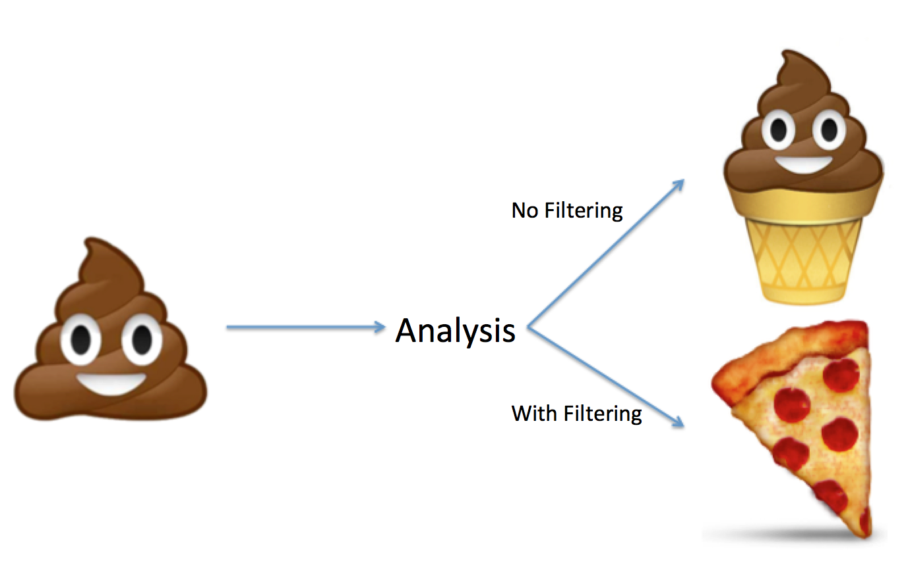
<p class="caption">(\#fig:unnamed-chunk-6)Why we should do quality filtering to the data. Origin unknown.</p>
</div>

So, which is the idea, what are the concerns we have with this type of data?

1. Cells are no really cells (empty droplets). 
2. Cells are not sequenced deeply enough to get an idea of which separates one cell from another.
3. Cells are broken. 
4. Doublets: More than two cells in one droplet.

To solve each of these problems we have different strategies. 

1. This is usually discarded before the alignment. Cells with too low reads are not taken forward.
2. We will select reads with more than certain amount of UMIs, in this case: 500UMIs per cells.
3. This is usually addressed in the field by counting % of mitochondrial genes. If a cell is broken, many mRNAs will fall out but the mitochondrial RNA will stay.
4. This is a tough one. Usually in the field people sequence cells from two different organisms and see how many cells have genes from both organisms, and say that they do not have a high percentage of Doublets. 

### Get number of genes captured and number of UMI (remember the difference between reads and UMI)

They are both calculated automatically by Seurat and stored in an object called meta.data. In the new version of Seurat, they call `features` to genes and `counts` to the UMIs. This is because more and more the single cell data became not only RNA sequencing data but also images, DNA, etc. However, I will call them genes because we are only using RNA data.

You can access that object using the @ simbol and runing in this case:
```DM.x@meta.data```

We will use this object to inspect the data and see the distribution of them.


```r
#Lets see how is it organized:
head(DM.1@meta.data)
```

```
##              orig.ident nCount_RNA nFeature_RNA
## CAAGAATTTTTC       DM.1      21318         3001
## AAAAAAAAAAAA       DM.1       1339         1316
## AGTCATCCGAGC       DM.1      16101         2802
## CAACACATGTAT       DM.1       8323         2001
## ATCTTTTTTTCG       DM.1       4426         2178
## TGAACTCTTGTC       DM.1       6896         1946
```

> What is each row? And each column?


```r
#We can explore the columns of this data, as any other data frame, with the $ sign.
unique(DM.1@meta.data$orig.ident)

#We can also see the distribution of the variables
summary(DM.1@meta.data)

#We can plot now the distribution of all the interesting things
p1=ggplot(data=DM.1@meta.data, aes(x=nCount_RNA, fill=orig.ident)) +
  geom_density(alpha=0.3) +
  #xlim(c(0,2000))+
  scale_fill_brewer(palette="Dark2") + 
  theme_minimal()+
  labs(main="nUMI")
p2=ggplot(data=DM.1@meta.data, aes(x=nFeature_RNA, fill=orig.ident)) +
  geom_density(alpha=0.3) +
  #xlim(c(0,500))+
  scale_fill_brewer(palette="Dark2") + 
  theme_minimal()+
  labs(main="nGene")

plot_grid(p1,p2)
```

<div class="figure" style="text-align: center">
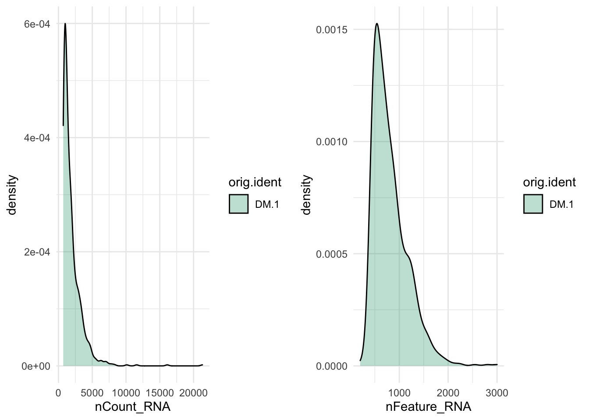
<p class="caption">(\#fig:unnamed-chunk-8-1)**CAPTION THIS FIGURE!!**</p>
</div>

```r
#We can also see how is the realtion between nGenes and nUMI
p3=ggplot(data = DM.1@meta.data ,aes(y = nFeature_RNA, x = nCount_RNA,color=orig.ident)) +   geom_point(dotsize=0.5, alpha=0.5) +
  scale_fill_brewer(palette="Dark2") + theme_minimal()

p4=ggplot(data = DM.1@meta.data ,aes(y =nFeature_RNA, x = nCount_RNA,color=orig.ident)) +   geom_point(dotsize=0.5, alpha=0.5) +
  scale_fill_brewer(palette="Dark2") + theme_minimal() +
  xlim(0,1000) + ylim(0,1000)

plot_grid(p3,p4,labels = c("nGene_vs_nUMI","zoom"))
```

<div class="figure" style="text-align: center">
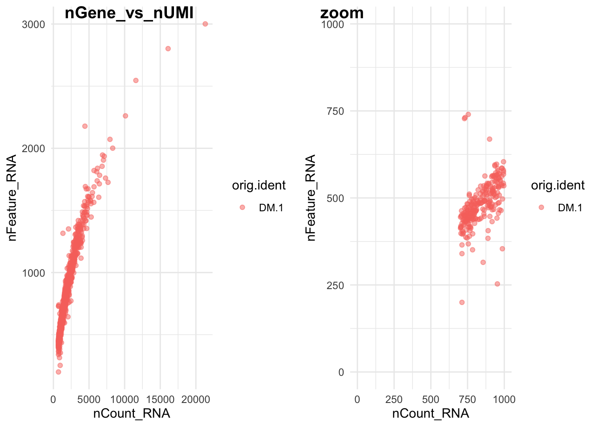
<p class="caption">(\#fig:unnamed-chunk-8-2)**CAPTION THIS FIGURE!!**</p>
</div>

```
## [1] DM.1
## Levels: DM.1
##  orig.ident   nCount_RNA     nFeature_RNA   
##  DM.1:907   Min.   :  702   Min.   : 200.0  
##             1st Qu.:  967   1st Qu.: 545.0  
##             Median : 1443   Median : 724.0  
##             Mean   : 1928   Mean   : 816.8  
##             3rd Qu.: 2383   3rd Qu.: 997.5  
##             Max.   :21318   Max.   :3001.0
```

> What is each point? How did we achieve the zoom? Why is there is cut at 200? Try it with the other replicates, what do you see? Can you think of a way to have them all together in the same plot?

### Calculate percentage of mitochondrial genes:

We calculate it as the proportion. Unfortunately we can see in our data that the mitochondrial genes are not included in the gene mapping.

We are interested in the genes encoded by the mitochondrial genome. These are named in a particular way. You can explore them in [FlyBase](http://flybase.org/reports/FBgn0013676) and in [UCSC](https://genome.ucsc.edu/cgi-bin/hgTracks?db=dm6&lastVirtModeType=default&lastVirtModeExtraState=&virtModeType=default&virtMode=0&nonVirtPosition=&position=chrM%3A1%2D19524&hgsid=816569087_Gcgg8v6VAM8DUYmIEUPWWGYPnXxJ)

For this we will use a function named `grep` that is used to extract elements that contain certain pattern from a vector or list.


```r
#nGene and nUMI are automatically calculated for every object by Seurat. For non-UMI data.
## We calculate the percentage of mitochondrial genes here and store it in percent.mito using the AddMetaData. The % of UMI mapping to MT-genes is a common scRNA-seq QC metric.

#We can explore the genes in each object
rownames(DM.1@assays$RNA)[1:5]

#mitochondrial genes have certain pattern
grep(pattern = "^mt-",x= rownames(DM.1@assays$RNA), value = T) #Here we are taking the data that actually is mitochondrial genes

#We will try with some other names for the mitochondrial genes: http://flybase.org/reports/FBgn0013676 for example
grep("CO",x= rownames(DM.1@assays$RNA), value = T)
grep("co",x= rownames(DM.1@assays$RNA), value = T)
```

```
## [1] "128up"               "14-3-3epsilon"       "14-3-3zeta"         
## [4] "140up"               "18SrRNA-Psi:CR41602"
## character(0)
##  [1] "COQ7"       "COX4"       "COX5A"      "COX5B"      "COX6B"     
##  [6] "COX7A"      "COX7C"      "COX8"       "SCOT"       "alphaCOP"  
## [11] "betaCOP"    "betapCOP"   "deltaCOP"   "epsilonCOP" "gammaCOP"  
## [16] "zetaCOP"   
##  [1] "Acon"       "Acox57D-p"  "Glycogenin" "Mco1"       "Ncoa6"     
##  [6] "Orco"       "Orcokinin"  "Picot"      "Scox"       "chico"     
## [11] "coil"       "cold"       "colt"       "comm"       "comt"      
## [16] "conu"       "cora"       "corn"       "coro"       "cort"      
## [21] "corto"      "cos"        "dco"        "disco"      "disco-r"   
## [26] "eco"        "loco"       "pico"
```

```
#The CO3 is not there, you can try this for all of the mitochondrial genes. 
#Anyways, once you have a list this is the way to proceed (we will not do this because we do not have the genes in the annotation):
percent.mito <- grep("^mt-",x= rownames(DM.1@assays$RNA), value = T)
percent.mito <- colSums(DM.1@raw.data[mito.genes, ])/colSums(ALL@raw.data)

DM.1[["percent.mt"]] <- AddMetaData(DM.1, percent.mito, "percent.mito")

#Or this other way
DM.1[["percent.mt"]] <- PercentageFeatureSet(DM.1, pattern = "^mt-")
```

### Removing low quality cells

We will do the same cutoff as the paper: nUMI>700, I added the nGene>100


```r
#How many cells there are?
nrow(DM.1@meta.data)

#Subset in ALL the data sets
DM.1 <- subset(DM.1, subset = nFeature_RNA > 100 & nCount_RNA> 700)

#How many cells are now?
nrow(DM.1@meta.data)
```

```
## [1] 907
## [1] 907
```

## Normalizing the data

Now we want to normalize the data. Remember that in the previous chapter we normalized by library depth to able to compare the different samples. For single cell we do the same but a different way.
Seurat uses a global-scaling normalization method “LogNormalize” that normalizes the feature expression measurements for each cell by the total expression (like library depth), multiplies this by a scale factor (this helps to increase the level, as in single cell the gene expression is really low), and log-transforms the result (this helps reduce the variability). 


```r
DM.1 <-  NormalizeData(object = DM.1, normalization.method = "LogNormalize", scale.factor = 10000,verbose = F)
```

## Detection of variable genes across the single cells

To be able to differentiate once cell from another we need to focus in the genes that are different between cells and not in the ones that are similar. For example, if we want to differentiate two neurons from each other looking at the levels of actin makes no much sense, but looking at the genes that have different levels in these neurons can be indicative of the identity of them.

Seurat calculates highly variable genes and focuses on these for downstream analysis. `FindVariableGenes` calculates the average expression and dispersion for each gene. This helps control for the relationship between variability and average expression. Then we decide how many genes to get. The default is 2000. 

Please look at the data and try to understand what each axis means. 


```r
DM.1 <- FindVariableFeatures(DM.1, selection.method = "vst", nfeatures = 2000,verbose = F)

## Identify the 10 most highly variable genes
top10 <- head(VariableFeatures(DM.1), 10)

## plot variable features with and without labels
plot1 <- VariableFeaturePlot(DM.1)
plot2 <- LabelPoints(plot = plot1, points = top10, repel = TRUE)
plot2
```

<div class="figure" style="text-align: center">
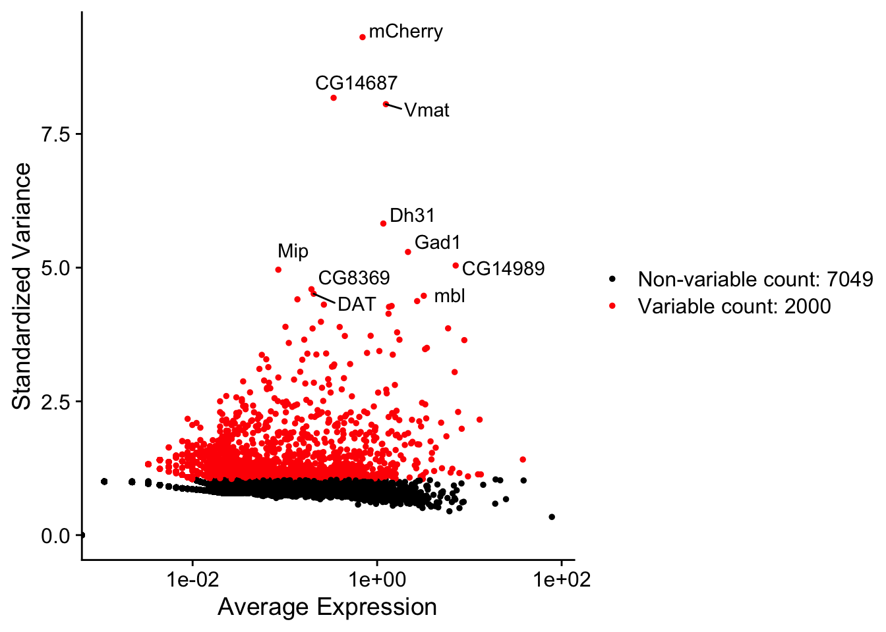
<p class="caption">(\#fig:unnamed-chunk-12)Variable genes plot</p>
</div>


>What are the top 10 genes? Make sense that they appear in this data?

## Integrating ALL the samples.

We have more than one replicate. Seurat has recently implemented a new way to integrate different data sets. This imply looking at the similitude between cells after normalization and variable genes. For that they create a set of `anchores` between the cells. This is used to integrate replicates, different data types, etc.

<div class="figure" style="text-align: center">
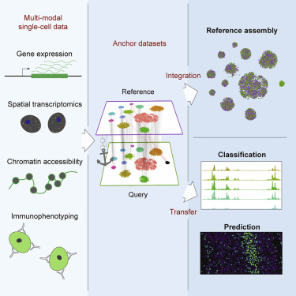
<p class="caption">(\#fig:unnamed-chunk-13)Figure from: Comprehensive Integration of Single-Cell Data, Stuart et al. Cell 2019</p>
</div>

Therefore, to integrate this data we will:
1. Do the same processing we just did for all of them (normalization and variable genes).
2. Find the anchors and create a new integrated object.

This integrated object has a new Assay with the integrated (or ‘batch-corrected’) expression matrix for all cells. This allows for an easier and better joint analysis.


```r
#create a list
dm.list<-list(DM.1,DM.2,DM.3)

#do a FOR loop to loop over all of them
for (i in 1:length(dm.list)) {
    dm.list[[i]] <- subset(dm.list[[i]], subset = nFeature_RNA > 100 & nCount_RNA> 700)
    dm.list[[i]] <- NormalizeData(dm.list[[i]], verbose = FALSE) #normalize
    dm.list[[i]] <- FindVariableFeatures(dm.list[[i]], selection.method = "vst", 
        nfeatures = 2000, verbose = FALSE) #find variable genes
}

#Find anchors
anchors <- FindIntegrationAnchors(object.list = dm.list, dims = 1:30,verbose = F)
ALL <- IntegrateData(anchorset = anchors, dims = 1:30,verbose = F)

#remove the anchors, they are too big and we will not use them anymore
rm(anchors)

head(as.data.frame(ALL@meta.data))
head(unique(ALL@meta.data$orig.ident))
```

```
##                orig.ident nCount_RNA nFeature_RNA
## CAAGAATTTTTC_1       DM.1      21318         3001
## AAAAAAAAAAAA_1       DM.1       1339         1316
## AGTCATCCGAGC_1       DM.1      16101         2802
## CAACACATGTAT_1       DM.1       8323         2001
## ATCTTTTTTTCG_1       DM.1       4426         2178
## TGAACTCTTGTC_1       DM.1       6896         1946
## [1] "DM.1" "DM.2" "DM.3"
```

>How does the meta.data looks like now? how many "orig.ident" there are?

We can plot the quality plots now and compare the replicates


```r
ggplot(data = ALL@meta.data ,aes(y =nFeature_RNA, x = nCount_RNA,color=orig.ident)) +   geom_point(dotsize=0.5, alpha=0.5) +
  scale_fill_brewer(palette="Dark2") + theme_minimal() 
```

<div class="figure" style="text-align: center">
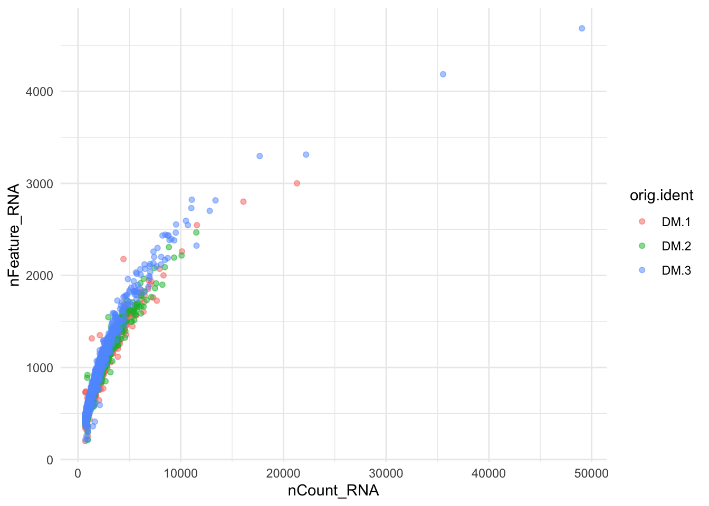
<p class="caption">(\#fig:unnamed-chunk-15-1)Number of Genes and Number of UMIs</p>
</div>

```r
p1=ggplot(data=ALL@meta.data, aes(x=nCount_RNA, fill=orig.ident)) +
  geom_density(alpha=0.3) +
  #xlim(c(0,2000))+
  scale_fill_brewer(palette="Dark2") + 
  theme_minimal()+
  labs(main="nUMI")
p2=ggplot(data=ALL@meta.data, aes(x=nFeature_RNA, fill=orig.ident)) +
  geom_density(alpha=0.3) +
  #xlim(c(0,500))+
  scale_fill_brewer(palette="Dark2") + 
  theme_minimal()+
  labs(main="nGene")

plot_grid(p1,p2)
```

<div class="figure" style="text-align: center">
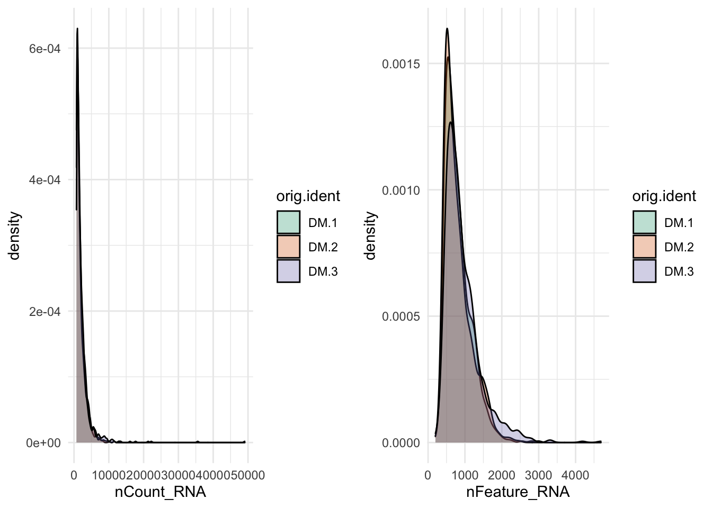
<p class="caption">(\#fig:unnamed-chunk-15-2)Number of Genes and Number of UMIs</p>
</div>

>Try to describe in your own words what is this for loop doing. What are the dimensions in the integration?

## Scaling the data and removing unwanted sources of variation

Scale the data allows for better comparison. Basically, it takes care of the differences between genes that are highly expressed and lowly expressed. [Z-score](https://www.statisticshowto.datasciencecentral.com/probability-and-statistics/z-score/) is a commonly used method to scale the data. To sum up:
1. Shifts the expression of each gene, so that the mean expression across cells is 0
2. Scales the expression of each gene, so that the variance across cells is 1

This step gives equal weight in downstream analyses, so that highly-expressed genes do not dominate.

Single-cell data has sources of variation that are not biologically interesting. For example, each sample was prepared in a different batch (batch effect, already reduced by the integration), some cells are just more deeply sequenced (we already took care of these with normalization) or some cells are just healthier than others or in another cell cycle state (not important for brain data but super important for other data sets).
We can regress out cell-cell variation in gene expression driven by batch (if applicable), cell alignment rate (as provided by Drop-seq tools for Drop-seq data), the number of detected molecules, and mitochondrial gene expression. As we just said, we took care of most of the problems. But if you want, there is an option in this function that allows you to do that.


```r
ALL <-ScaleData(object = ALL,verbose = F)
```

## Perform linear dimensional reduction

Dimensional reduction literally means that: reduce dimensions. This means that we will use less variables. This was already done by reducing the number of genes we will use for downstream analysis. Now we apply another one that you already saw and that is useful for clustering: PCA.

So, we will perform PCA on the scaled data using the 2000 more variable genes. You can play with the number of genes using the `feature` option.


```r
## switch to integrated assay. The variable features of this assay are automatically
## set during IntegrateData
DefaultAssay(ALL) <- "integrated"

## Run the standard workflow for visualization and clustering
ALL <- ScaleData(ALL, verbose = FALSE) #The scaling is now done on the integrated data

#Run the PCA, npcs is the maximum PCs computed
ALL <- RunPCA(ALL, npcs = 30, verbose = FALSE)
```


```r
## Visualizing the PCs and determine the significance
ElbowPlot(ALL,ndims = 30) + geom_hline(yintercept = 2,linetype=2) 
```

<div class="figure" style="text-align: center">
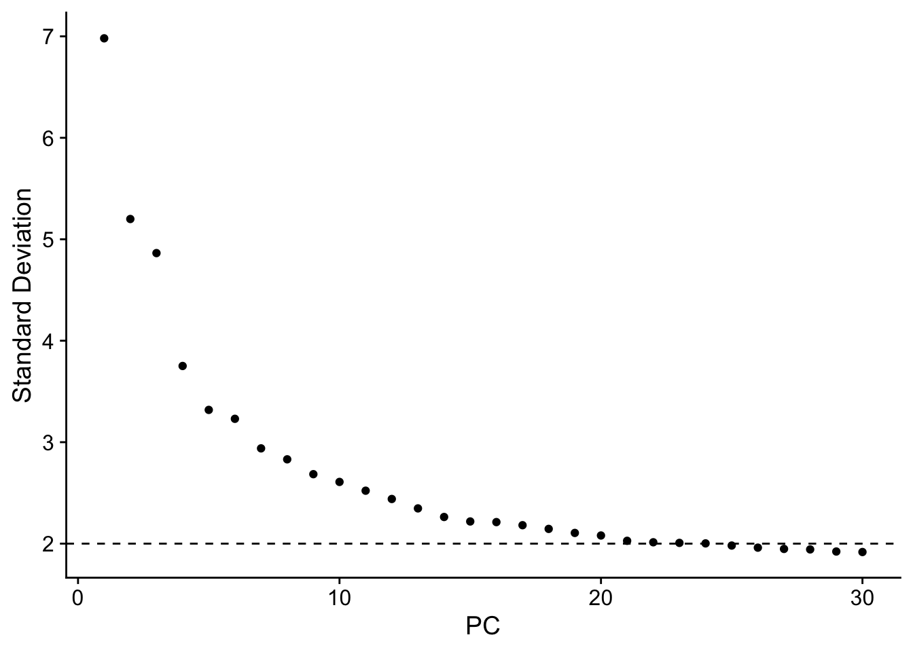
<p class="caption">(\#fig:unnamed-chunk-18)PCA plots</p>
</div>
>does this plot ring any bell? How many PCs would you select?


```r
p1=DimPlot(ALL, reduction = "pca",dims = c(1,2))
p2=DimPlot(ALL, reduction = "pca",dims = c(2,3))
p3=DimPlot(ALL, reduction = "pca",dims = c(2,5))
p4=DimPlot(ALL, reduction = "pca",dims = c(21,3))
p1+p2+p3+p4
```

<div class="figure" style="text-align: center">
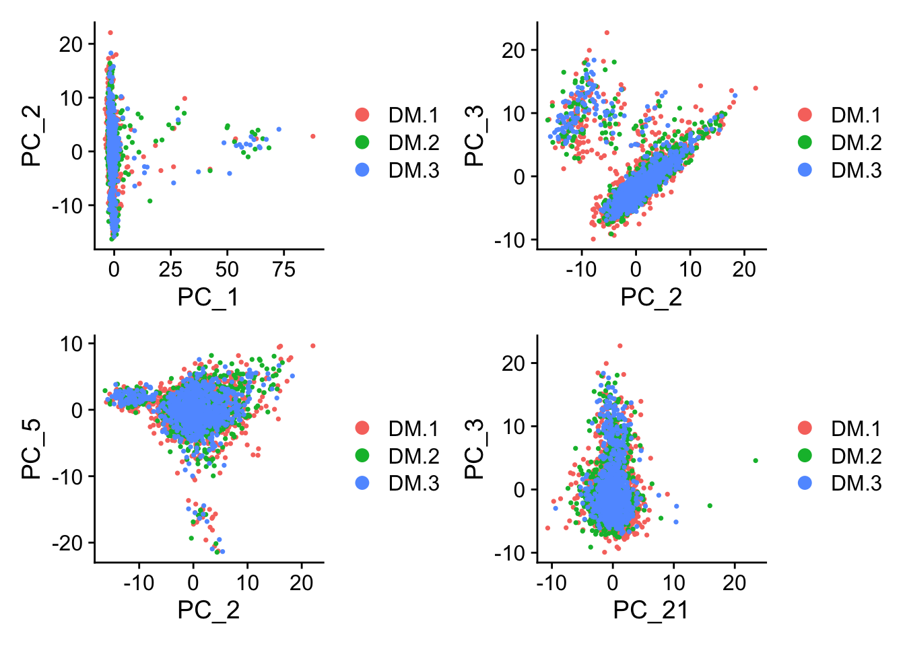
<p class="caption">(\#fig:unnamed-chunk-19)PCA plots</p>
</div>

> What about this? What are we looking for here?


```r
#Other way to see this
DimHeatmap(ALL, dims = 1:6, cells = 500, balanced = TRUE)
```

<div class="figure" style="text-align: center">
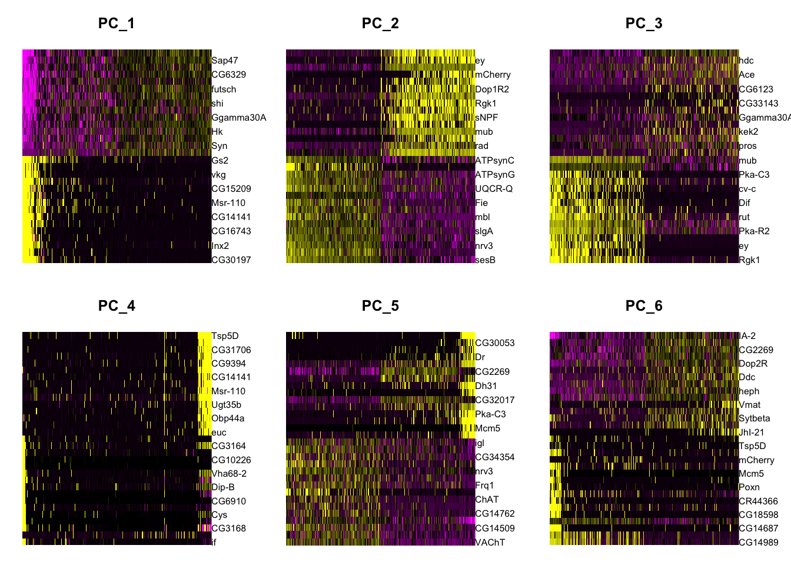
<p class="caption">(\#fig:unnamed-chunk-20)PCA heatmap plots</p>
</div>

> Are 2 dimensions enough to descrive the data?


## Clustering 

Once you have explored the PCs, you can do the clustering an visualization. We will use all the 30 PCs.
There are many ways to cluster data. The main idea is to be able to identify the points that are more similar to each other and the ones that are more different from each other.

Seurat calculates the distance/similarity between cells in the function `FindNeighbors`. This performs a [KNN graph](https://en.wikipedia.org/wiki/K-nearest_neighbors_algorithm) based on the Euclidean distance in PCA space (this means using the PCs values and NOT the gene values), and refine the edge weights between any two cells based on the shared overlap in their local neighborhoods (Jaccard similarity).

To cluster the cells Surat can use different algorithms in the function `FindClusters`. As default it uses Louvain algorithm. The main idea is to iteratively group cells together. One of the most important things to tune in this function is the `resolution`. This will impact the number of final clusters. In out case we expect to have a LOT of clusters because we are working with a complex tissue.


```r
ALL <- FindNeighbors(ALL, dims = 1:30,reduction = "pca") #What are these dimensions?
ALL <- FindClusters(ALL, resolution = 3)

#explore the meta data now, what is new now?
as.data.frame(head(ALL@meta.data))
```

```
## Modularity Optimizer version 1.3.0 by Ludo Waltman and Nees Jan van Eck
## 
## Number of nodes: 2573
## Number of edges: 123835
## 
## Running Louvain algorithm...
## Maximum modularity in 10 random starts: 0.5747
## Number of communities: 27
## Elapsed time: 0 seconds
##                orig.ident nCount_RNA nFeature_RNA integrated_snn_res.3
## CAAGAATTTTTC_1       DM.1      21318         3001                   14
## AAAAAAAAAAAA_1       DM.1       1339         1316                   26
## AGTCATCCGAGC_1       DM.1      16101         2802                    8
## CAACACATGTAT_1       DM.1       8323         2001                   21
## ATCTTTTTTTCG_1       DM.1       4426         2178                   12
## TGAACTCTTGTC_1       DM.1       6896         1946                   10
##                seurat_clusters
## CAAGAATTTTTC_1              14
## AAAAAAAAAAAA_1              26
## AGTCATCCGAGC_1               8
## CAACACATGTAT_1              21
## ATCTTTTTTTCG_1              12
## TGAACTCTTGTC_1              10
```

## Visualization

To visualize this data, as we already saw, PC is not enough. So, we need to find a way to visualize the clusters in the 30! PCs we used for clustering. For this we will use UMAP. You can think of it as a compressed version of the 30PCs.


```r
ALL <- RunUMAP(ALL, reduction = "pca", dims = 1:30)

#explore the meta data now, what is new now?
as.data.frame(head(ALL@meta.data))

#Plot
DimPlot(object = ALL,label = T)
```

<div class="figure" style="text-align: center">
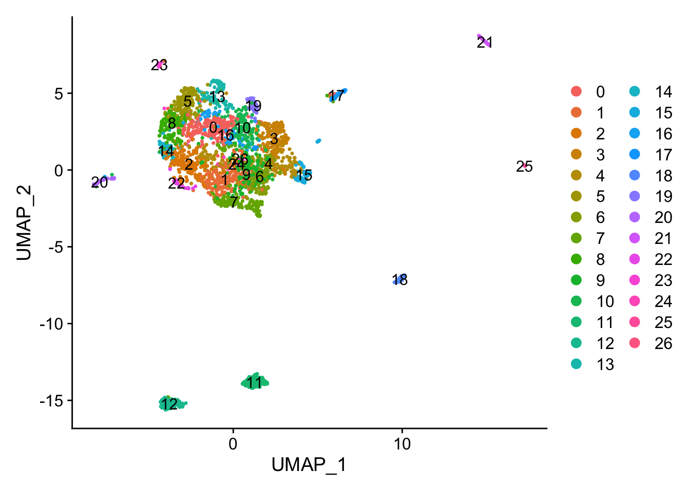
<p class="caption">(\#fig:unnamed-chunk-22-1)UMAP plot</p>
</div>

```r
p1 <- DimPlot(ALL, reduction = "umap", group.by = "orig.ident") #we can color the cells based on any of the things in the meta.data
p2 <- DimPlot(ALL, reduction = "umap", label = T,repel = TRUE) + NoLegend()
p1 + p2
```

<div class="figure" style="text-align: center">
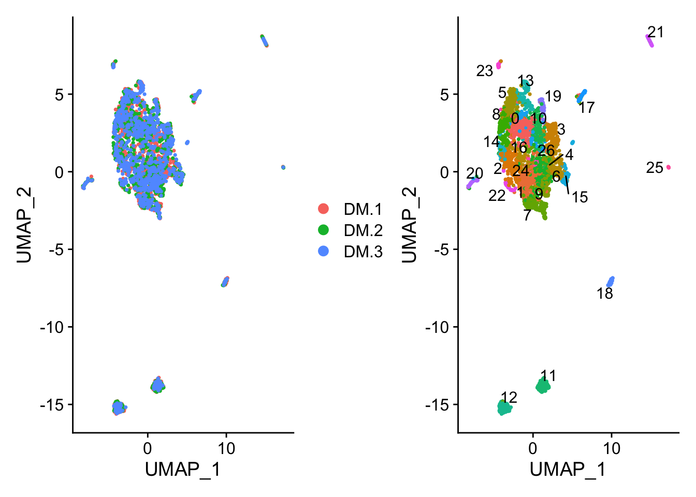
<p class="caption">(\#fig:unnamed-chunk-22-2)UMAP plot</p>
</div>

```
##                orig.ident nCount_RNA nFeature_RNA integrated_snn_res.3
## CAAGAATTTTTC_1       DM.1      21318         3001                   14
## AAAAAAAAAAAA_1       DM.1       1339         1316                   26
## AGTCATCCGAGC_1       DM.1      16101         2802                    8
## CAACACATGTAT_1       DM.1       8323         2001                   21
## ATCTTTTTTTCG_1       DM.1       4426         2178                   12
## TGAACTCTTGTC_1       DM.1       6896         1946                   10
##                seurat_clusters
## CAAGAATTTTTC_1              14
## AAAAAAAAAAAA_1              26
## AGTCATCCGAGC_1               8
## CAACACATGTAT_1              21
## ATCTTTTTTTCG_1              12
## TGAACTCTTGTC_1              10
```

>How many clusters we have? Do you think this is enough? Any explanation?

## Finding differentially expressed features (cluster biomarkers)

What is missing now? Basically, we want to identify the genes that makes one cluster different from the rest. How would you do it?
`FindAllMarkers` is the function that does the job. Is basically doing a differential gene expression between the clusters. 
Important parameters:
1. The `min.pct` argument determines that the genes reported have to be detected at a minimum percentage in either of the two groups of cells
2. The `logfc.threshold` is setting a threshold in the foldchange of he reported genes.
3. The `only.pos` argument determine if the reported genes will be only the ones with a positive foldchange in the cluster (important for markers).

There is an option to compare cluster by cluster. This is useful for example if you want to focus in one cluster for some reason.
`FindMarkers` function where `ident.1` and `ident.2` will be compared.


```r
## find markers for every cluster compared to all remaining cells, report only the positive ones
markers.all <- FindAllMarkers(ALL, only.pos = TRUE, min.pct = 0.25, logfc.threshold  = 0.25,verbose = F)
top10.markers.all <- markers.all %>% group_by(cluster) %>% top_n(n = 10, wt = avg_logFC) #what do you think this is doing?

#Visualization
DoHeatmap(ALL, features = top10.markers.all$gene) + NoLegend()
```

<div class="figure" style="text-align: center">
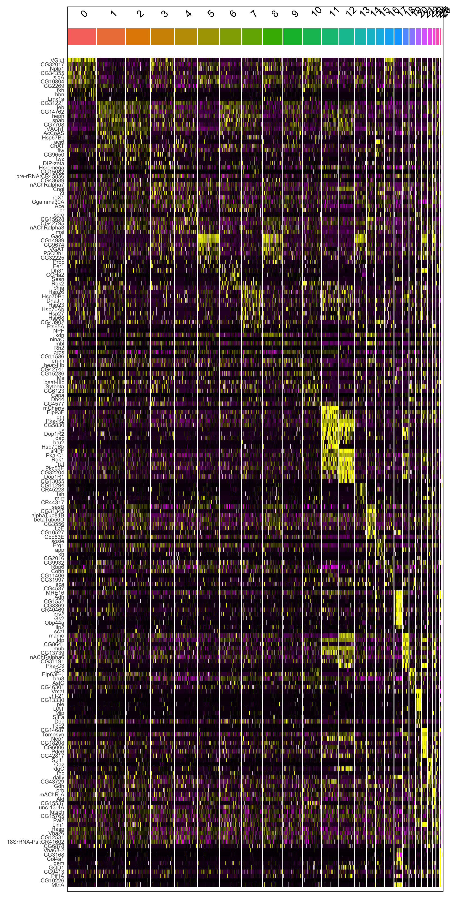
<p class="caption">(\#fig:unnamed-chunk-23)Heatmap of marker genes per cluster</p>
</div>

```r
#If you want to save ALL the data in an object you can share with anyone and with yourself in the future :)
#save.image(file = "sc_class.RData")
```

> What are the colors representing here? Try to play with them.

> Do you think all the clusters are equally important? What happens in cluster 0?

> There are other ways to visualize this. Please go to https://satijalab.org/seurat/v3.1/pbmc3k_tutorial.html and explore other options. 

> Pickup one cluster and determine the cell identity in biological terms. How do think this can be done?

> As a note of color: Who was Seurat and why do you think the single cell package is names after him?

Here a small hint. 

<div class="figure" style="text-align: center">
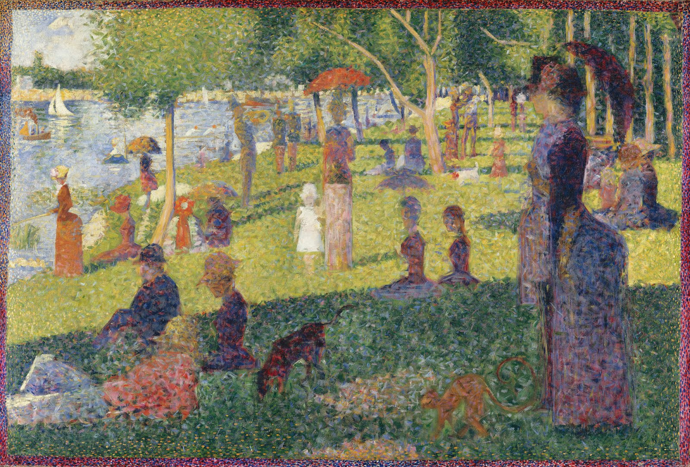
<p class="caption">(\#fig:unnamed-chunk-24)A Sunday Afternoon on the Island of La Grande Jatte or Un dimanche après-midi à l'Île de la Grande Jatte, Georges Seurat, Oil on canvas, 1884–1886 </p>
</div>
